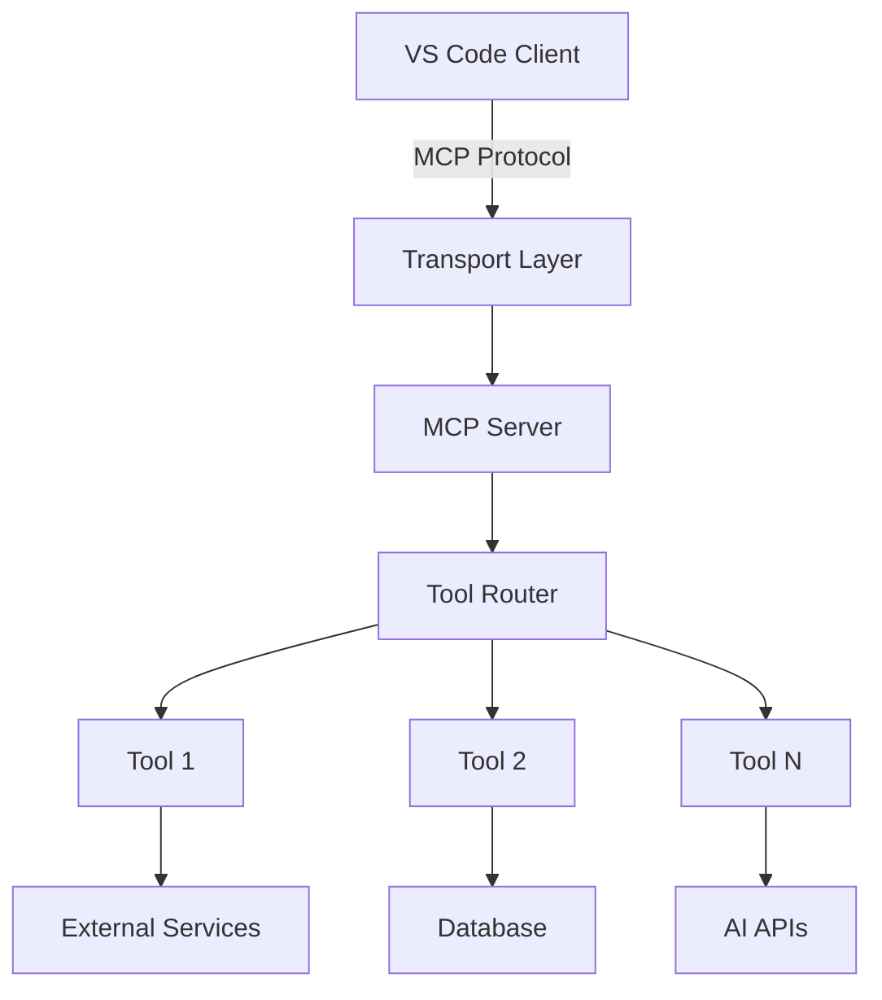

# 🧠 MCP SERVER DOCUMENTATION TEMPLATE

**Server Name**: [MCP_SERVER_NAME]  
**Transport**: stdio | HTTP | SSE  
**Status**: ✅ PRODUCTION READY | 🔧 DEVELOPMENT | ⚠️ MAINTENANCE  
**Tools**: [Number] specialized AI tools  
**Performance**: [Response times and efficiency metrics]  
**Version**: [X.Y.Z]  
**Last Updated**: [Date]

---

## 🎯 Executive Summary

[2-3 sentences describing the MCP server purpose, primary capabilities, and value proposition in the AI development workflow]

### Server Capabilities:
- ✅ [Primary capability 1]
- ✅ [Primary capability 2]
- ✅ [Primary capability 3]
- ✅ [Additional capabilities as needed]

### Available Tools:
| Tool | Function | Use Case | Performance |
|------|----------|----------|-------------|
| `tool_name_1` | [Brief function description] | [Primary use case] | [Response time/metrics] |
| `tool_name_2` | [Brief function description] | [Primary use case] | [Response time/metrics] |
| `tool_name_3` | [Brief function description] | [Primary use case] | [Response time/metrics] |

---

## 🏗️ Architecture and Design

### MCP Protocol Implementation:


### Technology Stack:
- **Protocol**: Model Context Protocol (MCP) v2.0+
- **Transport**: [stdio/HTTP/SSE]
- **Runtime**: [Node.js 20+, Python 3.11+]
- **Framework**: [Express.js, FastAPI, custom]
- **Dependencies**: [Key dependencies]
- **AI Integration**: [Azure OpenAI, OpenAI, local models]

### Server Configuration:
```json
{
  "mcpServers": {
    "[server-name]": {
      "command": "[command]",
      "args": ["[arg1]", "[arg2]"],
      "transport": "[stdio|http|sse]",
      "env": {
        "API_KEY": "[api-key]",
        "LOG_LEVEL": "[log-level]"
      }
    }
  }
}
```

---

## 🚀 Installation and Setup

### Prerequisites:
- **VS Code**: Version 1.85+ with MCP support
- **Node.js**: Version 20+ (for Node.js servers)
- **Python**: Version 3.11+ (for Python servers)
- **Dependencies**: [List specific requirements]

### Installation Methods:

#### Method 1: NPM Package (Recommended)
```bash
# Install globally
npm install -g @codai/[server-name]-mcp

# Or install locally in project
npm install @codai/[server-name]-mcp
```

#### Method 2: Direct from Source
```bash
# Clone repository
git clone [repository-url]
cd [server-directory]

# Install dependencies
npm install  # or pip install -r requirements.txt

# Build server
npm run build
```

### VS Code MCP Configuration:

#### Add to VS Code Settings:
```json
{
  "mcp.servers": {
    "[server-name]": {
      "command": "npx",
      "args": ["@codai/[server-name]-mcp"],
      "transport": "stdio",
      "initializationOptions": {
        "apiKey": "${env:API_KEY}",
        "logLevel": "info"
      }
    }
  }
}
```

#### Environment Variables:
Create or update your `.env` file:
```bash
# Required API keys
API_KEY=your_api_key_here
AZURE_OPENAI_KEY=your_azure_key

# Optional configuration
LOG_LEVEL=info
CACHE_TTL=3600
MAX_CONCURRENT_REQUESTS=10
```

### Verification:
```bash
# Test server directly
npx @codai/[server-name]-mcp

# Check VS Code MCP status
# Open Command Palette: Ctrl+Shift+P
# Run: "MCP: List Servers"
# Verify [server-name] appears as "Connected"
```

---

## 🛠️ Tools Reference

### Tool Categories:
- **[Category 1]**: [Brief description]
- **[Category 2]**: [Brief description]
- **[Category 3]**: [Brief description]

---

### Tool 1: `tool_name_1`

#### Purpose:
[Detailed description of what this tool does and when to use it]

#### Parameters:
| Parameter | Type | Required | Description | Default |
|-----------|------|----------|-------------|---------|
| `param1` | string | Yes | [Parameter description] | - |
| `param2` | number | No | [Parameter description] | [default] |
| `param3` | boolean | No | [Parameter description] | false |

#### Usage Example:
```javascript
// Using the tool in VS Code Copilot Chat
// Tool is automatically invoked based on context, or manually:

// Direct tool call (internal MCP usage)
const result = await tool_name_1({
  param1: "example_value",
  param2: 42,
  param3: true
});
```

#### Response Format:
```json
{
  "success": true,
  "data": {
    "result": "[result_data]",
    "metadata": {
      "processing_time": "[time_ms]",
      "source": "[data_source]"
    }
  },
  "timestamp": "2025-07-22T10:00:00Z"
}
```

#### Error Handling:
```json
{
  "success": false,
  "error": {
    "code": "ERROR_CODE",
    "message": "Human readable error message",
    "details": {
      "parameter": "param1",
      "issue": "Invalid format"
    }
  },
  "timestamp": "2025-07-22T10:00:00Z"
}
```

#### Performance:
- **Average Response Time**: [X]ms
- **95th Percentile**: [X]ms
- **Success Rate**: [X]%
- **Rate Limit**: [X] requests per minute

---

### Tool 2: `tool_name_2`

#### Purpose:
[Detailed description of what this tool does and when to use it]

#### Parameters:
[Same format as Tool 1]

#### Usage Example:
```python
# For Python-based tools
result = await tool_name_2(
    param1="example",
    param2=123
)
```

#### Integration Patterns:
- **Synchronous**: For immediate results
- **Asynchronous**: For long-running operations
- **Streaming**: For real-time data updates
- **Batch**: For processing multiple items

---

## 🎨 Usage Examples and Scenarios

### Scenario 1: [Common Use Case Name]

#### Context:
[Description of when and why this scenario is useful]

#### Implementation:
```javascript
// Step-by-step example
async function scenarioExample() {
  try {
    // Step 1: [Description]
    const step1Result = await tool_name_1({
      param1: "initial_data"
    });
    
    // Step 2: [Description] 
    const step2Result = await tool_name_2({
      param1: step1Result.data.result,
      param2: 100
    });
    
    // Step 3: [Description]
    return processResults(step2Result);
    
  } catch (error) {
    console.error('Scenario failed:', error);
    throw error;
  }
}
```

#### Expected Results:
[Description of what the user should see/expect]

### Scenario 2: [Advanced Use Case Name]

#### Context:
[Description of complex integration or advanced usage]

#### Implementation:
```typescript
// Advanced TypeScript example with error handling
interface AdvancedScenarioConfig {
  batchSize: number;
  timeout: number;
  retries: number;
}

async function advancedScenario(
  data: string[], 
  config: AdvancedScenarioConfig
): Promise<ProcessedResult[]> {
  const results: ProcessedResult[] = [];
  
  for (const batch of chunkArray(data, config.batchSize)) {
    const batchResults = await Promise.all(
      batch.map(item => 
        retryWithBackoff(
          () => tool_name_1({ param1: item }),
          config.retries
        )
      )
    );
    results.push(...batchResults);
  }
  
  return results;
}
```

### VS Code Integration Examples:

#### Chat Integration:
```
// User asks in VS Code Copilot Chat:
"Can you [specific task related to this MCP server]?"

// Copilot automatically uses the appropriate tools:
// 1. Analyzes request context
// 2. Selects relevant tools from this MCP server
// 3. Calls tools with appropriate parameters
// 4. Processes results and responds to user
```

#### Agent Mode Usage:
```
// In VS Code with agent mode enabled:
// 1. Tools are available in the tools picker
// 2. Confirmation dialogs appear for non-read-only operations
// 3. Tools coordinate with other MCP servers automatically
// 4. Results are integrated into the development workflow
```

---

## 📊 Performance and Monitoring

### Performance Metrics:
| Metric | Value | Target | Status |
|--------|-------|--------|--------|
| Average Response Time | [X]ms | <[Y]ms | ✅ Met |
| 95th Percentile Response Time | [X]ms | <[Y]ms | ✅ Met |
| Tool Success Rate | [X]% | >99% | ✅ Met |
| Concurrent Request Handling | [X] | >[Y] | ✅ Met |
| Memory Usage | [X]MB | <[Y]MB | ✅ Met |

### Performance Benchmarks:
```yaml
Load Test Results:
  concurrent_users: [number]
  requests_per_second: [number]
  tool_calls_per_minute: [number]
  average_response_time: [X]ms
  error_rate: [X]%
  
Resource Usage:
  cpu_usage_peak: [X]%
  memory_usage_peak: [X]MB
  disk_io: [X]MB/s
  network_io: [X]MB/s
```

### Monitoring Integration:
```json
{
  "prometheus_metrics": [
    "mcp_tool_requests_total",
    "mcp_tool_request_duration_seconds", 
    "mcp_tool_errors_total",
    "mcp_server_up"
  ],
  "health_check_endpoint": "/health",
  "metrics_endpoint": "/metrics"
}
```

### Health Check:
```bash
# Check server health
curl http://localhost:[port]/health

# Expected response
{
  "status": "healthy",
  "tools": [number],
  "version": "[version]",
  "uptime": "[uptime]"
}
```

---

## 🔒 Security and Compliance

### Security Features:
- **Authentication**: [API key validation, token verification]
- **Authorization**: [Role-based access, permission checks]
- **Input Validation**: [Parameter sanitization, injection prevention]
- **Rate Limiting**: [Request throttling, abuse prevention]
- **Encryption**: [Data encryption in transit and at rest]

### Security Configuration:
```json
{
  "security": {
    "api_key_required": true,
    "rate_limit": {
      "requests_per_minute": 100,
      "burst_limit": 20
    },
    "input_validation": {
      "max_string_length": 10000,
      "allowed_characters": "[regex_pattern]"
    },
    "encryption": {
      "algorithm": "AES-256-GCM",
      "key_rotation": "30d"
    }
  }
}
```

### Compliance:
- **Data Privacy**: [GDPR compliance, data anonymization]
- **Enterprise Standards**: [SOC 2, ISO 27001 compliance]
- **Audit Logging**: [Request logging, security event tracking]
- **Access Controls**: [Multi-tenant isolation, permission matrix]

### Security Best Practices:
1. **API Key Management**: Store keys securely, rotate regularly
2. **Input Validation**: Validate all parameters, sanitize inputs
3. **Error Handling**: Don't expose internal system details
4. **Logging**: Log security events, monitor for anomalies
5. **Updates**: Keep dependencies updated, monitor security advisories

---

## 🐛 Troubleshooting and Diagnostics

### Common Issues:

#### Issue: MCP Server Not Starting
**Symptoms**:
- Server appears as "Disconnected" in VS Code MCP status
- Error messages in VS Code Output panel
- Tool calls fail with connection errors

**Diagnostic Steps**:
```bash
# 1. Check server directly
npx @codai/[server-name]-mcp

# 2. Verify environment variables
echo $API_KEY
echo $AZURE_OPENAI_KEY

# 3. Check VS Code MCP configuration
# Command Palette > "MCP: Show Server Logs"

# 4. Test dependencies
node -e "console.log(process.version)"  # Check Node.js version
npm list  # Check installed packages
```

**Solutions**:
1. Verify all environment variables are set
2. Check API key validity and permissions
3. Ensure Node.js version compatibility
4. Reinstall server package if corrupted

#### Issue: Tool Calls Failing
**Symptoms**:
- Tools return error responses
- High error rates in monitoring
- Timeout errors

**Diagnostic Commands**:
```bash
# Check API connectivity
curl -H "Authorization: Bearer $API_KEY" [external-api-endpoint]

# Monitor server logs
tail -f ~/.vscode/logs/mcp-[server-name].log

# Test individual tools
npx @codai/[server-name]-mcp --test-tool tool_name_1
```

**Solutions**:
1. Verify external API credentials and quotas
2. Check network connectivity and firewall rules
3. Review rate limiting configurations
4. Update to latest server version

#### Issue: Poor Performance
**Symptoms**:
- Slow tool response times
- VS Code becoming unresponsive
- High resource usage

**Performance Analysis**:
```bash
# Monitor resource usage
top -p $(pgrep -f "[server-name]-mcp")

# Profile memory usage
node --inspect [server-script]

# Check concurrent request handling
curl -w "@curl-format.txt" [server-endpoint]
```

**Optimization Steps**:
1. Implement request caching
2. Optimize external API calls
3. Increase timeout values
4. Scale server resources

### Debugging Mode:
```bash
# Enable debug logging
export LOG_LEVEL=debug
npx @codai/[server-name]-mcp

# Enable trace logging for detailed debugging
export LOG_LEVEL=trace
export MCP_DEBUG=1
npx @codai/[server-name]-mcp
```

### Log Analysis:
```bash
# View recent errors
grep -i error ~/.vscode/logs/mcp-[server-name].log | tail -20

# Monitor in real-time
tail -f ~/.vscode/logs/mcp-[server-name].log | grep -E "(ERROR|WARN)"

# Parse structured logs
cat logs/server.log | jq '.level, .message, .timestamp, .tool'
```

---

## 🚀 Development and Contributing

### Development Setup:
```bash
# Clone repository
git clone [repository-url]
cd [server-directory]

# Install dependencies
npm install

# Run in development mode
npm run dev

# Run tests
npm test

# Build for production
npm run build
```

### Testing:
```bash
# Unit tests
npm run test:unit

# Integration tests  
npm run test:integration

# MCP protocol tests
npm run test:mcp

# Performance tests
npm run test:performance
```

### Code Structure:
```
src/
├── server.ts           # Main MCP server implementation
├── tools/              # Individual tool implementations
│   ├── tool1.ts
│   ├── tool2.ts
│   └── index.ts
├── services/           # External service integrations
│   ├── api-client.ts
│   └── database.ts
├── utils/              # Utility functions
│   ├── validation.ts
│   └── logging.ts
└── types/              # TypeScript type definitions
    ├── tools.ts
    └── server.ts
```

### Adding New Tools:
1. **Create Tool File**: Add new tool in `src/tools/`
2. **Implement Interface**: Follow MCP tool interface
3. **Add Tests**: Create comprehensive test coverage
4. **Update Documentation**: Document parameters and usage
5. **Register Tool**: Add to server tool registry

### Code Quality Standards:
- **TypeScript**: Strict mode enabled, full type coverage
- **ESLint**: Follow CODAI ecosystem linting rules
- **Testing**: Minimum 90% code coverage required
- **Documentation**: All public APIs documented
- **Performance**: Tools must respond within [X]ms target

---

## 🔄 Version Management and Releases

### Current Version: [X.Y.Z]
**Release Date**: [Date]
**Changes**:
- [Feature/improvement/fix description]
- [Feature/improvement/fix description]
- [Breaking changes if any]

### Version History:

#### Version [X.Y.Z-1]
**Release Date**: [Date]
**Changes**:
- [Change description]
- [Change description]

### Semantic Versioning:
- **Major (X)**: Breaking changes, incompatible API changes
- **Minor (Y)**: New functionality, backward compatible
- **Patch (Z)**: Bug fixes, backward compatible

### Update Process:
```bash
# Check current version
npm list @codai/[server-name]-mcp

# Update to latest version
npm update @codai/[server-name]-mcp

# Or install specific version
npm install @codai/[server-name]-mcp@[version]
```

### Migration Guides:
- **v2.0 Migration**: [Link to migration guide if major version]
- **Breaking Changes**: [Documentation of any breaking changes]

---

## 🔗 Integration with Other MCP Servers

### Compatible Servers:
| Server | Integration Type | Use Cases |
|--------|------------------|-----------|
| [Other MCP Server 1] | [Complementary/Sequential] | [Combined use cases] |
| [Other MCP Server 2] | [Data sharing] | [Shared data scenarios] |

### Coordination Patterns:
```javascript
// Example of coordinated tool usage
async function coordinatedWorkflow() {
  // Step 1: Use this server's tool
  const result1 = await thisServer.tool1({ data: "input" });
  
  // Step 2: Use another server's tool with result
  const result2 = await otherServer.process({ 
    input: result1.output 
  });
  
  // Step 3: Combine results
  return await thisServer.tool2({ 
    context: result2.data 
  });
}
```

### Best Practices:
- **Tool Sequencing**: Optimal order for multi-server workflows
- **Data Passing**: Efficient data transfer between servers
- **Error Handling**: Graceful failure handling across servers
- **Performance**: Minimize latency in multi-server calls

---

## 📚 Educational Resources

### Learning Path:
1. **MCP Protocol Basics**: Understanding the Model Context Protocol
2. **Server Architecture**: How MCP servers work
3. **Tool Development**: Creating effective tools
4. **Integration Patterns**: Using tools in development workflows
5. **Advanced Usage**: Complex scenarios and optimizations

### Code Examples Repository:
- **GitHub Repository**: [Link to examples repository]
- **Interactive Tutorials**: [Link to hands-on tutorials]
- **Video Guides**: [Link to video explanations]

### Community Resources:
- **Discord Community**: [Invite link]
- **Stack Overflow Tag**: [Tag name]
- **GitHub Discussions**: [Link to discussions]

---

## 📞 Support and Community

### Support Channels:
- **GitHub Issues**: [Repository issues link] - Bug reports and feature requests
- **Discord**: [Discord invite] - Real-time community support
- **Email Support**: [support-email] - Direct technical support
- **Documentation**: [Link to comprehensive docs]

### Community Guidelines:
- **Be Respectful**: Professional and inclusive communication
- **Provide Context**: Include relevant details in support requests
- **Search First**: Check existing issues and documentation
- **Contribute Back**: Share solutions and improvements

### Development Team:
- **Lead Developer**: [Name] ([email])
- **MCP Specialist**: [Name] ([email])  
- **DevOps Engineer**: [Name] ([email])

### Contribution Process:
1. **Fork Repository**: Create your own fork
2. **Create Branch**: Feature or fix branch
3. **Implement Changes**: Follow coding standards
4. **Add Tests**: Ensure test coverage
5. **Submit PR**: Pull request with description
6. **Code Review**: Address feedback
7. **Merge**: After approval and CI passing

---

## 📋 Documentation Checklist

Use this checklist to ensure MCP server documentation completeness:

### Essential Content:
- [ ] Executive summary explains server purpose clearly
- [ ] All tools documented with parameters and examples
- [ ] Installation and setup instructions tested
- [ ] Performance metrics and benchmarks included
- [ ] Security features and compliance covered
- [ ] Troubleshooting section with common issues
- [ ] Integration examples with other MCP servers
- [ ] Version history and migration guides

### Technical Accuracy:
- [ ] All code examples tested and working
- [ ] Tool parameters verified and current
- [ ] Performance metrics current (within 30 days)
- [ ] Configuration examples validated
- [ ] Links tested and functional
- [ ] VS Code integration tested

### MCP-Specific Requirements:
- [ ] MCP protocol compliance documented
- [ ] Transport mechanism clearly specified
- [ ] Tool interface implementations validated
- [ ] Error handling patterns documented
- [ ] Server lifecycle management covered

### Review and Approval:
- [ ] Technical review by MCP specialist
- [ ] Integration testing completed
- [ ] Editorial review for clarity and consistency
- [ ] Final approval and publication

---

**Status**: 📋 TEMPLATE - Ready for Implementation  
**Template Version**: 1.0.0  
**Created**: July 22, 2025  
**Protocol Compliance**: MCP v2.0+  
**Next Review**: [Schedule review date]

*This template provides comprehensive structure for documenting CODAI ecosystem MCP servers. Ensure all tools are thoroughly documented with working examples and performance metrics.*
