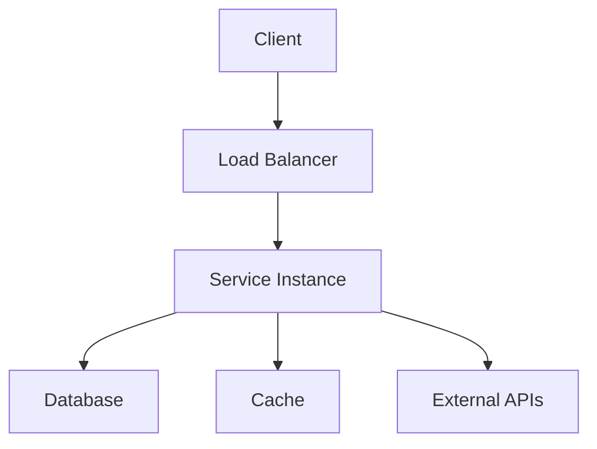

# 📚 SERVICE DOCUMENTATION TEMPLATE

**Version**: [X.Y.Z]  
**Port**: [XXXX]  
**Status**: ✅ OPERATIONAL | 🔧 DEVELOPMENT | ⚠️ MAINTENANCE | ❌ DOWN  
**Performance**: [Key performance metrics]  
**Dependencies**: [List of dependencies]  
**Last Updated**: [Date]

---

## 🎯 Executive Summary

[2-3 sentences describing the service purpose, main capabilities, and business value]

### Service Capabilities:
- ✅ [Primary capability 1]
- ✅ [Primary capability 2] 
- ✅ [Primary capability 3]
- ✅ [Additional capabilities as needed]

### Key Features:
- **[Feature Name]**: [Brief description]
- **[Feature Name]**: [Brief description]
- **[Feature Name]**: [Brief description]

---

## 🏗️ Architecture Overview

### System Architecture
[High-level architecture description with system context]



### Technology Stack:
- **Runtime**: [e.g., Node.js 20+, Python 3.11+]
- **Framework**: [e.g., Express.js, FastAPI, Next.js]
- **Database**: [e.g., PostgreSQL, MongoDB, Redis]
- **Authentication**: [e.g., JWT, OAuth 2.0, API Keys]
- **Monitoring**: [e.g., Prometheus, Grafana]

### Data Flow:
1. **Input Processing**: [How data enters the system]
2. **Business Logic**: [Core processing and transformations]
3. **Data Storage**: [How data is persisted]
4. **Output Generation**: [How results are returned]

---

## 🚀 Getting Started

### Prerequisites:
- [List required software, versions, accounts]
- [Environment requirements]
- [Access permissions needed]

### Installation:

#### Development Environment:
```bash
# Clone repository
git clone [repository-url]
cd [service-directory]

# Install dependencies
npm install  # or yarn install, pip install -r requirements.txt

# Configure environment
cp .env.example .env
# Edit .env with your configuration

# Start development server
npm run dev  # or appropriate start command
```

#### Production Deployment:
```bash
# Build application
npm run build

# Start production server
npm start

# Or use Docker
docker build -t [service-name] .
docker run -p [port]:[port] [service-name]
```

---

## 🔧 Configuration

### Environment Variables:
| Variable | Required | Default | Description |
|----------|----------|---------|-------------|
| `PORT` | No | [default] | Service port number |
| `DATABASE_URL` | Yes | - | Database connection string |
| `API_KEY` | Yes | - | External API authentication |
| `LOG_LEVEL` | No | `info` | Logging level (debug, info, warn, error) |

### Configuration Files:
```yaml
# config.yaml example
service:
  name: [service-name]
  port: [port]
  environment: [development|production]

database:
  host: [host]
  port: [port]
  name: [database-name]
  
security:
  jwt_secret: [secret]
  rate_limit: [requests-per-minute]
```

### Feature Flags:
- `ENABLE_[FEATURE]`: [Description of feature toggle]
- `USE_CACHE`: [Enable/disable caching]
- `DEBUG_MODE`: [Enable detailed logging]

---

## 🔌 API Reference

### Base Information:
- **Base URL**: `http://localhost:[port]` (dev) | `https://[production-url]` (prod)
- **API Version**: v[X]
- **Authentication**: [Bearer token | API Key | OAuth]
- **Content Type**: `application/json`

### Core Endpoints:

#### Health Check
```http
GET /health
```
**Response:**
```json
{
  "status": "healthy",
  "timestamp": "2025-07-22T10:00:00Z",
  "version": "1.0.0",
  "uptime": "24h 15m 30s"
}
```

#### Main Resource Endpoints

#### `GET /api/v1/[resource]`
**Description**: [Endpoint description]

**Parameters:**
| Parameter | Type | Required | Description |
|-----------|------|----------|-------------|
| `id` | string | No | Resource identifier |
| `limit` | number | No | Number of results (default: 10) |
| `offset` | number | No | Pagination offset (default: 0) |

**Request Example:**
```javascript
const response = await fetch('/api/v1/[resource]?limit=20&offset=0', {
  headers: {
    'Authorization': 'Bearer [token]',
    'Content-Type': 'application/json'
  }
});
```

**Success Response (200):**
```json
{
  "data": [
    {
      "id": "[id]",
      "name": "[name]",
      "created_at": "2025-07-22T10:00:00Z"
    }
  ],
  "meta": {
    "total": 100,
    "limit": 20,
    "offset": 0
  }
}
```

**Error Responses:**
| Status Code | Description | Example Response |
|-------------|-------------|------------------|
| 400 | Bad Request | `{"error": "Invalid parameter", "code": "INVALID_PARAM"}` |
| 401 | Unauthorized | `{"error": "Authentication required", "code": "AUTH_REQUIRED"}` |
| 403 | Forbidden | `{"error": "Insufficient permissions", "code": "FORBIDDEN"}` |
| 404 | Not Found | `{"error": "Resource not found", "code": "NOT_FOUND"}` |
| 500 | Internal Server Error | `{"error": "Internal server error", "code": "INTERNAL_ERROR"}` |

### Authentication:
```javascript
// Example authentication
const token = await authenticateUser(username, password);
const headers = {
  'Authorization': `Bearer ${token}`,
  'Content-Type': 'application/json'
};
```

### Rate Limiting:
- **Rate Limit**: [X] requests per [time period]
- **Headers**: `X-RateLimit-Limit`, `X-RateLimit-Remaining`, `X-RateLimit-Reset`

---

## 📊 Performance Metrics

### Current Performance:
| Metric | Value | Target | Status |
|--------|-------|--------|--------|
| Average Response Time | [X]ms | <[Y]ms | ✅ Met |
| 95th Percentile Response Time | [X]ms | <[Y]ms | ✅ Met |
| Uptime | [X]% | >99.9% | ✅ Met |
| Error Rate | [X]% | <0.1% | ✅ Met |
| Throughput | [X] RPS | >[Y] RPS | ✅ Met |

### Performance Benchmarks:
```yaml
Load Test Results:
  concurrent_users: [number]
  requests_per_second: [number]
  average_response_time: [X]ms
  error_rate: [X]%
  
Resource Usage:
  cpu_usage: [X]%
  memory_usage: [X]MB
  disk_usage: [X]GB
  network_io: [X]MB/s
```

### Scalability:
- **Horizontal Scaling**: [Supports load balancing and multiple instances]
- **Vertical Scaling**: [Resource requirements for scaling up]
- **Auto-scaling**: [Triggers and thresholds for automatic scaling]

---

## 🔒 Security

### Security Features:
- **Authentication**: [JWT tokens, OAuth 2.0, API keys]
- **Authorization**: [Role-based access control, permissions]
- **Encryption**: [TLS 1.3, data encryption at rest]
- **Input Validation**: [Request sanitization, SQL injection protection]
- **Rate Limiting**: [DDoS protection, API abuse prevention]

### Security Configuration:
```yaml
security:
  tls:
    enabled: true
    version: "1.3"
  
  cors:
    origins: ["https://allowed-domain.com"]
    methods: ["GET", "POST", "PUT", "DELETE"]
  
  headers:
    - "X-Frame-Options: DENY"
    - "X-Content-Type-Options: nosniff"
    - "X-XSS-Protection: 1; mode=block"
```

### Compliance:
- **Data Privacy**: [GDPR, CCPA compliance measures]
- **Industry Standards**: [SOC 2, ISO 27001, specific industry requirements]
- **Audit Logging**: [Security event logging and monitoring]

---

## 📈 Monitoring and Alerting

### Health Checks:
```bash
# Health check endpoint
curl http://localhost:[port]/health

# Deep health check (includes dependencies)
curl http://localhost:[port]/health?deep=true
```

### Metrics Collection:
```yaml
Prometheus Metrics:
  - http_requests_total: Total HTTP requests
  - http_request_duration_seconds: Request duration histogram
  - service_up: Service availability (1 = up, 0 = down)
  - database_connections: Active database connections
  
Custom Business Metrics:
  - [business_specific_metric]: Description
  - [performance_metric]: Description
```

### Alerting Rules:
- **High Error Rate**: Alert when error rate > [X]% for [Y] minutes
- **High Response Time**: Alert when 95th percentile > [X]ms for [Y] minutes  
- **Service Down**: Alert when health check fails
- **Resource Usage**: Alert when CPU > [X]% or Memory > [Y]% for [Z] minutes

### Dashboards:
- **Operational Dashboard**: Real-time service health and performance
- **Business Dashboard**: Key business metrics and KPIs
- **Infrastructure Dashboard**: System resource utilization

---

## 🐛 Troubleshooting

### Common Issues:

#### Issue: Service Won't Start
**Symptoms**: 
- Service fails to start
- Port binding errors
- Database connection failures

**Solutions**:
1. Check environment variables are set correctly
2. Verify database is running and accessible
3. Ensure port is not already in use
4. Check application logs for specific error messages

**Commands**:
```bash
# Check if port is in use
netstat -tulpn | grep :[port]

# Check database connectivity
npm run db:check  # or equivalent command

# View recent logs
npm run logs:tail  # or docker logs [container]
```

#### Issue: High Response Times
**Symptoms**:
- API responses taking longer than expected
- User complaints about slow performance
- High resource utilization

**Solutions**:
1. Check database query performance
2. Review cache hit rates
3. Analyze application logs for bottlenecks
4. Consider scaling resources

**Diagnostic Commands**:
```bash
# Check resource usage
top -p [process-id]

# Analyze slow queries (if database-related)
# [Database-specific commands]

# Check cache metrics
curl http://localhost:[port]/metrics | grep cache
```

#### Issue: Authentication Failures
**Symptoms**:
- 401 Unauthorized responses
- JWT token validation errors
- OAuth flow failures

**Solutions**:
1. Verify API keys/tokens are current
2. Check token expiration times
3. Validate JWT signing keys
4. Review authentication configuration

### Log Analysis:
```bash
# View recent error logs
grep -i error [log-file] | tail -100

# Monitor logs in real-time
tail -f [log-file] | grep -E "(ERROR|WARN)"

# Parse structured logs (if using JSON logging)
cat [log-file] | jq '.level, .message, .timestamp'
```

### Support Contacts:
- **Development Team**: [team-email]
- **Infrastructure Team**: [infra-email]
- **On-call Support**: [oncall-contact]

---

## 🚀 Deployment

### Deployment Environments:

#### Development:
- **URL**: http://localhost:[port]
- **Database**: Local development database
- **Configuration**: Development settings with debug logging

#### Staging:
- **URL**: https://staging-[service].example.com
- **Database**: Staging database (production-like data)
- **Configuration**: Production-like settings for testing

#### Production:
- **URL**: https://[service].example.com
- **Database**: Production database cluster
- **Configuration**: Production settings with optimizations

### Deployment Process:

#### Manual Deployment:
```bash
# 1. Build application
npm run build

# 2. Run tests
npm test

# 3. Deploy to staging
npm run deploy:staging

# 4. Run integration tests
npm run test:integration

# 5. Deploy to production
npm run deploy:production
```

#### Automated Deployment (CI/CD):
```yaml
# Example GitHub Actions workflow
name: Deploy Service
on:
  push:
    branches: [main]

jobs:
  deploy:
    runs-on: ubuntu-latest
    steps:
      - uses: actions/checkout@v2
      - name: Install dependencies
        run: npm install
      - name: Run tests
        run: npm test
      - name: Build application
        run: npm run build
      - name: Deploy to production
        run: npm run deploy
```

### Rollback Procedures:
```bash
# Quick rollback to previous version
npm run rollback

# Rollback to specific version
npm run rollback --version=[version-number]

# Check rollback status
npm run deployment:status
```

---

## 📋 Dependencies and Integration

### Internal Dependencies:
| Service | Purpose | Criticality | Contact |
|---------|---------|-------------|---------|
| [Service A] | [Purpose] | High/Medium/Low | [Contact] |
| [Service B] | [Purpose] | High/Medium/Low | [Contact] |

### External Dependencies:
| Provider | Service | Purpose | SLA | Fallback |
|----------|---------|---------|-----|----------|
| [Provider] | [Service] | [Purpose] | [SLA] | [Fallback strategy] |

### Integration Patterns:
- **Synchronous**: Direct HTTP API calls for real-time operations
- **Asynchronous**: Message queue processing for non-critical operations
- **Event-driven**: Event publishing/subscription for decoupled communication

### Circuit Breaker Configuration:
```yaml
circuit_breaker:
  failure_threshold: 5
  recovery_timeout: 30s
  half_open_max_calls: 3
```

---

## 📊 Business Impact

### Key Performance Indicators:
- **[Business Metric 1]**: [Current value] (Target: [target])
- **[Business Metric 2]**: [Current value] (Target: [target])
- **[Business Metric 3]**: [Current value] (Target: [target])

### Service Level Agreements:
- **Availability**: [X]% uptime (e.g., 99.9%)
- **Response Time**: [X]ms average response time
- **Error Rate**: <[X]% error rate
- **Data Consistency**: [X]% data accuracy

### Cost Information:
- **Infrastructure Cost**: $[X]/month
- **Operational Cost**: $[X]/month  
- **Development Cost**: $[X]/month
- **Total Cost of Ownership**: $[X]/month

---

## 🔄 Version History and Changelog

### Current Version: [X.Y.Z]
**Release Date**: [Date]
**Changes**:
- [Feature/fix description]
- [Feature/fix description]
- [Feature/fix description]

### Previous Versions:

#### Version [X.Y.Z-1]
**Release Date**: [Date]
**Changes**:
- [Change description]
- [Change description]

#### Version [X.Y.Z-2]
**Release Date**: [Date]
**Changes**:
- [Change description]
- [Change description]

### Upcoming Features:
- **[Feature Name]**: [Description and expected timeline]
- **[Feature Name]**: [Description and expected timeline]

---

## 🎯 Related Resources

### Documentation Links:
- **API Documentation**: [Link to detailed API docs]
- **Architecture Decision Records**: [Link to ADR repository]
- **Runbooks**: [Link to operational procedures]
- **Security Guidelines**: [Link to security documentation]

### Code Repositories:
- **Main Repository**: [GitHub/GitLab link]
- **Configuration Repository**: [Link to config repo]
- **Infrastructure as Code**: [Link to IaC repository]

### External Resources:
- **Framework Documentation**: [Links to framework docs]
- **Third-party Integrations**: [Links to integration guides]
- **Industry Standards**: [Links to relevant standards]

---

## 📞 Support and Contact

### Development Team:
- **Team Lead**: [Name] ([email])
- **Senior Developer**: [Name] ([email])
- **DevOps Engineer**: [Name] ([email])

### Support Channels:
- **Slack Channel**: #[service-name]-support
- **Email**: [support-email]
- **Issue Tracker**: [GitHub issues link]

### On-Call Information:
- **Primary On-Call**: [Contact information]
- **Secondary On-Call**: [Contact information]
- **Escalation Process**: [Description of escalation procedure]

---

## 📋 Documentation Checklist

Use this checklist to ensure documentation completeness:

### Content Completeness:
- [ ] Executive summary clearly explains service purpose
- [ ] Architecture overview with diagrams
- [ ] Complete API documentation with examples
- [ ] Performance metrics and benchmarks included
- [ ] Security features and compliance covered
- [ ] Troubleshooting section with common issues
- [ ] Deployment procedures documented
- [ ] Monitoring and alerting setup explained
- [ ] Dependencies and integrations listed
- [ ] Contact information provided

### Technical Accuracy:
- [ ] All code examples tested and working
- [ ] API endpoints verified and current
- [ ] Configuration examples validated
- [ ] Performance metrics current (within 30 days)
- [ ] Links tested and functional

### Review and Approval:
- [ ] Technical review completed
- [ ] Editorial review completed
- [ ] Final approval received
- [ ] Published to documentation system

---

**Status**: 📋 TEMPLATE - Ready for Implementation  
**Template Version**: 1.0.0  
**Created**: July 22, 2025  
**Last Updated**: [Update when used]  
**Next Review**: [Schedule review date]

*This template provides a comprehensive structure for documenting CODAI ecosystem services. Customize sections as needed while maintaining consistency with the documentation standards.*
