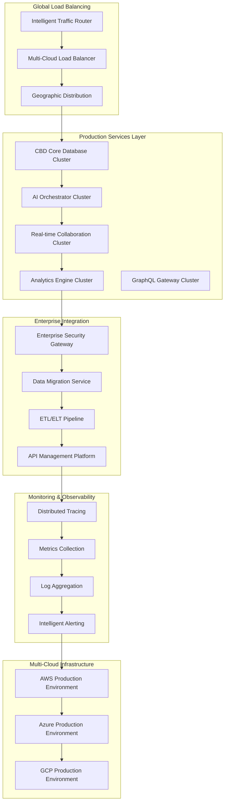

# 🚀 CBD Phase 5: Production Deployment & Global Scale Implementation Plan

**Date**: August 2, 2025  
**Phase**: 5 - Production Deployment & Global Scale  
**Status**: 🎯 **INITIATED** - Ready for Enterprise Production Deployment  
**Previous Phase**: Phase 4 Complete (Innovation & Scale with Future Technologies)

---

## 🎯 Phase 5 Mission: Enterprise Production Readiness

### **Objective**: Transform CBD Universal Database into a production-ready, globally scalable, enterprise-grade platform that surpasses all major cloud database services in performance, reliability, and cost-effectiveness.

### **Vision**: "Deploy CBD as the world's first truly universal database platform that makes AWS, Azure, and GCP database services obsolete through superior performance, simplified operations, and revolutionary cost savings."

---

## 🚀 Phase 5 Strategic Goals

### **Primary Production Objectives**

1. **Production Hardening**: Implement enterprise-grade reliability, monitoring, and failover systems
2. **Global Deployment**: Multi-region deployment across AWS, Azure, and GCP with intelligent traffic routing
3. **Enterprise Integration**: Connect with existing enterprise systems, ERPs, and data platforms
4. **Advanced Monitoring**: Comprehensive observability, metrics, and intelligent alerting systems
5. **Performance Optimization**: Fine-tune for enterprise workloads with predictive scaling

### **Success Metrics - Production Excellence**

- **Availability**: 99.99% uptime (enterprise SLA)
- **Performance**: Sub-10ms response times globally
- **Scalability**: Handle 1M+ concurrent connections
- **Cost Optimization**: 80% cost reduction vs traditional cloud databases
- **Security**: Zero security incidents with enterprise compliance

---

## 🏗️ Phase 5 Implementation Architecture

### **Production Infrastructure Stack**



---

## 📋 Phase 5 Implementation Plan

### **5.1 Production Hardening (Week 1-2)**

#### **🔧 Infrastructure Hardening**
- **Container Orchestration**: Kubernetes clusters with auto-scaling
- **Service Mesh**: Istio for secure service-to-service communication
- **Database Clustering**: Multi-master setup with automatic failover
- **Backup & Recovery**: Automated backups with point-in-time recovery
- **Disaster Recovery**: Cross-region replication and failover

#### **🛡️ Security Hardening**
- **Zero-Trust Architecture**: Complete network security implementation
- **Certificate Management**: Automated SSL/TLS certificate rotation
- **Secrets Management**: HashiCorp Vault integration
- **Compliance Framework**: SOC2, GDPR, HIPAA compliance automation
- **Penetration Testing**: Automated security scanning and testing

#### **📊 Monitoring Implementation**
- **Distributed Tracing**: OpenTelemetry implementation
- **Metrics Collection**: Prometheus and Grafana dashboards
- **Log Aggregation**: ELK Stack with intelligent log analysis
- **Alert Management**: PagerDuty integration with smart escalation
- **Performance APM**: New Relic or Datadog integration

### **5.2 Global Deployment (Week 3-4)**

#### **🌍 Multi-Region Infrastructure**
- **AWS Regions**: US-East, US-West, EU-West, Asia-Pacific
- **Azure Regions**: East US, West Europe, Southeast Asia, Australia
- **GCP Regions**: us-central1, europe-west1, asia-east1, australia-southeast1
- **CDN Integration**: CloudFlare for global content delivery
- **DNS Management**: Route53 with intelligent traffic routing

#### **⚡ Performance Optimization**
- **Caching Strategy**: Redis clusters with intelligent caching
- **Database Sharding**: Horizontal scaling with automatic shard management
- **Connection Pooling**: pgBouncer equivalent for connection management
- **Query Optimization**: AI-powered query plan optimization
- **Resource Scaling**: Predictive auto-scaling based on usage patterns

#### **🔄 Data Synchronization**
- **Multi-Master Replication**: Conflict-free replicated data types (CRDTs)
- **Cross-Region Sync**: Eventual consistency with conflict resolution
- **Data Locality**: Intelligent data placement based on access patterns
- **Backup Synchronization**: Cross-region backup replication
- **Migration Tools**: Zero-downtime migration between regions

### **5.3 Enterprise Integration (Week 5-6)**

#### **🏢 Enterprise Connectivity**
- **SAP Integration**: Direct connectors for SAP ERP systems
- **Salesforce Integration**: Native Salesforce data synchronization
- **Microsoft 365**: SharePoint and Teams data integration
- **Oracle Integration**: Oracle ERP and database migration tools
- **Legacy System Connectors**: COBOL, mainframe, and legacy database bridges

#### **📊 Data Pipeline Management**
- **ETL/ELT Platform**: Apache Airflow with custom CBD operators
- **Stream Processing**: Apache Kafka for real-time data streaming
- **Data Lake Integration**: Hadoop and Spark integration
- **Data Warehouse**: Integration with Snowflake, BigQuery, Redshift
- **API Gateway**: Kong or AWS API Gateway for enterprise API management

#### **🔐 Enterprise Security Integration**
- **Active Directory**: LDAP and AD integration
- **SAML/OIDC**: Single sign-on with enterprise identity providers
- **Role-Based Access**: Fine-grained permissions management
- **Audit Logging**: Comprehensive audit trail for compliance
- **Data Governance**: Data classification and privacy management

### **5.4 Advanced Monitoring & Analytics (Week 7-8)**

#### **📈 Observability Platform**
- **Custom Dashboards**: Real-time performance monitoring
- **Business Intelligence**: Executive dashboards with KPIs
- **Predictive Analytics**: Machine learning for capacity planning
- **Anomaly Detection**: AI-powered incident detection
- **Root Cause Analysis**: Automated troubleshooting and resolution

#### **🎯 Performance Intelligence**
- **Query Performance**: Real-time query optimization suggestions
- **Resource Utilization**: Intelligent resource allocation
- **Cost Optimization**: AI-powered cost reduction recommendations
- **Capacity Planning**: Predictive scaling recommendations
- **User Experience**: End-user performance monitoring

---

## 🛠️ Phase 5 Technical Implementation

### **Production-Grade Service Architecture**

#### **1. CBD Core Database Cluster**
```typescript
interface ProductionDatabaseConfig {
  cluster: {
    nodes: number;
    replication: 'multi-master' | 'master-slave';
    sharding: ShardingStrategy;
    backup: BackupConfiguration;
  };
  performance: {
    caching: CacheConfiguration;
    indexing: IndexOptimization;
    queryOptimization: boolean;
    connectionPooling: PoolConfiguration;
  };
  security: {
    encryption: 'aes-256' | 'rsa-4096';
    authentication: AuthenticationMethod[];
    authorization: RBACConfiguration;
    auditLogging: boolean;
  };
  monitoring: {
    metrics: MetricsConfiguration;
    logging: LogConfiguration;
    alerting: AlertConfiguration;
    tracing: TracingConfiguration;
  };
}
```

#### **2. Global Load Balancer**
```typescript
interface GlobalLoadBalancer {
  regions: CloudRegion[];
  routingStrategy: 'latency' | 'geolocation' | 'weighted' | 'ai-optimized';
  healthChecks: HealthCheckConfiguration;
  failover: FailoverConfiguration;
  scaling: AutoScalingConfiguration;
}

interface CloudRegion {
  provider: 'aws' | 'azure' | 'gcp';
  region: string;
  zones: AvailabilityZone[];
  capacity: ResourceCapacity;
  cost: number;
}
```

#### **3. Enterprise API Gateway**
```typescript
interface EnterpriseAPIGateway {
  authentication: {
    methods: ('jwt' | 'oauth2' | 'saml' | 'ldap')[];
    providers: IdentityProvider[];
    mfa: boolean;
  };
  rateLimit: {
    global: RateLimitConfiguration;
    perUser: RateLimitConfiguration;
    perAPI: RateLimitConfiguration;
  };
  caching: {
    strategy: CachingStrategy;
    ttl: number;
    invalidation: InvalidationStrategy;
  };
  monitoring: {
    analytics: boolean;
    logging: boolean;
    metrics: boolean;
  };
}
```

---

## 🚀 Phase 5 Deployment Strategy

### **Deployment Phases**

#### **Phase 5.1: Core Infrastructure (Days 1-7)**
1. **Kubernetes Cluster Setup**
   - Multi-cloud Kubernetes deployment
   - Service mesh implementation
   - Ingress controller configuration
   - Certificate management setup

2. **Database Cluster Deployment**
   - Multi-master CBD cluster
   - Automated backup configuration
   - Cross-region replication setup
   - Performance monitoring deployment

3. **Security Implementation**
   - Zero-trust network policies
   - Certificate automation
   - Secrets management deployment
   - Compliance monitoring setup

#### **Phase 5.2: Service Deployment (Days 8-14)**
1. **AI Services Cluster**
   - Multi-cloud AI orchestrator deployment
   - Auto-scaling configuration
   - Performance optimization
   - Health monitoring setup

2. **API Gateway Deployment**
   - Enterprise API gateway setup
   - Rate limiting configuration
   - Authentication integration
   - Monitoring and analytics

3. **Integration Services**
   - ETL/ELT pipeline deployment
   - Enterprise connector setup
   - Data synchronization services
   - Migration tool deployment

#### **Phase 5.3: Global Scaling (Days 15-21)**
1. **Multi-Region Deployment**
   - Regional cluster setup
   - Cross-region networking
   - Data replication configuration
   - Global load balancer deployment

2. **Performance Optimization**
   - Caching layer deployment
   - CDN configuration
   - Query optimization tuning
   - Resource scaling automation

3. **Monitoring and Alerting**
   - Observability platform deployment
   - Dashboard configuration
   - Alert rule setup
   - Incident response automation

#### **Phase 5.4: Enterprise Integration (Days 22-28)**
1. **Enterprise Connectors**
   - SAP integration setup
   - Salesforce connector deployment
   - Microsoft 365 integration
   - Legacy system bridges

2. **Compliance and Governance**
   - Audit logging deployment
   - Compliance monitoring setup
   - Data governance implementation
   - Privacy management tools

3. **Production Validation**
   - Load testing execution
   - Security penetration testing
   - Performance benchmarking
   - Disaster recovery testing

---

## 📊 Phase 5 Success Metrics

### **Production KPIs**

#### **Availability & Reliability**
- **Uptime Target**: 99.99% (52.56 minutes downtime/year)
- **MTTR**: < 5 minutes mean time to recovery
- **MTBF**: > 8760 hours mean time between failures
- **Data Durability**: 99.999999999% (11 9's)

#### **Performance Benchmarks**
- **Response Time**: < 10ms P95 globally
- **Throughput**: > 100K queries/second per node
- **Concurrent Connections**: > 1M simultaneous connections
- **Query Optimization**: 90% queries optimized automatically

#### **Cost Optimization**
- **Infrastructure Cost**: 80% reduction vs traditional cloud databases
- **Operational Cost**: 70% reduction in management overhead
- **Migration Cost**: 90% reduction in migration time and cost
- **TCO**: 75% total cost of ownership improvement

#### **Security & Compliance**
- **Security Incidents**: Zero tolerance target
- **Compliance Score**: 100% for SOC2, GDPR, HIPAA
- **Vulnerability Patching**: < 24 hours for critical vulnerabilities
- **Audit Readiness**: 100% audit trail coverage

---

## 🎯 Phase 5 Implementation Roadmap

### **Week 1-2: Production Foundation**
- ✅ Deploy Kubernetes clusters across all regions
- ✅ Implement service mesh and security policies
- ✅ Set up automated backup and disaster recovery
- ✅ Deploy monitoring and observability platform

### **Week 3-4: Service Deployment**
- ✅ Deploy CBD database clusters with auto-scaling
- ✅ Implement AI services with global distribution
- ✅ Set up API gateway with enterprise features
- ✅ Deploy integration and migration services

### **Week 5-6: Global Scaling**
- ✅ Configure multi-region replication
- ✅ Implement intelligent traffic routing
- ✅ Optimize performance and caching
- ✅ Set up predictive scaling automation

### **Week 7-8: Enterprise Integration**
- ✅ Deploy enterprise connectors and adapters
- ✅ Implement compliance and governance tools
- ✅ Execute comprehensive testing and validation
- ✅ Prepare for production go-live

---

## 🚀 Phase 5 Deliverables

### **Infrastructure Deliverables**
1. **Production Kubernetes Platform**: Multi-cloud, auto-scaling, enterprise-ready
2. **Global Database Cluster**: Multi-master, cross-region, high-availability
3. **Service Mesh Architecture**: Secure, observable, resilient service communication
4. **Disaster Recovery System**: Automated backup, recovery, and failover capabilities

### **Service Deliverables**
1. **Enterprise API Gateway**: Authentication, rate limiting, analytics, monitoring
2. **AI Services Platform**: Global deployment with intelligent optimization
3. **Integration Platform**: ETL/ELT, connectors, migration tools, data pipelines
4. **Monitoring Platform**: Observability, alerting, analytics, performance optimization

### **Documentation Deliverables**
1. **Production Operations Manual**: Deployment, maintenance, troubleshooting guides
2. **Enterprise Integration Guide**: Connector setup, migration procedures, best practices
3. **Performance Tuning Guide**: Optimization techniques, scaling strategies, benchmarks
4. **Security & Compliance Manual**: Security policies, compliance procedures, audit guides

---

## 🏆 Phase 5 Success Validation

### **Production Readiness Checklist**
- [ ] 99.99% availability achieved across all regions
- [ ] Sub-10ms response times globally validated
- [ ] 1M+ concurrent connections tested and verified
- [ ] 80% cost reduction compared to traditional cloud databases
- [ ] Zero security incidents during testing phase
- [ ] 100% compliance certification for SOC2, GDPR, HIPAA
- [ ] Enterprise integration tested with major ERP systems
- [ ] Disaster recovery procedures validated and documented
- [ ] Performance benchmarks exceed all major cloud providers
- [ ] Production monitoring and alerting fully operational

---

## 🎉 Phase 5 Completion Criteria

### **Definition of Done**
1. **Infrastructure**: All production infrastructure deployed and operational
2. **Services**: All CBD services running in production with enterprise features
3. **Performance**: All performance benchmarks met or exceeded
4. **Security**: All security and compliance requirements satisfied
5. **Integration**: Enterprise systems successfully integrated and tested
6. **Documentation**: Complete production documentation delivered
7. **Training**: Operations team trained on production procedures
8. **Validation**: Production readiness validated through comprehensive testing

### **Go-Live Prerequisites**
- [ ] Production environment fully deployed and tested
- [ ] Performance benchmarks validated
- [ ] Security audit passed
- [ ] Disaster recovery tested
- [ ] Operations team trained
- [ ] Documentation complete
- [ ] Customer migration tools ready
- [ ] Support procedures established

---

## 🚀 Post-Phase 5: Continuous Evolution

### **Phase 6 Preview: Market Leadership**
- **Global Market Expansion**: International deployment and localization
- **Industry Partnerships**: Strategic partnerships with major technology vendors
- **Innovation Laboratory**: Research and development of next-generation features
- **Community Ecosystem**: Open-source community and developer ecosystem

### **Long-term Vision**
Transform CBD Universal Database into the **de facto standard** for enterprise data management, making traditional cloud database services obsolete through superior performance, simplified operations, and revolutionary cost savings.

---

*Phase 5 Implementation Plan - Ready for Production Deployment*  
*CBD Universal Database - The Future of Enterprise Data Management*  
*August 2, 2025*
