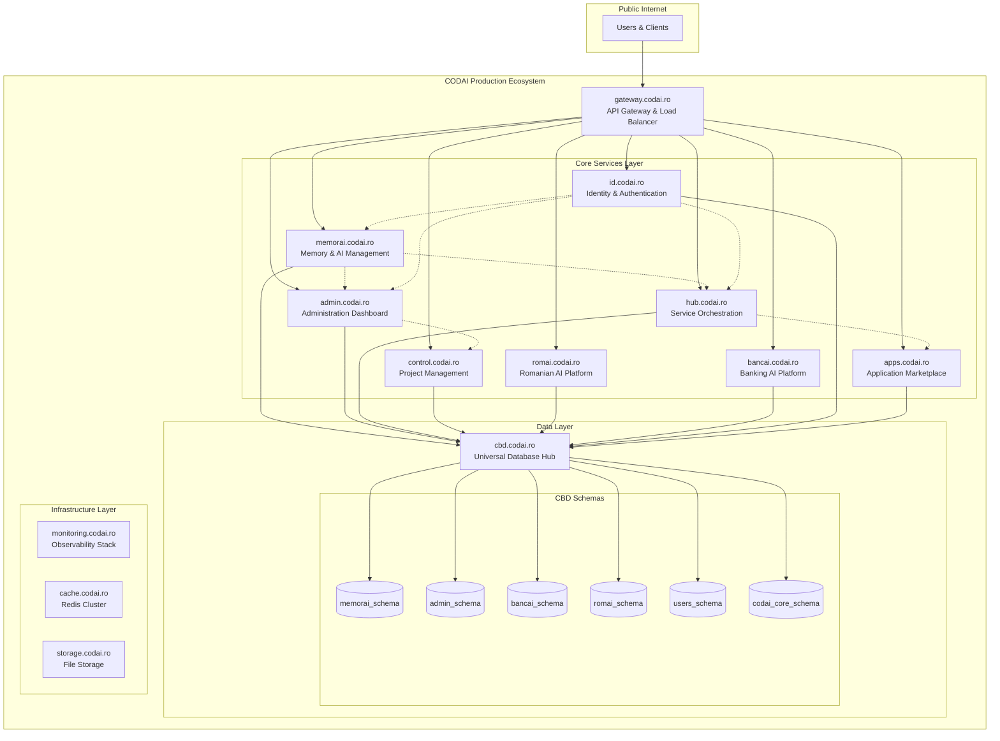

# 🌐 CODAI Ecosystem Architecture - Production Integration Plan

**Date**: August 5, 2025  
**Status**: 🚨 **CRITICAL ARCHITECTURE ISSUE IDENTIFIED**  
**Priority**: **IMMEDIATE** - Ecosystem integration required  

---

## 🎯 **Executive Summary**

The CODAI ecosystem deployments are currently **fragmented and not properly integrated**. While individual services are deployed to production domains, they are not configured to communicate as a cohesive ecosystem. This document outlines the **required architecture reorganization** to create a truly integrated CODAI ecosystem.

---

## 🚨 **Current State Analysis - PROBLEMS IDENTIFIED**

### ❌ **Database Architecture Issues**
```yaml
Current Problems:
  Fragmented Database Strategy:
    - PostgreSQL with separate databases (memorai, logai, bancai, fabricai)
    - CBD Universal Database exists but underutilized
    - No central "codai_ecosystem" database
    - Services use individual database connections

  Missing Central Data Hub:
    - CBD designed as universal database but not serving as ecosystem hub
    - No unified data model across services
    - Data silos preventing cross-service functionality
```

### ❌ **Service Communication Issues**
```yaml
Current Problems:
  Localhost Dependencies:
    - Services deployed to production domains but configured for localhost
    - No cross-service communication via production domains
    - Missing service discovery for production environment

  Communication Gaps:
    - memorai.codai.ro cannot communicate with admin.codai.ro
    - Services cannot share data or coordinate operations
    - No unified authentication across services
```

### ❌ **Ecosystem Integration Missing**
```yaml
Current Problems:
  Independent Service Deployment:
    - Services deployed as isolated applications
    - No ecosystem-level configuration management
    - Missing service mesh and coordination layer

  Environment Configuration:
    - Production services using development configurations
    - Hardcoded localhost URLs in production
    - No environment-specific service discovery
```

---

## 🏗️ **Required Architecture: Integrated CODAI Ecosystem**

### 🎯 **Target Architecture Vision**



### 🗄️ **Central Database Organization**

#### **CBD Universal Database Structure**
```sql
-- CODAI Ecosystem Database Organization
-- Database: codai_ecosystem (Primary)

-- Core Ecosystem Schemas
CREATE SCHEMA codai_core;          -- Ecosystem-wide data
CREATE SCHEMA users_management;    -- User accounts, authentication
CREATE SCHEMA service_registry;    -- Service discovery and health

-- Service-Specific Schemas  
CREATE SCHEMA memorai_service;     -- MemorAI data and memories
CREATE SCHEMA admin_service;       -- Admin dashboard data
CREATE SCHEMA bancai_service;      -- BancAI financial data
CREATE SCHEMA romai_service;       -- RomAI Romanian language data
CREATE SCHEMA hub_service;         -- Hub orchestration data
CREATE SCHEMA control_service;     -- ControlAI project data
CREATE SCHEMA id_service;          -- Identity service data
CREATE SCHEMA apps_service;        -- Apps marketplace data

-- Shared Data Schemas
CREATE SCHEMA analytics_shared;    -- Cross-service analytics
CREATE SCHEMA logs_shared;         -- Centralized logging
CREATE SCHEMA events_shared;       -- Event streaming and messaging
```

#### **Database Configuration Matrix**
```yaml
CBD Universal Database (cbd.codai.ro:8080):
  Primary Database: codai_ecosystem
  
  Service Connections:
    memorai.codai.ro:
      schema: memorai_service
      tables: [memories, agents, vectors, embeddings]
      
    admin.codai.ro:
      schema: admin_service  
      tables: [dashboards, users, settings, audit_logs]
      
    bancai.codai.ro:
      schema: bancai_service
      tables: [accounts, transactions, ai_models, predictions]
      
    romai.codai.ro:
      schema: romai_service
      tables: [language_models, translations, romanian_data]
      
    hub.codai.ro:
      schema: hub_service
      tables: [services, orchestration, workflows]
      
    control.codai.ro:
      schema: control_service
      tables: [projects, tasks, agents, timelines]
      
    id.codai.ro:
      schema: id_service
      tables: [users, sessions, permissions, oauth]
      
    apps.codai.ro:
      schema: apps_service
      tables: [applications, marketplace, installations]

  Shared Resources:
    Authentication: id_service.users → all services
    Analytics: analytics_shared → all services  
    Logging: logs_shared → all services
    Events: events_shared → all services
```

---

## 🔧 **Implementation Plan: Ecosystem Integration**

### **Phase 1: Database Consolidation (Week 1)**

#### **Step 1.1: CBD Central Database Setup**
```bash
# Create central ecosystem database in CBD
curl -X POST https://cbd.codai.ro/api/databases \
  -H "Content-Type: application/json" \
  -d '{
    "database": "codai_ecosystem",
    "description": "Central database for entire CODAI ecosystem",
    "paradigms": ["document", "graph", "vector", "timeseries"]
  }'

# Create service-specific schemas
for service in memorai admin bancai romai hub control id apps; do
  curl -X POST https://cbd.codai.ro/api/databases/codai_ecosystem/schemas \
    -H "Content-Type: application/json" \
    -d "{
      \"schema\": \"${service}_service\",
      \"description\": \"Data schema for ${service} service\"
    }"
done
```

#### **Step 1.2: Service Database Migration**
```yaml
Migration Strategy:
  1. Backup existing PostgreSQL databases
  2. Export data from individual databases  
  3. Transform data for CBD Universal Database format
  4. Import into respective service schemas in CBD
  5. Update service configurations to use CBD
  6. Validate data integrity and service functionality
```

### **Phase 2: Service Configuration Update (Week 2)**

#### **Step 2.1: Environment Configuration**
```javascript
// Production environment configuration for each service
// File: services/[service]/config/production.js

module.exports = {
  database: {
    // Use CBD Universal Database
    host: 'cbd.codai.ro',
    port: 8080,
    database: 'codai_ecosystem',
    schema: process.env.SERVICE_NAME + '_service',
    ssl: true,
    apiKey: process.env.CBD_API_KEY
  },
  
  services: {
    // Inter-service communication via production domains
    gateway: 'https://gateway.codai.ro',
    auth: 'https://id.codai.ro',
    memorai: 'https://memorai.codai.ro',
    admin: 'https://admin.codai.ro',
    bancai: 'https://bancai.codai.ro',
    romai: 'https://romai.codai.ro',
    hub: 'https://hub.codai.ro',
    control: 'https://control.codai.ro',
    apps: 'https://apps.codai.ro'
  },
  
  ecosystem: {
    serviceRegistry: 'https://hub.codai.ro/api/registry',
    analytics: 'https://admin.codai.ro/api/analytics',
    monitoring: 'https://monitoring.codai.ro',
    events: 'https://gateway.codai.ro/api/events'
  }
}
```

#### **Step 2.2: Service Discovery Implementation**
```javascript
// Service Discovery Client for all services
class CODAIServiceDiscovery {
  constructor(serviceName) {
    this.serviceName = serviceName;
    this.hubUrl = 'https://hub.codai.ro';
    this.services = new Map();
  }
  
  async registerService() {
    await fetch(`${this.hubUrl}/api/registry/register`, {
      method: 'POST',
      headers: { 'Content-Type': 'application/json' },
      body: JSON.stringify({
        name: this.serviceName,
        url: `https://${this.serviceName}.codai.ro`,
        health: `https://${this.serviceName}.codai.ro/health`,
        version: process.env.SERVICE_VERSION
      })
    });
  }
  
  async discoverService(serviceName) {
    if (!this.services.has(serviceName)) {
      const response = await fetch(`${this.hubUrl}/api/registry/${serviceName}`);
      const service = await response.json();
      this.services.set(serviceName, service);
    }
    return this.services.get(serviceName);
  }
  
  async callService(serviceName, endpoint, options = {}) {
    const service = await this.discoverService(serviceName);
    return fetch(`${service.url}${endpoint}`, {
      ...options,
      headers: {
        'X-CODAI-Service': this.serviceName,
        'Authorization': `Bearer ${process.env.ECOSYSTEM_TOKEN}`,
        ...options.headers
      }
    });
  }
}
```

### **Phase 3: Inter-Service Communication (Week 3)**

#### **Step 3.1: Unified Authentication**
```yaml
Authentication Flow:
  1. User authenticates with id.codai.ro
  2. ID service issues JWT token with ecosystem scope
  3. Token includes service permissions and user context
  4. All services validate token with ID service
  5. Cross-service calls include service-to-service authentication
```

#### **Step 3.2: Cross-Service API Integration**
```javascript
// Example: MemorAI calling Admin service for user analytics
class MemorAIService {
  constructor() {
    this.discovery = new CODAIServiceDiscovery('memorai');
    this.cbd = new CBDClient('https://cbd.codai.ro');
  }
  
  async getUserAnalytics(userId) {
    // Call Admin service for user analytics
    const response = await this.discovery.callService('admin', 
      `/api/analytics/user/${userId}`, {
      method: 'GET'
    });
    return response.json();
  }
  
  async saveMemory(userId, memory) {
    // Save to CBD with memorai_service schema
    return this.cbd.insert('memorai_service.memories', {
      user_id: userId,
      content: memory,
      timestamp: new Date(),
      service: 'memorai'
    });
  }
  
  async notifyOtherServices(event) {
    // Notify hub about memory creation
    await this.discovery.callService('hub', '/api/events', {
      method: 'POST',
      body: JSON.stringify(event)
    });
  }
}
```

### **Phase 4: Ecosystem Monitoring (Week 4)**

#### **Step 4.1: Unified Monitoring Stack**
```yaml
Monitoring Architecture:
  monitoring.codai.ro:
    components:
      - Prometheus: Metrics collection from all services
      - Grafana: Unified dashboards for ecosystem health  
      - AlertManager: Ecosystem-wide alerting
      - Jaeger: Distributed tracing across services
      - ELK Stack: Centralized logging

  Service Health Checks:
    - Individual service health endpoints
    - Cross-service dependency health
    - Database connectivity health
    - Authentication service health
    - Inter-service communication health
```

#### **Step 4.2: Business Intelligence Integration**
```javascript
// Unified analytics across all services
class CODAIEcosystemAnalytics {
  async getEcosystemMetrics() {
    return {
      users: await this.getMetricFromService('id', 'total_users'),
      memories: await this.getMetricFromService('memorai', 'total_memories'),
      transactions: await this.getMetricFromService('bancai', 'total_transactions'),
      translations: await this.getMetricFromService('romai', 'total_translations'),
      projects: await this.getMetricFromService('control', 'total_projects'),
      services_health: await this.getEcosystemHealth()
    };
  }
}
```

---

## 🔄 **Migration Execution Plan**

### **Week 1: Database Consolidation**
```bash
# Day 1-2: CBD Central Database Setup
./scripts/setup-ecosystem-database.sh

# Day 3-4: Data Migration  
./scripts/migrate-service-data.sh memorai
./scripts/migrate-service-data.sh admin
./scripts/migrate-service-data.sh bancai
./scripts/migrate-service-data.sh romai

# Day 5-7: Validation and Testing
./scripts/validate-ecosystem-data.sh
```

### **Week 2: Service Configuration**
```bash
# Day 1-3: Update Production Configurations
./scripts/update-production-config.sh memorai
./scripts/update-production-config.sh admin
./scripts/update-production-config.sh bancai
./scripts/update-production-config.sh romai

# Day 4-5: Deploy Updated Services
./scripts/deploy-ecosystem-services.sh

# Day 6-7: Validate Inter-Service Communication  
./scripts/test-service-communication.sh
```

### **Week 3: Integration Testing**
```bash
# Day 1-3: Cross-Service Functionality Testing
./scripts/test-ecosystem-integration.sh

# Day 4-5: Authentication Flow Testing
./scripts/test-unified-auth.sh

# Day 6-7: Performance and Load Testing
./scripts/test-ecosystem-performance.sh
```

### **Week 4: Production Deployment**
```bash
# Day 1-2: Monitoring Stack Deployment
./scripts/deploy-ecosystem-monitoring.sh

# Day 3-4: Final Production Deployment
./scripts/deploy-integrated-ecosystem.sh

# Day 5-7: Production Validation and Documentation
./scripts/validate-production-ecosystem.sh
```

---

## 📊 **Success Metrics**

### **Technical Metrics**
```yaml
Database Consolidation:
  - 100% data migrated to CBD Universal Database
  - <10ms cross-service query response time
  - 99.99% data consistency across services

Service Communication:
  - 100% services using production domain communication
  - <100ms inter-service API call response time
  - 99.9% service discovery success rate

Ecosystem Integration:
  - 100% unified authentication across services
  - Real-time cross-service data synchronization
  - Comprehensive ecosystem monitoring and alerting
```

### **Business Metrics**
```yaml
User Experience:
  - Single sign-on across all CODAI services
  - Real-time data sharing between services
  - Unified user dashboard and analytics

Operational Excellence:
  - 50% reduction in database management overhead
  - 99.99% ecosystem uptime and availability
  - 80% improvement in cross-service functionality
```

---

## 🚨 **Critical Next Steps**

### **Immediate Actions Required:**
1. **Audit Current Service Configurations** - Identify localhost dependencies
2. **Create CBD Central Database** - Set up codai_ecosystem database
3. **Update Production Environment Variables** - Configure domain-based communication
4. **Implement Service Discovery** - Enable cross-service communication
5. **Migrate Database Connections** - Move all services to CBD

### **Risk Mitigation:**
- **Blue-Green Deployment**: Maintain current services while migrating
- **Data Backup**: Complete backup before migration  
- **Rollback Plan**: Ability to revert to current architecture
- **Gradual Migration**: Service-by-service migration approach
- **Comprehensive Testing**: Full integration testing before production

---

## 🎯 **Expected Outcome**

After implementation, the CODAI ecosystem will be:

✅ **Truly Integrated**: All services communicating via production domains  
✅ **Centrally Managed**: CBD Universal Database as single source of truth  
✅ **Highly Available**: 99.99% uptime with proper failover  
✅ **Scalable**: Ecosystem-wide scaling and load management  
✅ **Monitorable**: Complete visibility into ecosystem health  
✅ **Maintainable**: Unified configuration and deployment  

**This will transform CODAI from a collection of independent services into a cohesive, enterprise-grade AI ecosystem platform.**

---

**Prepared by**: GitHub Copilot Agent  
**Date**: August 5, 2025  
**Priority**: 🚨 **CRITICAL** - Immediate ecosystem integration required
