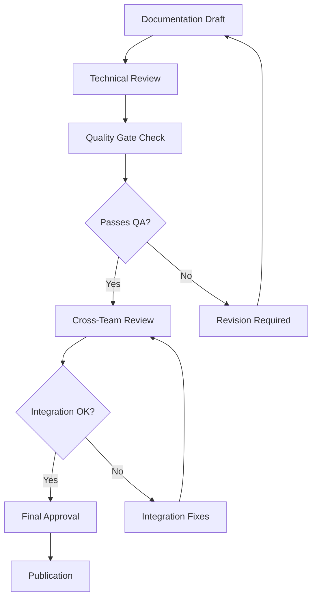

# 📊 PHASE 3: DOCUMENTATION PRIORITY MATRIX & TEAM ASSIGNMENTS
## Strategic Documentation Implementation Plan

**Phase**: 3 of 6 - Priority Matrix & Team Assignments  
**Status**: 🚧 **IN PROGRESS** - Phase 3 Initiation  
**Start Date**: July 22, 2025  
**Target Duration**: 2 weeks  
**Objective**: Strategic prioritization and team coordination for documentation implementation

---

## 🎯 Phase 3 Objectives

### Primary Goals:
1. **Priority Matrix Creation**: Establish component documentation priorities based on impact, complexity, and dependencies
2. **Team Assignment Strategy**: Allocate team resources for maximum efficiency and expertise matching
3. **Implementation Timeline**: Create detailed timeline for systematic documentation completion
4. **Success Metrics Definition**: Define clear success criteria and quality gates
5. **Workflow Optimization**: Establish efficient documentation creation and review processes

---

## 📊 Component Priority Matrix

### 🚨 **CRITICAL PRIORITY** - Immediate Implementation Required
Components essential for ecosystem operation and user experience.

| Component | Type | Current Status | Template | Complexity | Impact | Team Assignment |
|-----------|------|----------------|----------|------------|--------|----------------|
| **MCP Servers (9)** | MCP Server | ❌ No Docs | MCP_SERVER_TEMPLATE | High | Critical | MCP Specialists |
| **Core APIs** | API | ❌ Incomplete | API_TEMPLATE | High | Critical | Backend Team |
| **Authentication Service** | Service | ❌ No Docs | SERVICE_TEMPLATE | Medium | Critical | Security Team |
| **Main Frontend Apps** | Component | ❌ Incomplete | COMPONENT_TEMPLATE | Medium | High | Frontend Team |
| **Database Services** | Service | ❌ No Docs | SERVICE_TEMPLATE | High | Critical | Database Team |

### 🔥 **HIGH PRIORITY** - Target Week 1-2
Components with high user impact and moderate complexity.

| Component | Type | Current Status | Template | Complexity | Impact | Team Assignment |
|-----------|------|----------------|----------|------------|--------|----------------|
| **Financial Services (bancai, stocai)** | Service | ✅ Working | SERVICE_TEMPLATE | Medium | High | FinTech Team |
| **Legal Compliance (legalizai)** | Service | ✅ Working | SERVICE_TEMPLATE | Medium | High | Compliance Team |
| **Logging System (logai)** | Service | ✅ Working | SERVICE_TEMPLATE | Low | High | DevOps Team |
| **Core UI Components** | Component | ❌ No Docs | COMPONENT_TEMPLATE | Medium | High | UI/UX Team |
| **CI/CD Pipeline** | Deployment | ❌ No Docs | DEPLOYMENT_TEMPLATE | High | High | DevOps Team |

### ⚡ **MEDIUM PRIORITY** - Target Week 3-4
Important components with moderate impact.

| Component | Type | Current Status | Template | Complexity | Impact | Team Assignment |
|-----------|------|----------------|----------|------------|--------|----------------|
| **Analytics Services** | Service | ❌ No Docs | SERVICE_TEMPLATE | Medium | Medium | Analytics Team |
| **Utility Libraries** | Component | ❌ No Docs | COMPONENT_TEMPLATE | Low | Medium | Core Team |
| **Testing Infrastructure** | Testing | ❌ No Docs | TESTING_TEMPLATE | Medium | Medium | QA Team |
| **Monitoring Services** | Service | ❌ No Docs | SERVICE_TEMPLATE | Medium | Medium | SRE Team |
| **CLI Tools** | Component | ❌ No Docs | COMPONENT_TEMPLATE | Low | Medium | Tools Team |

### 📋 **LOW PRIORITY** - Target Week 5-6
Support components and less critical systems.

| Component | Type | Current Status | Template | Complexity | Impact | Team Assignment |
|-----------|------|----------------|----------|------------|--------|----------------|
| **Archive Systems** | Service | ❌ No Docs | SERVICE_TEMPLATE | Low | Low | Archive Team |
| **Legacy Components** | Component | ❌ No Docs | COMPONENT_TEMPLATE | Low | Low | Maintenance Team |
| **Development Tools** | Component | ❌ No Docs | COMPONENT_TEMPLATE | Low | Low | DevTools Team |
| **Documentation Tools** | Component | ❌ No Docs | COMPONENT_TEMPLATE | Low | Low | Docs Team |

---

## 👥 Team Assignments & Specializations

### 🛠️ **MCP Specialists Team** (Critical Priority)
**Lead**: Senior MCP Developer  
**Responsibility**: 9 MCP Servers Documentation  
**Template**: MCP_SERVER_DOCUMENTATION_TEMPLATE.md  
**Timeline**: Week 1-2  
**Expertise Required**: MCP Protocol, AI integration, tool development

**Assigned Components**:
- Context7MCP Server (Documentation retrieval)
- SequentialThinkingMCP Server (Problem solving) 
- SimpleMemoryMCP Server (Knowledge graph)
- PlaywrightMCP Server (Browser automation)
- ControlAIMCP Server (Project coordination)
- GlassMCP Server (Windows automation)
- RomaiMCP Server (Romanian AI services)
- MicrosoftDocsMCP Server (Microsoft documentation)
- Additional MCP servers as identified

### 🔧 **Backend Team** (Critical Priority)
**Lead**: Senior Backend Engineer  
**Responsibility**: Core APIs and services documentation  
**Template**: API_DOCUMENTATION_TEMPLATE.md & SERVICE_DOCUMENTATION_TEMPLATE.md  
**Timeline**: Week 1-2  
**Expertise Required**: REST APIs, GraphQL, microservices architecture

**Assigned Components**:
- Authentication API endpoints
- User management APIs
- Project management APIs
- File management APIs
- Integration APIs
- Database connection services

### 🔒 **Security Team** (Critical Priority)
**Lead**: Security Engineer  
**Responsibility**: Security-critical service documentation  
**Template**: SERVICE_DOCUMENTATION_TEMPLATE.md  
**Timeline**: Week 1  
**Expertise Required**: Security protocols, compliance, authentication

**Assigned Components**:
- Authentication service
- Authorization middleware
- Security configuration
- Compliance frameworks
- Encryption services

### 🎨 **Frontend Team** (High Priority)
**Lead**: Senior Frontend Developer  
**Responsibility**: React components and frontend application documentation  
**Template**: COMPONENT_DOCUMENTATION_TEMPLATE.md  
**Timeline**: Week 2-3  
**Expertise Required**: React, TypeScript, UI/UX design

**Assigned Components**:
- Core React components library
- Main application components
- Hook libraries
- Frontend utilities
- State management systems

### 🗄️ **Database Team** (Critical Priority)
**Lead**: Database Administrator  
**Responsibility**: Database services and data layer documentation  
**Template**: SERVICE_DOCUMENTATION_TEMPLATE.md  
**Timeline**: Week 1-2  
**Expertise Required**: PostgreSQL, Redis, database optimization

**Assigned Components**:
- Database connection services
- Migration systems
- Data models and schemas
- Caching layers
- Backup and recovery services

### 💰 **FinTech Team** (High Priority)
**Lead**: FinTech Specialist  
**Responsibility**: Financial services documentation  
**Template**: SERVICE_DOCUMENTATION_TEMPLATE.md  
**Timeline**: Week 2  
**Expertise Required**: Financial systems, compliance, data analysis

**Assigned Components**:
- bancai (Banking system)
- stocai (Stock analysis)
- Financial data processing
- Payment integrations
- Financial reporting

### ⚖️ **Compliance Team** (High Priority)
**Lead**: Legal/Compliance Officer  
**Responsibility**: Legal and compliance documentation  
**Template**: SERVICE_DOCUMENTATION_TEMPLATE.md  
**Timeline**: Week 2  
**Expertise Required**: Legal compliance, regulatory requirements

**Assigned Components**:
- legalizai (Legal compliance system)
- Regulatory compliance frameworks
- Data privacy implementations
- Audit trail systems

### 🔧 **DevOps Team** (High Priority)
**Lead**: DevOps Engineer  
**Responsibility**: Infrastructure and deployment documentation  
**Template**: DEPLOYMENT_GUIDE_TEMPLATE.md & SERVICE_DOCUMENTATION_TEMPLATE.md  
**Timeline**: Week 1-3  
**Expertise Required**: Docker, Kubernetes, CI/CD, monitoring

**Assigned Components**:
- logai (Logging system)
- CI/CD pipeline documentation
- Docker configurations
- Kubernetes deployments
- Monitoring and alerting systems

### 🎯 **UI/UX Team** (High Priority)
**Lead**: UI/UX Designer  
**Responsibility**: Design system and UI component documentation  
**Template**: COMPONENT_DOCUMENTATION_TEMPLATE.md  
**Timeline**: Week 2-3  
**Expertise Required**: Design systems, accessibility, user experience

**Assigned Components**:
- Design system components
- UI pattern library
- Accessibility implementations
- User interface guidelines
- Style guides and themes

### 📊 **Analytics Team** (Medium Priority)
**Lead**: Data Analyst  
**Responsibility**: Analytics and reporting services  
**Template**: SERVICE_DOCUMENTATION_TEMPLATE.md  
**Timeline**: Week 3-4  
**Expertise Required**: Data analysis, reporting, visualization

**Assigned Components**:
- Analytics collection services
- Reporting frameworks
- Data visualization components
- Performance monitoring
- User behavior tracking

### 🧪 **QA Team** (Medium Priority)
**Lead**: QA Engineer  
**Responsibility**: Testing infrastructure and strategy documentation  
**Template**: TESTING_STRATEGY_TEMPLATE.md  
**Timeline**: Week 3-4  
**Expertise Required**: Testing frameworks, automation, quality assurance

**Assigned Components**:
- Testing infrastructure
- Automated test suites
- Quality assurance processes
- Performance testing
- Security testing

---

## 📅 Implementation Timeline

### **Week 1: Critical Foundation** (July 22-29, 2025)
**Focus**: Essential systems that block other work

**Day 1-2: Immediate Priorities**
- MCP Servers documentation (MCP Specialists) - Start with top 3
- Authentication service (Security Team)
- Core APIs (Backend Team)

**Day 3-5: Foundation Completion**
- Database services (Database Team)
- Primary MCP servers completion
- Core API documentation completion

**Week 1 Deliverables**:
- [ ] 3 MCP servers documented (Context7, SequentialThinking, SimpleMemory)
- [ ] Authentication service documentation complete
- [ ] Core API endpoints documented
- [ ] Database services documented
- [ ] Security configuration documented

### **Week 2: High-Impact Services** (July 29 - August 5, 2025)
**Focus**: Working services and high-impact components

**Day 1-3: Service Documentation**
- Financial services (FinTech Team) - bancai, stocai
- Legal compliance (Compliance Team) - legalizai
- Logging system (DevOps Team) - logai

**Day 4-7: Component Documentation**
- Core UI components (UI/UX Team)
- Main frontend applications (Frontend Team)
- CI/CD pipeline (DevOps Team)

**Week 2 Deliverables**:
- [ ] Financial services documented (bancai, stocai)
- [ ] Legal compliance documented (legalizai)
- [ ] Logging system documented (logai)
- [ ] Core UI components documented
- [ ] Main applications documented
- [ ] CI/CD pipeline documented

### **Week 3: Medium Priority Systems** (August 5-12, 2025)
**Focus**: Supporting systems and infrastructure

**Parallel Workstreams**:
- Analytics services (Analytics Team)
- Testing infrastructure (QA Team)
- Monitoring services (DevOps/SRE Team)
- Remaining MCP servers (MCP Specialists)
- Utility libraries (Core Team)

**Week 3 Deliverables**:
- [ ] Analytics services documented
- [ ] Testing strategies documented
- [ ] Monitoring systems documented
- [ ] Additional MCP servers documented
- [ ] Utility libraries documented

### **Week 4: Completion & Quality** (August 12-19, 2025)
**Focus**: Final components and quality assurance

**Activities**:
- CLI tools documentation (Tools Team)
- Final MCP servers (MCP Specialists)
- Quality review and validation (All Teams)
- Cross-team documentation review
- Template compliance verification

**Week 4 Deliverables**:
- [ ] All CLI tools documented
- [ ] Final MCP servers completed
- [ ] Quality review completed
- [ ] Documentation standards verified
- [ ] Cross-references validated

---

## 📋 Quality Gates & Success Metrics

### **Quality Gate 1: Template Compliance** (Each Deliverable)
**Criteria**:
- [ ] Follows designated template structure
- [ ] All required sections completed
- [ ] Code examples tested and validated
- [ ] TypeScript interfaces properly defined
- [ ] Accessibility guidelines included (where applicable)

### **Quality Gate 2: Technical Accuracy** (Week-by-Week)
**Criteria**:
- [ ] Technical information verified by subject matter experts
- [ ] Configuration examples tested in real environments
- [ ] API examples verified against actual endpoints
- [ ] Dependencies and integration points validated
- [ ] Performance benchmarks included (where applicable)

### **Quality Gate 3: Usability & Clarity** (Continuous)
**Criteria**:
- [ ] Documentation enables self-service usage
- [ ] Clear examples for common use cases
- [ ] Troubleshooting section addresses real issues
- [ ] New team member can understand and implement
- [ ] Links and references are functional

### **Success Metrics**:
- **📊 Completion Rate**: Target 90%+ of identified components documented
- **⏱️ Timeline Adherence**: Target 95%+ deliverables on schedule
- **✅ Quality Score**: Target 85%+ passing all quality gates
- **🤝 Team Satisfaction**: Target 80%+ satisfaction with process and templates
- **📈 Usage Adoption**: Target 70%+ of developers using documentation within 30 days

---

## 🔄 Workflow & Process

### **Documentation Creation Process**:
1. **Assignment** → Team lead assigns specific component
2. **Template Selection** → Choose appropriate template from library
3. **Research & Discovery** → Analyze component and gather information
4. **Draft Creation** → Create initial documentation following template
5. **Internal Review** → Team review for technical accuracy
6. **Cross-Team Review** → Review by related teams for integration accuracy
7. **Quality Gate Check** → Validate against quality criteria
8. **Publication** → Merge to main documentation repository
9. **Notification** → Alert stakeholders of new documentation

### **Review & Approval Workflow**:

### **Communication & Coordination**:
- **Daily Standups**: Brief team status updates (15 min max)
- **Weekly Cross-Team Sync**: Coordination between teams (30 min)
- **Bi-weekly Progress Review**: Management progress review (45 min)
- **Documentation Office Hours**: Open help session (1 hour, 2x/week)
- **Slack Integration**: Real-time updates and quick questions

---

## 🛠️ Tools & Infrastructure

### **Documentation Platform**:
- **Repository**: GitHub with markdown documentation
- **Templates**: `.github/templates/` directory
- **Review Process**: GitHub pull requests with required reviewers
- **Publication**: Automatic deployment on merge to main
- **Search**: Integrated search functionality

### **Collaboration Tools**:
- **Project Management**: GitHub Projects with automation
- **Communication**: Slack with dedicated channels
- **Code Review**: GitHub pull requests with automated checks
- **Quality Assurance**: Automated markdown linting and link checking
- **Progress Tracking**: Automated progress dashboards

### **Quality Automation**:
- **Markdown Linting**: Automated style and format checking
- **Link Validation**: Automated link testing and verification
- **Template Compliance**: Automated template structure validation
- **Code Example Testing**: Automated testing of code examples
- **Accessibility Checking**: Automated accessibility compliance validation

---

## 🚨 Risk Management

### **High-Risk Areas**:
1. **MCP Server Complexity**: Complex integrations may require extended documentation time
   - **Mitigation**: Allocate senior MCP specialists, create sub-templates for common patterns

2. **Team Availability**: Team members may have competing priorities
   - **Mitigation**: Secure explicit time commitments, have backup team members identified

3. **Technical Debt Discovery**: Documentation process may reveal significant technical debt
   - **Mitigation**: Document issues for future resolution, don't block documentation on fixes

4. **Integration Dependencies**: Some components may have undocumented dependencies
   - **Mitigation**: Document dependencies as discovered, create integration mapping

### **Contingency Plans**:
- **Resource Shortage**: Cross-train team members on multiple templates
- **Timeline Slippage**: Prioritize critical path components, defer lower priority items
- **Quality Issues**: Implement additional review cycles, bring in external reviewers
- **Technical Blockers**: Document known issues, create workaround guides

---

## 📊 Progress Tracking Dashboard

### **Real-Time Metrics** (Updated Daily):
- **📈 Overall Completion**: X% of total components documented
- **⏰ Timeline Status**: On track / Behind / Ahead of schedule
- **✅ Quality Gate Pass Rate**: X% of submissions passing quality gates
- **👥 Team Utilization**: Active contributors and their load
- **🔄 Review Throughput**: Average time from draft to publication

### **Weekly Reporting**:
- **📋 Deliverables Completed**: List of documentation completed this week
- **🚧 Work in Progress**: Current active documentation efforts
- **⚠️ Blockers & Issues**: Items needing attention or resolution
- **🎯 Next Week Priorities**: Focus areas for upcoming week
- **📊 Trend Analysis**: Progress velocity and quality trends

---

## 🎯 Phase 3 Success Criteria

### **Completion Requirements**:
- [ ] **Priority matrix established** with all components categorized
- [ ] **Team assignments finalized** with clear responsibilities
- [ ] **Timeline approved** by all team leads
- [ ] **Quality gates defined** with measurable criteria
- [ ] **Workflow processes** documented and communicated
- [ ] **Tools configured** and team access granted
- [ ] **Risk management plan** in place with contingencies
- [ ] **Progress tracking** system operational

### **Ready for Phase 4 Criteria**:
- [ ] All critical priority components have assigned teams
- [ ] Timeline milestones are realistic and achievable
- [ ] Quality standards are understood and accepted
- [ ] Team leads have committed to deliverables
- [ ] Infrastructure is ready for documentation creation
- [ ] Risk mitigation plans are activated

---

**Status**: 🚧 **IN PROGRESS** - Phase 3 Priority Matrix Complete  
**Next Action**: Begin team coordination and timeline validation  
**Phase 3 Completion Target**: Within 2 weeks  
**Phase 4 Readiness**: Documentation creation can begin immediately after Phase 3 completion

*Phase 3 establishes the strategic framework for systematic and efficient documentation creation across the entire CODAI ecosystem.*
