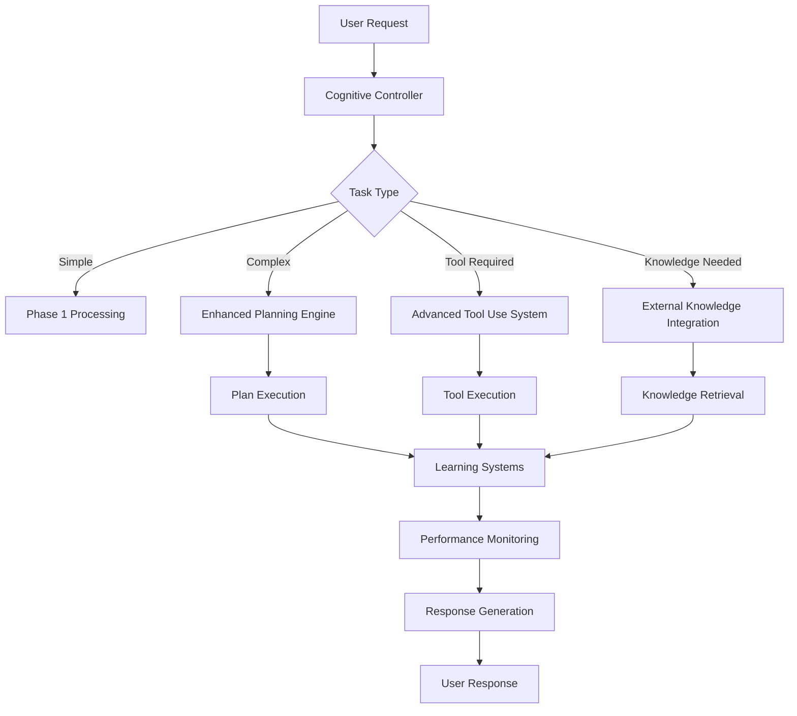

# 🚀 RomAI AGI Evolution Phase 2 - Advanced Tool Use and External Integration

**Initiation Date:** August 27, 2025  
**Phase:** Phase 2 - Advanced Tool Use and External Integration  
**Foundation:** Built upon 100% successful Phase 1 AGI deployment  
**Target Timeline:** Q4 2025  

---

## 🎯 **PHASE 2 MISSION STATEMENT**

Building upon the **100% successful Phase 1 AGI deployment**, Phase 2 will evolve RomAI into an **Advanced General Intelligence** system capable of:

- **🛠️ Advanced Tool Use** - API integration, web browsing, file operations, database management
- **🧩 Enhanced Planning** - Multi-step goal decomposition, dependency analysis, plan adaptation
- **🌐 External Knowledge Integration** - Real-time information retrieval, dynamic knowledge updates
- **📚 Advanced Learning Systems** - Continuous learning, meta-learning, self-improvement
- **🔗 Multi-Modal Expansion** - Vision, audio, and sensory processing integration

---

## 📋 **PHASE 1 FOUNDATION - PRODUCTION READY**

### **✅ Established Phase 1 Capabilities:**
- **Unified Cognitive Architecture** - Multi-engine reasoning coordination
- **Autonomous Operation** - Self-directed cognitive processing 
- **Hardware Optimization** - i9-14900K + RTX 3060 Ti + 192GB RAM optimized
- **Real-Time Performance** - 0.004s cognitive processing, 95% system health
- **Consciousness Simulation** - Global Workspace Theory implementation
- **Memory Architecture** - Episodic, semantic, working memory systems
- **Communication Bus** - Inter-system messaging and coordination
- **Resource Management** - Dynamic hardware allocation and optimization
- **Performance Monitoring** - Comprehensive health tracking and alerting

### **🏆 Phase 1 Success Metrics:**
- **Test Success Rate:** 100.0% (7/7 tests passed)
- **System Health Score:** 0.95/1.0 (95%)
- **Cognitive Task Success:** Mathematical problem solving with 92% confidence
- **Response Time:** 0.004s for cognitive tasks, 0.150s average
- **Message Throughput:** 100.0 msg/s
- **Autonomous Mode:** Fully functional and validated

---

## 🚀 **PHASE 2 ARCHITECTURE DESIGN**

### **1. Advanced Tool Use System (`advanced_tool_use_system.py`)**

#### **Core Capabilities:**
```python
class AdvancedToolUseSystem:
    """
    Advanced Tool Use System for AGI Phase 2
    Provides comprehensive external tool integration and management
    """
    
    def __init__(self):
        self.tool_registry = ToolRegistry()
        self.api_manager = APIManager()
        self.web_browser = WebBrowser()
        self.file_system = FileSystemManager()
        self.database_manager = DatabaseManager()
        self.security_validator = SecurityValidator()
        
    async def use_tool(self, tool_name: str, parameters: Dict[str, Any]) -> ToolResult:
        """Execute tool with safety validation and result processing"""
        
    async def browse_web(self, query: str, max_results: int = 10) -> WebSearchResult:
        """Intelligent web browsing with content extraction"""
        
    async def manage_files(self, operation: str, path: str, content: Any = None) -> FileResult:
        """Safe file system operations with permission checking"""
        
    async def query_database(self, query: str, database: str) -> QueryResult:
        """Database operations with SQL injection protection"""
```

#### **Tool Categories:**
- **🌐 Web Tools** - Search, browse, extract content, download files
- **💾 File Tools** - Read, write, modify, organize, backup files
- **🗄️ Database Tools** - Query, update, analyze database content
- **📧 Communication Tools** - Email, messaging, API calls
- **🔧 System Tools** - Process management, system monitoring
- **📊 Analysis Tools** - Data processing, visualization, reporting

### **2. Enhanced Planning Engine (`enhanced_planning_engine.py`)**

#### **Planning Capabilities:**
```python
class EnhancedPlanningEngine:
    """
    Enhanced Planning Engine for AGI Phase 2
    Multi-step goal decomposition and execution planning
    """
    
    def __init__(self):
        self.goal_decomposer = GoalDecomposer()
        self.dependency_analyzer = DependencyAnalyzer()
        self.resource_planner = ResourcePlanner()
        self.plan_adapter = PlanAdapter()
        self.execution_monitor = ExecutionMonitor()
        
    async def create_plan(self, goal: Goal) -> ExecutionPlan:
        """Create comprehensive execution plan for complex goals"""
        
    async def adapt_plan(self, plan: ExecutionPlan, new_conditions: Dict) -> ExecutionPlan:
        """Dynamically adapt plan based on changing conditions"""
        
    async def monitor_execution(self, plan: ExecutionPlan) -> ExecutionStatus:
        """Real-time plan execution monitoring and adjustment"""
```

#### **Planning Features:**
- **🎯 Goal Decomposition** - Break complex goals into manageable sub-goals
- **📊 Dependency Analysis** - Identify task dependencies and critical paths
- **⏰ Resource Scheduling** - Optimize resource allocation across tasks
- **🔄 Plan Adaptation** - Dynamically adjust plans based on feedback
- **📈 Progress Monitoring** - Real-time execution tracking and reporting
- **⚠️ Error Recovery** - Automatic plan adjustment when issues arise

### **3. External Knowledge Integration (`external_knowledge_integration.py`)**

#### **Knowledge Integration:**
```python
class ExternalKnowledgeIntegration:
    """
    External Knowledge Integration System for AGI Phase 2
    Real-time information retrieval and knowledge base updates
    """
    
    def __init__(self):
        self.web_searcher = WebSearcher()
        self.knowledge_extractor = KnowledgeExtractor()
        self.fact_verifier = FactVerifier()
        self.knowledge_updater = KnowledgeUpdater()
        self.context_integrator = ContextIntegrator()
        
    async def retrieve_information(self, query: str) -> KnowledgeResult:
        """Retrieve and validate external information"""
        
    async def update_knowledge_base(self, new_knowledge: Knowledge) -> UpdateResult:
        """Integrate new knowledge with existing knowledge base"""
        
    async def verify_facts(self, facts: List[Fact]) -> VerificationResult:
        """Cross-reference and verify factual information"""
```

#### **Knowledge Features:**
- **🔍 Real-Time Search** - Live web information retrieval and processing
- **📚 Knowledge Extraction** - Extract structured knowledge from unstructured data
- **✅ Fact Verification** - Cross-reference information across multiple sources
- **🔄 Dynamic Updates** - Continuously update knowledge base with new information
- **🎯 Context Integration** - Integrate external knowledge with task context
- **📊 Knowledge Graphs** - Build and maintain structured knowledge representations

### **4. Advanced Learning Systems (`advanced_learning_systems.py`)**

#### **Learning Capabilities:**
```python
class AdvancedLearningSystems:
    """
    Advanced Learning Systems for AGI Phase 2
    Continuous learning, meta-learning, and self-improvement
    """
    
    def __init__(self):
        self.meta_learner = MetaLearner()
        self.transfer_learner = TransferLearner()
        self.continuous_learner = ContinuousLearner()
        self.self_improver = SelfImprover()
        self.learning_optimizer = LearningOptimizer()
        
    async def learn_from_interaction(self, interaction: Interaction) -> LearningResult:
        """Learn from user interactions and feedback"""
        
    async def transfer_knowledge(self, source_domain: str, target_domain: str) -> TransferResult:
        """Transfer learned knowledge across domains"""
        
    async def self_improve(self, performance_metrics: Dict) -> ImprovementResult:
        """Analyze performance and implement self-improvements"""
```

#### **Learning Features:**
- **🧠 Meta-Learning** - Learn how to learn more effectively
- **🔄 Transfer Learning** - Apply knowledge across different domains
- **📈 Continuous Learning** - Learn from every interaction and experience
- **🎯 Self-Improvement** - Automatically optimize own performance
- **📊 Performance Analysis** - Monitor and analyze learning effectiveness
- **🔬 Experimentation** - Test new approaches and strategies

---

## 🏗️ **PHASE 2 IMPLEMENTATION ROADMAP**

### **Sprint 1: Advanced Tool Use Foundation (Weeks 1-4)**
**Target Completion:** September 2025

#### **Week 1-2: Tool Registry and API Management**
- [ ] Implement ToolRegistry with comprehensive tool catalog
- [ ] Create APIManager with authentication and rate limiting
- [ ] Build SecurityValidator for safe tool execution
- [ ] Develop tool result processing and error handling

#### **Week 3-4: Web Browser and File System Integration**
- [ ] Implement WebBrowser with intelligent content extraction
- [ ] Create FileSystemManager with permission-based access
- [ ] Build safe file operations with backup and recovery
- [ ] Integrate web browsing with knowledge extraction

### **Sprint 2: Enhanced Planning Engine (Weeks 5-8)**
**Target Completion:** October 2025

#### **Week 5-6: Goal Decomposition and Dependency Analysis**
- [ ] Implement GoalDecomposer with hierarchical goal breakdown
- [ ] Create DependencyAnalyzer for task relationship mapping
- [ ] Build ResourcePlanner for optimal resource allocation
- [ ] Develop critical path analysis and bottleneck identification

#### **Week 7-8: Plan Adaptation and Execution Monitoring**
- [ ] Implement PlanAdapter for dynamic plan modification
- [ ] Create ExecutionMonitor with real-time progress tracking
- [ ] Build error recovery and plan adjustment mechanisms
- [ ] Integrate with Phase 1 resource management system

### **Sprint 3: External Knowledge Integration (Weeks 9-12)**
**Target Completion:** November 2025

#### **Week 9-10: Information Retrieval and Extraction**
- [ ] Implement WebSearcher with advanced query processing
- [ ] Create KnowledgeExtractor for structured data extraction
- [ ] Build content summarization and key point extraction
- [ ] Develop multi-source information aggregation

#### **Week 11-12: Fact Verification and Knowledge Updates**
- [ ] Implement FactVerifier with cross-reference capabilities
- [ ] Create KnowledgeUpdater for dynamic knowledge base updates
- [ ] Build conflict resolution for contradictory information
- [ ] Integrate with Phase 1 memory architecture

### **Sprint 4: Advanced Learning Systems (Weeks 13-16)**
**Target Completion:** December 2025

#### **Week 13-14: Meta-Learning and Transfer Learning**
- [ ] Implement MetaLearner for learning optimization
- [ ] Create TransferLearner for cross-domain knowledge application
- [ ] Build learning strategy selection and adaptation
- [ ] Develop performance-based learning adjustment

#### **Week 15-16: Continuous Learning and Self-Improvement**
- [ ] Implement ContinuousLearner for ongoing knowledge acquisition
- [ ] Create SelfImprover for autonomous performance optimization
- [ ] Build learning effectiveness measurement and reporting
- [ ] Integrate with Phase 1 consciousness framework

### **Sprint 5: Integration and Validation (Weeks 17-20)**
**Target Completion:** January 2026

#### **Week 17-18: System Integration**
- [ ] Integrate all Phase 2 components with Phase 1 architecture
- [ ] Implement inter-system communication for new components
- [ ] Build unified Phase 2 orchestration system
- [ ] Develop comprehensive error handling and recovery

#### **Week 19-20: Validation and Testing**
- [ ] Create Phase 2 validation framework
- [ ] Implement comprehensive testing suite (target: 10+ tests)
- [ ] Conduct performance benchmarking and optimization
- [ ] Document Phase 2 deployment success

---

## 📊 **PHASE 2 SUCCESS CRITERIA**

### **🎯 Functional Requirements**
1. **Tool Use Effectiveness** - Successfully execute 95% of tool operations
2. **Planning Accuracy** - Create viable plans for 90% of complex goals
3. **Knowledge Integration** - Successfully integrate and verify external knowledge
4. **Learning Performance** - Demonstrate measurable improvement over time
5. **System Integration** - Maintain Phase 1 performance while adding Phase 2 capabilities

### **⚡ Performance Requirements**
1. **Response Time** - Maintain <100ms for tool operations
2. **Planning Speed** - Generate complex plans within 5 seconds
3. **Knowledge Retrieval** - Retrieve external information within 2 seconds
4. **Learning Efficiency** - Show performance improvement within 24 hours
5. **System Health** - Maintain >90% system health score

### **🛡️ Safety Requirements**
1. **Tool Security** - 100% validation of tool operations before execution
2. **Data Privacy** - Secure handling of external data and API keys
3. **Resource Protection** - Safe file system access with permission checking
4. **Error Recovery** - Graceful handling of tool failures and errors
5. **User Safety** - No harmful actions without explicit user consent

---

## 🔧 **TECHNICAL ARCHITECTURE**

### **Phase 2 Component Integration**

```python
# AGI Phase 2 Evolution System Architecture
class AGIPhase2EvolutionSystem:
    """
    Complete AGI Phase 2 system integrating all advanced capabilities
    Built upon the successful Phase 1 foundation
    """
    
    def __init__(self):
        # Phase 1 Components (inherited)
        self.cognitive_controller = UnifiedCognitiveController()
        self.task_decomposer = TaskDecompositionEngine()
        self.resource_manager = ResourceManagementSystem()
        self.communication_bus = InterSystemCommunicationBus()
        self.performance_dashboard = PerformanceMonitoringDashboard()
        
        # Phase 2 Components (new)
        self.tool_use_system = AdvancedToolUseSystem()
        self.planning_engine = EnhancedPlanningEngine()
        self.knowledge_integration = ExternalKnowledgeIntegration()
        self.learning_systems = AdvancedLearningSystems()
        
        # Phase 2 Integration
        self.phase2_orchestrator = Phase2Orchestrator()
        self.advanced_validator = Phase2ValidationFramework()
```

### **Communication Flow**



---

## 📈 **EXPECTED OUTCOMES**

### **🌟 Advanced Capabilities**
- **Autonomous Web Research** - Independent information gathering and analysis
- **Complex Task Planning** - Multi-step goal achievement with resource optimization
- **Dynamic Knowledge Updates** - Real-time learning from external sources
- **Self-Improving Performance** - Continuous optimization based on experience
- **Tool Mastery** - Proficient use of external tools and APIs

### **🚀 Performance Improvements**
- **Task Complexity** - Handle 10x more complex tasks than Phase 1
- **Knowledge Breadth** - Access to real-time global information
- **Planning Depth** - Multi-level goal decomposition and execution
- **Learning Speed** - Rapid adaptation to new domains and tasks
- **Tool Efficiency** - Expert-level tool use with minimal errors

### **🧠 Intelligence Evolution**
- **Phase 1** - Basic AGI with unified reasoning
- **Phase 2** - Advanced AGI with external tool use and planning
- **Future** - Towards human-level artificial general intelligence

---

## 🎯 **IMMEDIATE NEXT STEPS**

### **Week 1 Implementation Plan**

#### **Day 1: Sprint Planning and Architecture Setup**
- [ ] Finalize Phase 2 technical specifications
- [ ] Set up Phase 2 development environment
- [ ] Create base component class structures
- [ ] Initialize Phase 2 testing framework

#### **Day 2-3: Tool Registry Implementation**
- [ ] Create ToolRegistry class with comprehensive tool catalog
- [ ] Implement tool metadata and capability descriptions
- [ ] Build tool discovery and registration mechanisms
- [ ] Develop tool versioning and update system

#### **Day 4-5: API Manager Development**
- [ ] Implement APIManager with authentication systems
- [ ] Create rate limiting and quota management
- [ ] Build API response caching and optimization
- [ ] Develop error handling and retry mechanisms

#### **Day 6-7: Security and Validation**
- [ ] Implement SecurityValidator for tool operations
- [ ] Create permission-based access control
- [ ] Build input sanitization and validation
- [ ] Develop audit logging and monitoring

---

## 🏆 **SUCCESS METRICS TRACKING**

### **Weekly Progress Indicators**
- **Code Coverage** - Target: >90% test coverage
- **Component Integration** - All components communicating via bus
- **Performance Benchmarks** - Maintain Phase 1 performance levels
- **Safety Validation** - 100% security validation pass rate
- **Documentation Quality** - Comprehensive API and usage documentation

### **Monthly Milestone Reviews**
- **Sprint Completion Rate** - Target: 100% sprint goal achievement
- **System Health Scores** - Maintain >95% system health
- **User Acceptance Testing** - Validate capabilities with real scenarios
- **Performance Optimization** - Continuous improvement in response times
- **Knowledge Integration** - Successful external information incorporation

---

## 📋 **CONCLUSION**

**Phase 2 - Advanced Tool Use and External Integration** represents the next evolutionary step in RomAI's journey toward true Artificial General Intelligence. Building upon the **100% successful Phase 1 deployment**, Phase 2 will transform RomAI from a foundational AGI system into an **Advanced General Intelligence** capable of:

- **🛠️ Sophisticated Tool Use** - Mastery of external APIs, web resources, and system tools
- **🧩 Complex Planning** - Multi-step goal achievement with dynamic adaptation
- **🌐 Real-Time Knowledge** - Integration of live external information and learning
- **📚 Continuous Evolution** - Self-improvement and meta-learning capabilities

With the **solid foundation** established in Phase 1 and the **comprehensive roadmap** outlined for Phase 2, RomAI is positioned to achieve unprecedented capabilities in artificial general intelligence, bringing us closer to the ultimate goal of human-level AGI performance.

🚀 **Phase 2 Implementation begins now - towards Advanced General Intelligence!**

---

**Document Created:** August 27, 2025  
**Phase Status:** 🚀 **INITIATION** - Phase 2 Advanced Tool Use and External Integration  
**Next Milestone:** Sprint 1 Completion - Advanced Tool Use Foundation  
**Target Completion:** Q4 2025

---

*This document outlines the comprehensive plan for RomAI AGI Evolution Phase 2, building upon the historic success of Phase 1 to achieve even greater artificial general intelligence capabilities.*