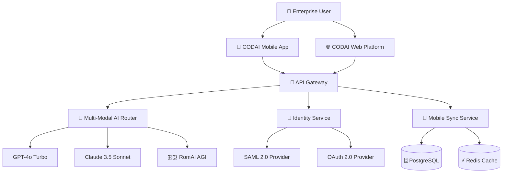
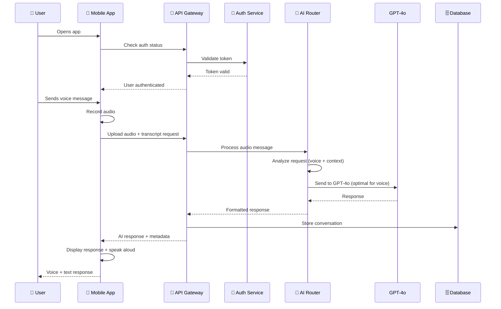
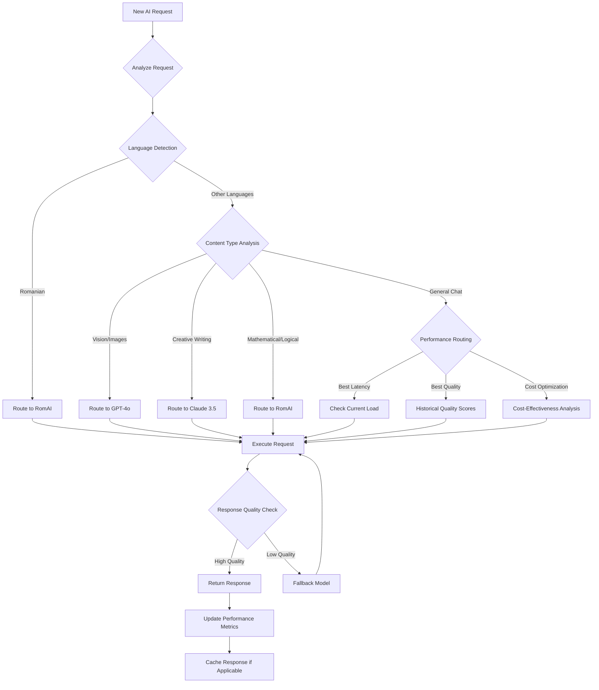

# 🏗️ Sprint 15 Technical Architecture Documentation

**Project**: CODAI Mobile App & Multi-Modal AI Router  
**Sprint**: 15 (September 11-24, 2025)  
**Architecture Version**: 2.0  
**Created**: August 27, 2025  

---

## 🎯 Architecture Overview

### System Context Diagram


### Core Architecture Principles
```yaml
Architecture Foundations:
  scalability: "Horizontal scaling with microservices"
  security: "Zero-trust with end-to-end encryption"
  performance: "Sub-200ms API responses, <2s page loads"
  reliability: "99.9% uptime with graceful degradation"
  maintainability: "Clean architecture with clear boundaries"
  extensibility: "Plugin-based AI model integration"
```

---

## 📱 Mobile App Architecture

### React Native Architecture Pattern

#### Application Structure
```typescript
// Core application architecture
interface MobileAppArchitecture {
  presentation: {
    screens: Screen[];
    components: Component[];
    navigation: NavigationStack;
  };
  business: {
    services: Service[];
    repositories: Repository[];
    useCases: UseCase[];
  };
  data: {
    apiClient: APIClient;
    database: LocalDatabase;
    cache: CacheManager;
  };
  infrastructure: {
    networking: NetworkClient;
    storage: StorageManager;
    auth: AuthenticationManager;
  };
}

// Clean Architecture layers
class MobileApp {
  // Presentation Layer
  screens = {
    auth: [LoginScreen, SSOScreen, BiometricScreen],
    chat: [ChatScreen, VoiceScreen, HistoryScreen],
    profile: [ProfileScreen, SettingsScreen, PreferencesScreen],
    offline: [OfflineScreen, SyncScreen, CacheScreen]
  };
  
  // Business Logic Layer  
  services = {
    aiService: new AIService(),
    authService: new AuthService(),
    syncService: new SyncService(),
    voiceService: new VoiceService()
  };
  
  // Data Layer
  repositories = {
    chatRepository: new ChatRepository(),
    userRepository: new UserRepository(),
    cacheRepository: new CacheRepository()
  };
}
```

#### Key Components Architecture
```yaml
Mobile App Components:

authentication_system:
  biometric_auth:
    technologies: ["Touch ID", "Face ID", "Fingerprint"]
    fallback: "PIN code authentication"
    security: "Keychain storage for tokens"
  
  sso_integration:
    protocols: ["SAML 2.0", "OAuth 2.0", "OIDC"]
    providers: ["Microsoft AD", "Google Workspace", "Okta"]
    session_management: "JWT with refresh token rotation"

voice_interface:
  speech_recognition:
    engine: "Azure Speech Services"
    languages: ["en-US", "ro-RO"]
    accuracy_target: ">95% for business terminology"
  
  text_to_speech:
    engine: "Azure Neural Voices"
    voice_selection: "Professional/conversational modes"
    audio_quality: "48kHz, 16-bit"

ai_chat_interface:
  real_time_messaging:
    protocol: "WebSocket over WSS"
    message_queuing: "Redis pub/sub"
    typing_indicators: "Real-time status updates"
  
  multi_modal_support:
    text_input: "Rich text editor with formatting"
    voice_input: "Speech-to-text integration" 
    file_upload: "Images, documents, audio files"
    response_streaming: "Token-by-token AI response display"

offline_capabilities:
  local_storage:
    database: "SQLite with encryption"
    capacity: "500MB cached conversations"
    sync_strategy: "Incremental sync when online"
  
  offline_features:
    chat_history: "Last 100 conversations accessible"
    voice_recording: "Local recording with cloud sync"
    draft_messages: "Auto-save with conflict resolution"
```

### Mobile Development Stack
```yaml
Technology Stack:

frontend_framework:
  core: "React Native 0.73+"
  navigation: "@react-navigation/native 6.x"
  state_management: "Zustand + React Query"
  ui_components: "React Native Elements + custom design system"
  
backend_integration:
  api_client: "Axios with interceptors"
  authentication: "@react-native-async-storage for tokens"
  networking: "Flipper network debugging"
  push_notifications: "@react-native-firebase/messaging"

native_modules:
  ios_specific:
    - "KeychainWrapper for secure storage"
    - "AVFoundation for voice recording"
    - "LocalAuthentication for biometrics"
  
  android_specific:
    - "Keystore for secure storage"
    - "MediaRecorder for voice recording"
    - "BiometricManager for fingerprint/face"

development_tools:
  build_system: "Metro bundler with custom configuration"
  testing: "Jest + Detox for E2E automation"
  debugging: "Flipper with React DevTools"
  deployment: "CodePush for OTA updates"
```

### Mobile App API Integration
```typescript
// API client architecture
class MobileAPIClient {
  private baseURL = 'https://api.codai.dev/mobile/v1';
  private authToken: string;
  
  constructor() {
    this.setupInterceptors();
  }
  
  private setupInterceptors() {
    // Request interceptor for auth
    axios.interceptors.request.use((config) => {
      config.headers.Authorization = `Bearer ${this.authToken}`;
      config.headers['X-Platform'] = Platform.OS;
      config.headers['X-App-Version'] = DeviceInfo.getVersion();
      return config;
    });
    
    // Response interceptor for error handling
    axios.interceptors.response.use(
      (response) => response,
      (error) => this.handleAPIError(error)
    );
  }
  
  // AI Chat integration
  async sendChatMessage(message: ChatMessage): Promise<AIResponse> {
    const response = await axios.post('/ai/chat', {
      message,
      context: await this.getConversationContext(),
      preferences: await this.getUserPreferences(),
      platform: 'mobile'
    });
    
    return response.data;
  }
  
  // Real-time WebSocket connection
  connectToAIChat(): WebSocket {
    const ws = new WebSocket(`wss://api.codai.dev/ai/chat/stream`);
    
    ws.onmessage = (event) => {
      const data = JSON.parse(event.data);
      this.handleStreamingResponse(data);
    };
    
    return ws;
  }
  
  // Offline sync mechanism
  async syncOfflineData(): Promise<SyncResult> {
    const offlineData = await this.getOfflineData();
    const syncPayload = this.prepareSyncPayload(offlineData);
    
    const response = await axios.post('/sync/mobile', syncPayload);
    await this.processServerUpdates(response.data);
    
    return response.data;
  }
}
```

---

## 🧠 Multi-Modal AI Router Architecture

### AI Router Core Design

#### Router Architecture Pattern
```typescript
// Multi-modal AI Router implementation
interface AIRouterArchitecture {
  routing_engine: RoutingEngine;
  model_adapters: ModelAdapter[];
  context_manager: ContextManager;
  performance_optimizer: PerformanceOptimizer;
  fallback_handler: FallbackHandler;
}

class MultiModalAIRouter {
  private models: Map<string, AIModel> = new Map();
  private routingRules: RoutingRule[] = [];
  private performanceTracker: PerformanceTracker;
  
  constructor() {
    this.initializeModels();
    this.setupRoutingRules();
    this.initializePerformanceTracking();
  }
  
  private initializeModels() {
    // GPT-4o Turbo configuration
    this.models.set('gpt4o', new GPT4oAdapter({
      apiKey: process.env.OPENAI_API_KEY,
      maxTokens: 4096,
      temperature: 0.7,
      capabilities: ['text', 'vision', 'code', 'reasoning']
    }));
    
    // Claude 3.5 Sonnet configuration
    this.models.set('claude35', new ClaudeAdapter({
      apiKey: process.env.ANTHROPIC_API_KEY,
      maxTokens: 8192,
      temperature: 0.6,
      capabilities: ['text', 'analysis', 'creative', 'coding']
    }));
    
    // RomAI AGI configuration
    this.models.set('romai', new RomAIAdapter({
      endpoint: 'http://localhost:6101',
      capabilities: ['text', 'logic', 'romanian', 'math']
    }));
  }
  
  async route(request: AIRequest): Promise<AIResponse> {
    // 1. Analyze request characteristics
    const analysis = await this.analyzeRequest(request);
    
    // 2. Select optimal model based on routing rules
    const selectedModel = await this.selectModel(analysis);
    
    // 3. Execute with performance monitoring
    const startTime = Date.now();
    const response = await this.executeRequest(selectedModel, request);
    const latency = Date.now() - startTime;
    
    // 4. Track performance and optimize
    await this.trackPerformance(selectedModel, latency, response.quality);
    
    return response;
  }
  
  private async selectModel(analysis: RequestAnalysis): Promise<string> {
    // Routing decision logic
    if (analysis.language === 'ro' || analysis.hasRomanianContext) {
      return 'romai';
    }
    
    if (analysis.requiresVision || analysis.hasImageContent) {
      return 'gpt4o';
    }
    
    if (analysis.isCreativeWriting || analysis.isAnalytical) {
      return 'claude35';
    }
    
    if (analysis.isMathematical || analysis.isLogical) {
      return 'romai';
    }
    
    // Default to best general performance
    return this.getBestPerformingModel();
  }
}
```

#### Model Integration Patterns
```yaml
AI Model Integration:

gpt4o_turbo:
  integration_pattern: "REST API with streaming"
  endpoint: "https://api.openai.com/v1/chat/completions"
  authentication: "Bearer token (API key)"
  rate_limits: "10,000 RPM, 30,000,000 TPM"
  specializations:
    - "Visual understanding and analysis"
    - "Code generation and debugging"
    - "Complex reasoning tasks"
    - "Multi-step problem solving"
  
  performance_optimization:
    connection_pooling: "5 persistent connections"
    request_batching: "Combine multiple requests when possible"
    caching: "Response caching for identical requests"
    timeout: "30 seconds with exponential backoff"

claude_3_5_sonnet:
  integration_pattern: "REST API with message streaming"
  endpoint: "https://api.anthropic.com/v1/messages"
  authentication: "X-API-Key header"
  rate_limits: "50 requests/minute for tier 1"
  specializations:
    - "Long-form content analysis"
    - "Creative writing and ideation"
    - "Research and summarization"
    - "Ethical reasoning and safety"
  
  performance_optimization:
    streaming: "Token-by-token response streaming"
    context_management: "Sliding window for long conversations"
    prompt_optimization: "Template-based prompt engineering"
    fallback: "GPT-4o for high availability"

romai_agi:
  integration_pattern: "Direct service communication"
  endpoint: "http://romai-service:6101"
  authentication: "Internal service token"
  rate_limits: "Unlimited internal usage"
  specializations:
    - "Romanian language understanding"
    - "Mathematical computation"
    - "Logical reasoning"
    - "Cultural context analysis"
  
  performance_optimization:
    local_deployment: "Same cluster deployment"
    model_caching: "Pre-loaded models in memory"
    gpu_optimization: "CUDA acceleration"
    load_balancing: "Multiple model instances"
```

### AI Router Performance Architecture
```yaml
Performance Optimization System:

intelligent_routing:
  decision_factors:
    - "Request complexity analysis"
    - "Model current load and latency"
    - "Historical performance data"
    - "Cost optimization targets"
    - "User preference settings"
  
  routing_algorithms:
    load_balancing: "Weighted round-robin based on performance"
    failover: "Automatic model switching on failure"
    cost_optimization: "Route to most cost-effective model"
    quality_routing: "Route to highest quality model for user type"

caching_strategy:
  response_cache:
    technology: "Redis with TTL"
    key_generation: "Hash of request parameters"
    ttl: "1 hour for general queries, 15 minutes for dynamic"
    size_limit: "1GB cache with LRU eviction"
  
  embeddings_cache:
    technology: "Vector database (Pinecone/Weaviate)"
    embedding_model: "text-embedding-ada-002"
    similarity_threshold: "0.95 for cache hits"
    refresh_strategy: "Background refresh on cache miss"

performance_monitoring:
  metrics_collection:
    - "Request latency per model"
    - "Model accuracy scores"
    - "Cost per request"
    - "Error rates and types"
    - "User satisfaction ratings"
  
  optimization_triggers:
    latency_threshold: ">2 seconds triggers routing adjustment"
    error_threshold: ">5% error rate triggers model switch"
    cost_threshold: "Daily budget exceeded switches to cheaper models"
```

---

## 🔧 System Integration Architecture

### API Gateway Integration

#### Gateway Configuration
```yaml
API Gateway Design:

routing_configuration:
  mobile_endpoints:
    base_path: "/mobile/v1"
    authentication: "JWT Bearer tokens"
    rate_limiting: "1000 requests/minute per user"
    cors_policy: "Mobile app origins only"
  
  ai_endpoints:
    base_path: "/ai/v1"
    authentication: "Service-to-service tokens"
    rate_limiting: "10,000 requests/minute"
    load_balancing: "Round-robin with health checks"

security_policies:
  authentication:
    jwt_validation: "RS256 signature verification"
    token_refresh: "Automatic refresh on expiry"
    session_management: "Redis-based session store"
  
  authorization:
    rbac_enforcement: "Role-based access control"
    resource_permissions: "Fine-grained endpoint permissions"
    tenant_isolation: "Multi-tenant data separation"

performance_optimization:
  request_routing:
    static_content: "CDN delivery"
    api_requests: "Load balancer distribution"
    websocket_connections: "Sticky sessions"
  
  caching_headers:
    static_assets: "1 year max-age"
    api_responses: "5 minutes max-age"
    user_specific: "no-cache for personalized content"
```

### Database Architecture

#### Data Models and Relationships
```sql
-- Core mobile app data models
CREATE SCHEMA mobile_app;

-- User profile and settings
CREATE TABLE mobile_app.users (
    id UUID PRIMARY KEY DEFAULT gen_random_uuid(),
    email VARCHAR(255) UNIQUE NOT NULL,
    encrypted_profile JSONB NOT NULL,
    preferences JSONB NOT NULL DEFAULT '{}',
    created_at TIMESTAMP WITH TIME ZONE DEFAULT NOW(),
    updated_at TIMESTAMP WITH TIME ZONE DEFAULT NOW(),
    tenant_id UUID NOT NULL REFERENCES tenants(id)
);

-- Chat conversations and messages
CREATE TABLE mobile_app.conversations (
    id UUID PRIMARY KEY DEFAULT gen_random_uuid(),
    user_id UUID NOT NULL REFERENCES mobile_app.users(id),
    title VARCHAR(500) NOT NULL,
    ai_model_used VARCHAR(100) NOT NULL,
    conversation_metadata JSONB NOT NULL DEFAULT '{}',
    created_at TIMESTAMP WITH TIME ZONE DEFAULT NOW(),
    updated_at TIMESTAMP WITH TIME ZONE DEFAULT NOW()
);

CREATE TABLE mobile_app.messages (
    id UUID PRIMARY KEY DEFAULT gen_random_uuid(),
    conversation_id UUID NOT NULL REFERENCES mobile_app.conversations(id),
    role VARCHAR(20) NOT NULL CHECK (role IN ('user', 'assistant', 'system')),
    content TEXT NOT NULL,
    message_metadata JSONB NOT NULL DEFAULT '{}',
    created_at TIMESTAMP WITH TIME ZONE DEFAULT NOW(),
    
    INDEX idx_messages_conversation_created (conversation_id, created_at),
    INDEX idx_messages_user_search (conversation_id) WHERE role = 'user'
);

-- AI model routing and performance tracking
CREATE TABLE mobile_app.ai_requests (
    id UUID PRIMARY KEY DEFAULT gen_random_uuid(),
    user_id UUID NOT NULL REFERENCES mobile_app.users(id),
    model_used VARCHAR(100) NOT NULL,
    request_content TEXT NOT NULL,
    response_content TEXT,
    latency_ms INTEGER NOT NULL,
    tokens_used INTEGER,
    cost_usd DECIMAL(10,6),
    quality_score DECIMAL(3,2),
    created_at TIMESTAMP WITH TIME ZONE DEFAULT NOW(),
    
    INDEX idx_ai_requests_performance (model_used, created_at),
    INDEX idx_ai_requests_user (user_id, created_at)
);

-- Mobile device and sync tracking
CREATE TABLE mobile_app.devices (
    id UUID PRIMARY KEY DEFAULT gen_random_uuid(),
    user_id UUID NOT NULL REFERENCES mobile_app.users(id),
    device_id VARCHAR(255) UNIQUE NOT NULL,
    platform VARCHAR(20) NOT NULL CHECK (platform IN ('ios', 'android')),
    app_version VARCHAR(50) NOT NULL,
    push_token VARCHAR(500),
    last_sync TIMESTAMP WITH TIME ZONE,
    created_at TIMESTAMP WITH TIME ZONE DEFAULT NOW(),
    
    UNIQUE(user_id, device_id)
);

-- Offline sync queue
CREATE TABLE mobile_app.sync_queue (
    id UUID PRIMARY KEY DEFAULT gen_random_uuid(),
    user_id UUID NOT NULL REFERENCES mobile_app.users(id),
    device_id VARCHAR(255) NOT NULL,
    operation_type VARCHAR(50) NOT NULL,
    entity_type VARCHAR(100) NOT NULL,
    entity_id UUID NOT NULL,
    operation_data JSONB NOT NULL,
    sync_status VARCHAR(20) DEFAULT 'pending' CHECK (sync_status IN ('pending', 'processing', 'completed', 'failed')),
    created_at TIMESTAMP WITH TIME ZONE DEFAULT NOW(),
    processed_at TIMESTAMP WITH TIME ZONE,
    
    INDEX idx_sync_queue_pending (sync_status, created_at) WHERE sync_status = 'pending',
    INDEX idx_sync_queue_user (user_id, device_id, created_at)
);
```

#### Database Performance Configuration
```yaml
PostgreSQL Configuration:

performance_tuning:
  shared_buffers: "25% of available RAM"
  effective_cache_size: "75% of available RAM"
  work_mem: "256MB for complex queries"
  maintenance_work_mem: "1GB for index operations"
  
connection_pooling:
  pool_size: "25 connections per app instance"
  max_connections: "200 total"
  idle_timeout: "10 minutes"
  connection_validation: "SELECT 1 on checkout"

backup_strategy:
  primary_backup: "Daily full backup at 2 AM UTC"
  incremental_backup: "Hourly WAL shipping"
  retention_policy: "30 days full backups, 7 days incremental"
  recovery_target: "15 minutes RPO, 30 minutes RTO"

monitoring:
  slow_query_log: "Queries >100ms logged"
  connection_monitoring: "Active connection tracking"
  index_usage: "Unused index identification"
  performance_insights: "Query performance analysis"
```

---

## 🔐 Security Architecture

### Security Implementation Framework

#### Authentication & Authorization
```yaml
Security Framework:

authentication_system:
  jwt_implementation:
    algorithm: "RS256 with key rotation"
    token_lifetime: "15 minutes access, 7 days refresh"
    key_management: "Azure Key Vault integration"
    token_storage: "Secure keychain (mobile), httpOnly cookies (web)"
  
  biometric_integration:
    ios_touch_id: "LocalAuthentication framework"
    ios_face_id: "Secure Enclave integration"
    android_fingerprint: "BiometricManager API"
    fallback: "PIN/password authentication"
  
  sso_integration:
    saml_2_0:
      identity_providers: ["Microsoft AD", "Okta", "OneLogin"]
      assertion_validation: "XML signature verification"
      attribute_mapping: "Custom attribute mapper"
    
    oauth_2_0:
      authorization_code_flow: "PKCE for mobile apps"
      scope_management: "Granular permission scopes"
      token_refresh: "Automatic silent refresh"

authorization_system:
  rbac_implementation:
    roles: ["admin", "user", "viewer", "enterprise_user"]
    permissions: ["read:conversations", "write:conversations", "admin:users"]
    resource_access: "Tenant-based resource isolation"
  
  api_authorization:
    endpoint_protection: "JWT middleware validation"
    permission_checks: "Role-based endpoint access"
    tenant_isolation: "Multi-tenant data separation"
```

#### Data Security & Encryption
```yaml
Data Protection:

encryption_at_rest:
  database_encryption: "AES-256 transparent data encryption"
  file_storage: "AES-256 encryption for uploaded files"
  key_management: "Azure Key Vault with HSM backing"
  key_rotation: "Automatic 90-day rotation"

encryption_in_transit:
  api_communication: "TLS 1.3 with HSTS headers"
  websocket_security: "WSS with certificate pinning"
  mobile_communication: "Certificate pinning validation"
  internal_services: "mTLS for service-to-service"

data_privacy:
  pii_handling:
    encryption: "Field-level encryption for PII"
    tokenization: "Sensitive data tokenization"
    data_masking: "Production data masking"
    retention: "GDPR compliance with data deletion"
  
  audit_logging:
    access_logs: "All data access logged"
    modification_logs: "Change tracking with user attribution"
    security_events: "Authentication/authorization failures"
    retention: "7 years audit log retention"
```

---

## 📊 Monitoring & Observability Architecture

### Comprehensive Monitoring Stack

#### Application Performance Monitoring
```yaml
Observability Framework:

performance_monitoring:
  apm_solution: "New Relic / Datadog for distributed tracing"
  custom_metrics:
    business_metrics:
      - "AI model usage by type"
      - "Mobile app session duration"
      - "Feature adoption rates"
      - "User engagement scores"
    
    technical_metrics:
      - "API response times (p95, p99)"
      - "Database query performance"
      - "Cache hit rates"
      - "WebSocket connection stability"
  
  real_time_alerting:
    critical_alerts:
      - "API latency >500ms sustained"
      - "Error rate >1% for 5 minutes"
      - "Database connection failures"
      - "AI model service unavailable"
    
    warning_alerts:
      - "Cache hit rate <80%"
      - "Mobile app crash rate >0.5%"
      - "Disk usage >80%"
      - "Memory usage >85%"

logging_strategy:
  structured_logging:
    format: "JSON with correlation IDs"
    fields: ["timestamp", "level", "service", "trace_id", "user_id", "message"]
    retention: "30 days for debug, 1 year for error/warn"
  
  log_aggregation:
    solution: "ELK Stack (Elasticsearch, Logstash, Kibana)"
    ingestion_rate: "10,000 events/second capacity"
    search_performance: "<2 second query response"
    alerting: "Watcher-based alert rules"

health_monitoring:
  health_endpoints:
    detailed_health: "/health/detailed"
    liveness: "/health/live"
    readiness: "/health/ready"
    dependencies: "/health/dependencies"
  
  health_checks:
    database_connectivity: "Connection pool status"
    redis_availability: "Cache service status"
    ai_model_availability: "Model service health"
    external_dependencies: "Third-party service status"
```

---

## 🚀 Deployment Architecture

### Infrastructure & Deployment Strategy

#### Container & Orchestration
```yaml
Deployment Framework:

containerization:
  mobile_backend_services:
    base_image: "node:18-alpine"
    security: "Non-root user, minimal attack surface"
    optimization: "Multi-stage builds, layer caching"
    size: "<500MB per service image"
  
  ai_router_service:
    base_image: "python:3.11-slim"
    gpu_support: "NVIDIA runtime for model inference"
    optimization: "Model caching in persistent volumes"
    scaling: "HPA with custom metrics"

kubernetes_deployment:
  cluster_configuration:
    nodes: "3 master nodes, 5-20 worker nodes (auto-scaling)"
    networking: "Calico CNI with NetworkPolicy"
    storage: "Azure Premium SSD persistent volumes"
    monitoring: "Prometheus + Grafana stack"
  
  service_mesh:
    implementation: "Istio for traffic management"
    security: "mTLS for service-to-service communication"
    observability: "Distributed tracing with Jaeger"
    traffic_policies: "Circuit breaker, retry, timeout"
  
  deployment_strategy:
    rolling_updates: "25% max unavailable, 25% max surge"
    health_checks: "Liveness and readiness probes"
    resource_limits: "CPU/memory limits with HPA"
    secrets_management: "Kubernetes secrets + Azure Key Vault"

mobile_app_distribution:
  ios_deployment:
    distribution: "Enterprise distribution + TestFlight"
    code_signing: "Automatic signing with CI/CD"
    app_store: "Prepared for App Store submission"
  
  android_deployment:
    distribution: "Enterprise APK + Play Store (internal track)"
    signing: "Upload key signing with Android App Bundle"
    testing: "Firebase App Distribution for beta testing"
```

---

## 📋 Integration Testing Architecture

### Testing Strategy & Automation

#### Comprehensive Testing Framework
```yaml
Testing Architecture:

mobile_testing:
  unit_tests:
    framework: "Jest with React Native Testing Library"
    coverage_target: "≥85% code coverage"
    mocking: "API mocks with MSW (Mock Service Worker)"
    performance: "Snapshot testing for UI consistency"
  
  integration_tests:
    api_integration: "Supertest for API endpoint testing"
    database_tests: "Test database with Docker containers"
    authentication_flow: "Complete auth flow testing"
    offline_sync: "Offline/online state transition testing"
  
  e2e_testing:
    framework: "Detox for React Native E2E automation"
    test_devices: "iOS Simulator + Android Emulator"
    test_scenarios:
      - "Complete user registration and login flow"
      - "AI chat conversation with all model types"
      - "Voice input and response flow"
      - "Offline mode and sync recovery"
      - "Biometric authentication flow"
    
    performance_testing:
      - "App launch time measurement"
      - "Memory usage monitoring"
      - "Battery usage optimization validation"

ai_router_testing:
  model_integration_tests:
    gpt4o_integration: "Mock OpenAI API responses"
    claude_integration: "Mock Anthropic API responses"
    romai_integration: "Local RomAI service testing"
  
  routing_algorithm_tests:
    decision_accuracy: "Routing decision validation"
    performance_comparison: "Model performance benchmarking"
    fallback_testing: "Failure scenario handling"
  
  load_testing:
    concurrent_requests: "1000 concurrent AI requests"
    throughput_testing: "Target 500 requests/second"
    latency_testing: "P95 <200ms, P99 <500ms"

system_integration_tests:
  api_gateway_integration:
    authentication_flow: "JWT token validation"
    rate_limiting: "Rate limit enforcement"
    request_routing: "Correct service routing"
  
  database_integration:
    data_consistency: "ACID transaction testing"
    performance_testing: "Query performance under load"
    backup_recovery: "Backup and restore validation"
  
  security_testing:
    penetration_testing: "OWASP Top 10 vulnerability scanning"
    authentication_testing: "Auth bypass attempt detection"
    data_encryption: "End-to-end encryption validation"
```

---

## 📚 API Documentation

### Comprehensive API Specifications

#### Mobile App API Endpoints
```yaml
Mobile API Specification:

authentication_endpoints:
  POST /mobile/v1/auth/login:
    description: "Standard email/password authentication"
    request:
      email: "string (required)"
      password: "string (required)"
      device_id: "string (required)"
    response:
      access_token: "JWT token (15 minutes)"
      refresh_token: "JWT token (7 days)"
      user_profile: "User profile object"
    
  POST /mobile/v1/auth/sso:
    description: "Single sign-on authentication"
    request:
      provider: "string (saml|oauth)"
      assertion: "string (SAML assertion or OAuth code)"
      device_id: "string (required)"
    response:
      access_token: "JWT token"
      refresh_token: "JWT token"
      user_profile: "User profile with SSO metadata"

ai_chat_endpoints:
  POST /mobile/v1/ai/chat:
    description: "Send message to AI router"
    headers:
      Authorization: "Bearer {access_token}"
    request:
      message: "string (required)"
      conversation_id: "string (optional, creates new if not provided)"
      model_preference: "string (optional: gpt4o|claude35|romai)"
      context: "object (conversation history)"
    response:
      response: "string (AI response)"
      model_used: "string (which model processed the request)"
      conversation_id: "string (conversation identifier)"
      tokens_used: "number (token count)"
      latency_ms: "number (processing time)"
  
  GET /mobile/v1/ai/conversations:
    description: "Get user conversation history"
    headers:
      Authorization: "Bearer {access_token}"
    query_parameters:
      limit: "number (default: 50)"
      offset: "number (default: 0)"
      search: "string (optional search term)"
    response:
      conversations: "array of conversation objects"
      total_count: "number"
      has_more: "boolean"

voice_endpoints:
  POST /mobile/v1/voice/upload:
    description: "Upload voice recording for processing"
    headers:
      Authorization: "Bearer {access_token}"
      Content-Type: "multipart/form-data"
    request:
      audio_file: "file (required, .wav/.m4a/.mp3)"
      language: "string (optional: en-US|ro-RO)"
      conversation_id: "string (optional)"
    response:
      transcript: "string (speech-to-text result)"
      ai_response: "string (AI response to transcript)"
      conversation_id: "string"
      processing_time_ms: "number"

sync_endpoints:
  POST /mobile/v1/sync/upload:
    description: "Upload offline changes for sync"
    headers:
      Authorization: "Bearer {access_token}"
    request:
      device_id: "string (required)"
      sync_data: "array of offline operations"
      last_sync_timestamp: "string (ISO 8601)"
    response:
      sync_status: "string (success|partial|conflict)"
      conflicts: "array of conflicted items"
      server_changes: "array of server-side changes"
      new_sync_timestamp: "string (ISO 8601)"
```

#### AI Router API Specification
```yaml
AI Router Internal API:

model_routing:
  POST /ai/v1/route:
    description: "Route request to optimal AI model"
    headers:
      X-Service-Token: "Internal service authentication"
    request:
      content: "string (user input)"
      context: "object (conversation context)"
      user_preferences: "object (user model preferences)"
      routing_criteria: "object (performance/cost preferences)"
    response:
      selected_model: "string (model identifier)"
      reasoning: "string (routing decision explanation)"
      estimated_cost: "number (cost estimate)"
      estimated_latency: "number (latency estimate)"
  
  POST /ai/v1/execute:
    description: "Execute request on specific model"
    headers:
      X-Service-Token: "Internal service authentication"
    request:
      model: "string (gpt4o|claude35|romai)"
      content: "string (user input)"
      parameters: "object (model-specific parameters)"
      stream: "boolean (enable response streaming)"
    response:
      content: "string (model response)"
      tokens_used: "number"
      processing_time_ms: "number"
      model_metadata: "object (model-specific metadata)"

performance_monitoring:
  GET /ai/v1/performance:
    description: "Get AI model performance metrics"
    headers:
      X-Service-Token: "Internal service authentication"
    query_parameters:
      timeframe: "string (1h|24h|7d|30d)"
      model: "string (optional model filter)"
    response:
      metrics:
        average_latency: "number (milliseconds)"
        success_rate: "number (percentage)"
        cost_per_request: "number (USD)"
        user_satisfaction: "number (1-5 scale)"
      model_comparison: "array of model performance objects"
      trends: "object (performance trends over time)"
```

---

## 🔄 Data Flow Architecture

### End-to-End Data Flow Diagrams

#### Mobile App User Journey


#### AI Router Decision Flow


---

## 📊 Architecture Decision Records (ADRs)

### Key Architectural Decisions

#### ADR-001: Mobile Framework Selection
```yaml
Title: "React Native Selection for Cross-Platform Mobile Development"
Status: "Accepted"
Date: "2025-08-15"

Context:
  - Need cross-platform mobile app for iOS and Android
  - Team has strong React and TypeScript expertise
  - Requirement for native performance and platform integration
  - Time-to-market constraints for Sprint 15

Decision:
  - Use React Native 0.73+ with TypeScript
  - Leverage Expo for development tooling where possible
  - Use native modules for platform-specific features (biometrics, secure storage)

Rationale:
  - Code sharing between platforms (estimated 85% code reuse)
  - Team expertise reduces development time
  - Strong ecosystem and community support
  - Performance adequate for AI chat use cases
  - Native module availability for required security features

Consequences:
  - Positive: Faster development, code reuse, team efficiency
  - Negative: Some platform-specific UI/UX compromises
  - Risk: Dependency on React Native ecosystem stability
```

#### ADR-002: AI Router Architecture Pattern
```yaml
Title: "Multi-Model AI Router with Intelligent Routing"
Status: "Accepted"  
Date: "2025-08-20"

Context:
  - Multiple AI models available (GPT-4o, Claude 3.5, RomAI)
  - Each model has different strengths and cost structures
  - Need to optimize for performance, cost, and quality
  - Users should get best possible responses transparently

Decision:
  - Implement intelligent routing system with request analysis
  - Use machine learning for routing decision optimization
  - Implement fallback mechanisms for reliability
  - Cache routing decisions for similar request patterns

Rationale:
  - Maximizes AI response quality by using optimal model
  - Reduces costs by avoiding expensive models for simple tasks
  - Improves performance through intelligent load balancing
  - Provides better user experience through quality optimization

Consequences:
  - Positive: Optimal AI performance and cost efficiency
  - Positive: Scalable architecture for adding new models
  - Negative: Increased system complexity
  - Risk: Routing algorithm requires continuous tuning
```

#### ADR-003: Database Strategy for Mobile Sync
```yaml
Title: "PostgreSQL with Redis for Mobile Offline-First Architecture"
Status: "Accepted"
Date: "2025-08-22"

Context:
  - Mobile app requires offline functionality
  - Need to handle sync conflicts gracefully
  - Performance requirements for real-time chat
  - Data consistency requirements for enterprise use

Decision:
  - PostgreSQL as primary database with JSONB for flexibility
  - Redis for caching and real-time features
  - SQLite on mobile with incremental sync
  - Conflict resolution with last-writer-wins + user intervention

Rationale:
  - PostgreSQL provides ACID compliance for critical data
  - JSONB supports flexible schema evolution
  - Redis enables real-time features and caching
  - SQLite provides robust offline storage on mobile
  - Proven sync patterns with conflict resolution

Consequences:
  - Positive: Robust offline functionality and performance
  - Positive: Scalable architecture with caching
  - Negative: Increased complexity in sync logic
  - Risk: Conflict resolution UX challenges
```

---

**Architecture Owner**: Engineering Team  
**Review Schedule**: Weekly architecture review meetings  
**Approval Status**: Approved for Sprint 15 Implementation  
**Document Version**: 2.0  
**Last Updated**: August 27, 2025  

---

*This technical architecture provides the foundation for Sprint 15 mobile app and AI router development, ensuring scalable, secure, and high-performance implementation.*