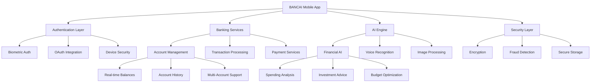

# BANCAI Mobile - AI-Powered Banking & Financial Mobile Application


**BANCAI Mobile** is an advanced AI-powered mobile banking and financial management application that brings the full power of artificial intelligence to personal and business banking. Built with React Native and Expo, BANCAI Mobile delivers a seamless, secure, and intelligent banking experience across iOS and Android platforms, integrating with the broader CODAI ecosystem to provide comprehensive financial solutions.

## 📱 Key Features

### 🤖 AI-Powered Banking
- **Intelligent Financial Assistant**: 24/7 AI chatbot for banking queries and assistance
- **Predictive Analytics**: AI-driven insights into spending patterns and financial behavior
- **Smart Budgeting**: Automated budget creation and expense categorization
- **Investment Recommendations**: AI-powered investment advice and portfolio optimization

### 💳 Core Banking Features
- **Account Management**: Multiple account support with real-time balances
- **Money Transfers**: Instant transfers with AI fraud detection
- **Bill Payments**: Automated bill payment scheduling and reminders
- **Mobile Check Deposit**: AI-enhanced check scanning and processing

### 📊 Financial Intelligence
- **Expense Analytics**: Detailed spending analysis with AI insights
- **Financial Planning**: AI-assisted financial goal setting and tracking
- **Credit Score Monitoring**: Real-time credit score updates and improvement tips
- **Investment Tracking**: Portfolio performance with AI recommendations

### 🔒 Advanced Security
- **Biometric Authentication**: Face ID, Touch ID, and voice recognition
- **AI Fraud Detection**: Real-time transaction monitoring and alerts
- **Secure Messaging**: End-to-end encrypted communication
- **Device Security**: Advanced device fingerprinting and security

### 💡 Smart Features
- **Voice Banking**: Natural language voice commands for banking operations
- **Augmented Reality**: AR-enabled ATM finder and branch locator
- **Offline Mode**: Essential banking features available offline
- **Push Notifications**: Intelligent alerts and financial insights

### 🌐 Ecosystem Integration
- **CODAI Integration**: Seamless connection with all CODAI services
- **Cross-Platform Sync**: Synchronization with web and desktop platforms
- **Third-Party APIs**: Integration with popular financial services
- **Open Banking**: Support for open banking standards and APIs

## 🚀 Quick Start

### Prerequisites
- Node.js 18+ 
- pnpm package manager
- Expo CLI (`npm install -g @expo/cli`)
- iOS Simulator (for iOS development)
- Android Studio (for Android development)
- EAS CLI for building (`npm install -g eas-cli`)

### Installation

1. **Clone and Install**
   ```bash
   cd apps/bancai-mobile
   pnpm install
   ```

2. **Environment Setup**
   ```bash
   cp .env.example .env.local
   ```

3. **Configure Environment Variables**
   ```env
   # Application
   EXPO_PUBLIC_API_URL=https://api.bancai.dev
   EXPO_PUBLIC_ENVIRONMENT=development
   
   # BANCAI Backend
   EXPO_PUBLIC_BANCAI_API_KEY=your-bancai-api-key
   EXPO_PUBLIC_BANCAI_CLIENT_ID=your-client-id
   
   # AI Services
   EXPO_PUBLIC_OPENAI_API_KEY=your-openai-api-key
   EXPO_PUBLIC_ANTHROPIC_API_KEY=your-anthropic-api-key
   
   # Banking APIs
   EXPO_PUBLIC_PLAID_CLIENT_ID=your-plaid-client-id
   EXPO_PUBLIC_PLAID_PUBLIC_KEY=your-plaid-public-key
   EXPO_PUBLIC_PLAID_ENVIRONMENT=sandbox
   
   # Security
   EXPO_PUBLIC_BIOMETRIC_ENABLED=true
   EXPO_PUBLIC_ENCRYPTION_KEY=your-encryption-key
   
   # Analytics
   EXPO_PUBLIC_ANALYTICS_ID=your-analytics-id
   EXPO_PUBLIC_CRASHLYTICS_ENABLED=true
   
   # Push Notifications
   EXPO_PUBLIC_FCM_SERVER_KEY=your-fcm-server-key
   EXPO_PUBLIC_APNS_KEY_ID=your-apns-key-id
   
   # Feature Flags
   EXPO_PUBLIC_VOICE_BANKING_ENABLED=true
   EXPO_PUBLIC_AR_FEATURES_ENABLED=true
   EXPO_PUBLIC_OFFLINE_MODE_ENABLED=true
   ```

4. **EAS Configuration**
   ```bash
   eas login
   eas init
   ```

5. **Start Development Server**
   ```bash
   # Start Expo development server
   pnpm start
   
   # Run on iOS simulator
   pnpm ios
   
   # Run on Android emulator
   pnpm android
   
   # Run in web browser
   pnpm web
   ```

6. **Building for Production**
   ```bash
   # Build for Android
   pnpm build:android
   
   # Build for iOS
   pnpm build:ios
   
   # Build for both platforms
   pnpm build:all
   ```

## 🏗️ Architecture

### Technology Stack
- **Framework**: React Native 0.80 + Expo 53
- **Language**: TypeScript
- **Navigation**: React Navigation 7
- **Styling**: NativeWind (Tailwind CSS for React Native)
- **State Management**: Zustand
- **API Integration**: Axios + React Query
- **Authentication**: Expo SecureStore + Biometric
- **Push Notifications**: Expo Notifications
- **Storage**: Expo SecureStore + AsyncStorage
- **Testing**: Jest + React Native Testing Library

### Mobile Architecture



### Core Components

#### AI Banking Assistant
```typescript
// AI-powered banking assistant
export class AIBankingAssistant {
  async processVoiceCommand(audioData: AudioData): Promise<BankingAction> {
    const transcript = await this.speechToText(audioData);
    const intent = await this.aiService.extractIntent(transcript);
    
    return this.executeBankingAction(intent);
  }
  
  async analyzeSpending(transactions: Transaction[]): Promise<SpendingInsights> {
    const analysis = await this.aiService.analyzeTransactions(transactions);
    
    return {
      categories: analysis.categoryBreakdown,
      trends: analysis.spendingTrends,
      recommendations: analysis.savingOpportunities,
      alerts: analysis.unusualActivity
    };
  }
  
  async generateFinancialAdvice(userProfile: UserProfile): Promise<FinancialAdvice> {
    // AI-generated personalized financial guidance
  }
}
```

#### Secure Transaction Processing
```typescript
// Secure mobile transaction handling
export class SecureTransactionService {
  async initiateTransfer(transfer: TransferRequest): Promise<TransferResult> {
    // Biometric verification
    const biometricVerified = await this.biometricAuth.verify();
    if (!biometricVerified) throw new Error('Biometric verification failed');
    
    // AI fraud detection
    const fraudCheck = await this.fraudDetection.analyze(transfer);
    if (fraudCheck.risk > 0.7) throw new Error('Transaction flagged for review');
    
    // Process transaction
    const result = await this.bankingAPI.processTransfer(transfer);
    
    // Store securely
    await this.secureStorage.storeTransaction(result);
    
    return result;
  }
}
```

### Mobile-Specific Features

#### Biometric Authentication
```typescript
// Advanced biometric security
export class BiometricSecurityService {
  async authenticateUser(): Promise<AuthResult> {
    const availableAuth = await LocalAuthentication.getEnrolledLevelAsync();
    
    if (availableAuth === LocalAuthentication.SecurityLevel.BIOMETRIC) {
      return await LocalAuthentication.authenticateAsync({
        promptMessage: 'Authenticate to access BANCAI',
        fallbackLabel: 'Use Passcode',
        biometryType: LocalAuthentication.AuthenticationType.FACIAL_RECOGNITION
      });
    }
    
    return this.fallbackToPasscode();
  }
}
```

#### Offline Banking
```typescript
// Offline banking capabilities
export class OfflineBankingService {
  async syncWhenOnline(): Promise<SyncResult> {
    const offlineTransactions = await this.getOfflineTransactions();
    const syncResults = [];
    
    for (const transaction of offlineTransactions) {
      try {
        const result = await this.bankingAPI.syncTransaction(transaction);
        syncResults.push(result);
      } catch (error) {
        await this.handleSyncError(transaction, error);
      }
    }
    
    return { success: syncResults.length, failed: offlineTransactions.length - syncResults.length };
  }
}
```

## 🛠️ Development

### Project Structure
```
apps/bancai-mobile/
├── app/                    # Expo Router app directory
│   ├── (auth)/            # Authentication screens
│   ├── (tabs)/            # Main tab navigation
│   ├── (modals)/          # Modal screens
│   └── +not-found.tsx     # 404 screen
├── components/            # React Native components
│   ├── ui/                # Reusable UI components
│   ├── banking/           # Banking-specific components
│   ├── ai/                # AI interface components
│   └── security/          # Security components
├── services/              # Business logic services
│   ├── banking/           # Banking API services
│   ├── ai/                # AI service integrations
│   ├── security/          # Security services
│   └── offline/           # Offline functionality
├── stores/                # Zustand state stores
├── types/                 # TypeScript definitions
├── constants/             # App constants
├── assets/                # Static assets
├── tests/                 # Test files
└── docs/                  # Documentation
```

### Running Tests
```bash
# Unit tests
pnpm test

# Watch mode
pnpm test:watch

# Coverage report
pnpm test:coverage

# E2E tests (with Detox)
pnpm test:e2e

# Performance tests
pnpm test:performance
```

### Key Development Commands
```bash
# Development
pnpm start            # Start Expo dev server
pnpm ios              # Run on iOS simulator
pnpm android          # Run on Android emulator
pnpm web              # Run in web browser

# Building
pnpm build:android    # Build Android APK/AAB
pnpm build:ios        # Build iOS IPA
pnpm build:all        # Build for both platforms

# Deployment
pnpm submit:android   # Submit to Google Play
pnpm submit:ios       # Submit to App Store
pnpm update           # Push OTA update

# Code Quality
pnpm lint             # ESLint checking
pnpm type-check       # TypeScript validation
pnpm format           # Prettier formatting

# Utilities
pnpm clean            # Clean build artifacts
```

## 🔗 Integration

### With CODAI Ecosystem
```typescript
// Integration with CODAI services
import { CodaiClient } from '@codai/sdk';
import { MemoraiClient } from '@memorai/sdk';

export class BANCAIMobileIntegration {
  async enhanceWithCodai(bankingData: BankingData) {
    // Use CODAI for financial code analysis and automation
    const automationScripts = await this.codaiClient.generateFinancialAutomation(bankingData);
    
    // Store financial insights in MemorAI
    await this.memoraiClient.store({
      type: 'financial_insights',
      userId: bankingData.userId,
      insights: automationScripts,
      timestamp: new Date()
    });
    
    return automationScripts;
  }
}
```

### Banking API Integration
```typescript
// Core banking API integration
export class BankingAPIService {
  async connectToPlaid(): Promise<PlaidConnection> {
    const linkToken = await this.plaidClient.createLinkToken({
      user: { client_user_id: this.userId },
      client_name: 'BANCAI Mobile',
      products: ['auth', 'transactions', 'assets'],
      country_codes: ['US', 'CA', 'GB']
    });
    
    return this.initializePlaidLink(linkToken);
  }
  
  async syncAccounts(): Promise<Account[]> {
    // Sync accounts from multiple banking providers
  }
}
```

### Push Notification Integration
```typescript
// Intelligent push notifications
export class IntelligentNotificationService {
  async sendSmartAlert(alert: SmartAlert): Promise<void> {
    const personalizedMessage = await this.aiService.personalizeMessage(alert);
    
    await Notifications.scheduleNotificationAsync({
      content: {
        title: personalizedMessage.title,
        body: personalizedMessage.body,
        data: alert.data,
        categoryIdentifier: alert.category
      },
      trigger: this.calculateOptimalTiming(alert.priority)
    });
  }
}
```

## 🗺️ Roadmap

### Phase 1: Core Features (Current)
- ✅ Basic banking functionality
- ✅ AI assistant integration
- ✅ Biometric security
- 🔄 Transaction processing
- 🔄 Account management

### Phase 2: AI Enhancement (Q2 2024)
- 📋 Advanced voice banking
- 📋 Predictive financial insights
- 📋 Smart investment recommendations
- 📋 Automated budgeting
- 📋 Expense categorization AI

### Phase 3: Advanced Features (Q3 2024)
- 📋 Augmented reality features
- 📋 Cryptocurrency integration
- 📋 Advanced fraud detection
- 📋 Social payment features
- 📋 Financial planning tools

### Phase 4: Platform Expansion (Q4 2024)
- 📋 Apple Watch integration
- 📋 Android Wear support
- 📋 iPad optimized interface
- 📋 Tablet-specific features
- 📋 Desktop companion app

### Phase 5: Global Features (2025)
- 📋 Multi-currency support
- 📋 International banking
- 📋 Cross-border payments
- 📋 Regulatory compliance tools
- 📋 Open banking integration

## 🤝 Contributing

BANCAI Mobile is committed to advancing mobile banking through AI. We welcome contributions from:

### How to Contribute
1. **Fork the Repository**
2. **Create Feature Branch**
   ```bash
   git checkout -b feature/mobile-enhancement
   ```
3. **Make Changes** with focus on:
   - Mobile user experience
   - Banking security and reliability
   - AI-powered features
   - Accessibility and inclusion
4. **Test Thoroughly**
   ```bash
   pnpm test
   pnpm test:e2e
   ```
5. **Submit Pull Request**

### Contribution Areas
- 📱 **Mobile UI/UX**: React Native interface improvements
- 🤖 **AI Features**: Machine learning integration
- 🔒 **Security**: Biometric and encryption enhancements
- 💳 **Banking**: Core banking functionality
- 🌐 **Integration**: Third-party service connections
- ♿ **Accessibility**: Inclusive design features

### Mobile Development Standards
- Follow React Native best practices
- Implement comprehensive testing
- Ensure cross-platform compatibility
- Optimize for performance and battery life
- Include accessibility features
- Maintain security standards

## 📞 Support

### Mobile App Support
- **User Support**: https://support.bancai.dev/mobile
- **Technical Docs**: https://docs.codai.dev/bancai-mobile
- **Video Tutorials**: https://tutorials.bancai.dev/mobile
- **FAQ**: https://faq.bancai.dev/mobile

### Developer Resources
- **Mobile SDK**: https://sdk.bancai.dev/mobile
- **API Documentation**: https://api.bancai.dev/mobile
- **React Native Guide**: https://rn.bancai.dev
- **Expo Integration**: https://expo.bancai.dev

### Banking Support
- **Customer Service**: support@bancai.dev
- **Banking Help**: banking@bancai.dev
- **Security Issues**: security@bancai.dev
- **Fraud Reports**: fraud@bancai.dev

### Technical Support
- **Bug Reports**: bugs@bancai.dev
- **Feature Requests**: features@bancai.dev
- **Performance Issues**: performance@bancai.dev
- **Integration Help**: integrations@bancai.dev

## 📄 License

BANCAI Mobile is part of the CODAI ecosystem and is licensed under the MIT License with additional provisions for financial services compliance and mobile app security requirements.

```
MIT License with Financial Services Provisions
Copyright (c) 2024 CODAI Ecosystem
```

**Financial Disclaimer**: BANCAI Mobile is a financial technology application. All banking services are provided through licensed financial institutions. Please review terms and conditions before using banking features.

For detailed license information, see the [LICENSE](../LICENSE) file in the repository root.

---

**📱 Banking Intelligence in Your Pocket 🤖**

*BANCAI Mobile: Where Mobile Banking meets Artificial Intelligence*
