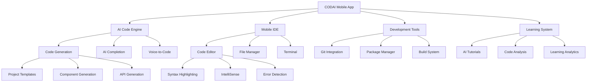

# CODAI Mobile - AI-Powered Mobile Development Platform


**CODAI Mobile** is the flagship mobile application of the CODAI ecosystem, bringing the full power of AI-assisted development, code generation, and intelligent programming tools directly to mobile devices. Built with React Native and Expo, CODAI Mobile empowers developers to code, learn, collaborate, and deploy applications from anywhere, making professional software development truly portable and accessible.

## 📱 Key Features

### 🤖 AI-Powered Mobile Development
- **Code Generation on Mobile**: Generate complete applications and code snippets using AI
- **Intelligent Code Completion**: Real-time AI suggestions and auto-completion
- **Voice-to-Code**: Speak your requirements and watch AI generate code
- **Mobile IDE Experience**: Full-featured development environment optimized for touch interfaces

### 💻 Complete Development Suite
- **Multi-Language Support**: JavaScript, TypeScript, Python, React Native, and more
- **Project Management**: Full project lifecycle management from mobile device
- **Git Integration**: Complete version control with GitHub, GitLab integration
- **Collaborative Coding**: Real-time collaboration with team members

### 🎓 AI Learning Assistant
- **Interactive Tutorials**: AI-guided learning paths for programming concepts
- **Code Explanation**: AI-powered explanations of complex code structures
- **Bug Detection & Fixes**: Intelligent error detection with suggested solutions
- **Best Practices**: Real-time suggestions for code quality and optimization

### 🔧 Development Tools
- **Mobile Code Editor**: Syntax highlighting, IntelliSense, and error detection
- **Terminal Access**: Full command-line interface on mobile
- **Package Management**: NPM, Yarn, and other package manager integration
- **Build & Deploy**: Direct deployment to cloud platforms from mobile

### 🌐 Ecosystem Integration
- **CODAI Services**: Seamless integration with all CODAI ecosystem applications
- **Cloud Sync**: Real-time synchronization across all devices
- **API Testing**: Built-in REST client for API development and testing
- **Database Management**: Direct database connection and query capabilities

### 📊 Development Analytics
- **Code Quality Metrics**: Real-time analysis of code quality and complexity
- **Performance Monitoring**: Application performance tracking and optimization
- **Learning Progress**: Track coding skills improvement with AI insights
- **Project Analytics**: Comprehensive project health and progress monitoring

## 🚀 Quick Start

### Prerequisites
- Node.js 18+ 
- pnpm package manager
- Expo CLI (`npm install -g @expo/cli`)
- iOS Simulator (for iOS development)
- Android Studio (for Android development)
- EAS CLI for building (`npm install -g eas-cli`)

### Installation

1. **Clone and Install**
   ```bash
   cd apps/codai-mobile
   pnpm install
   ```

2. **Environment Setup**
   ```bash
   cp .env.example .env.local
   ```

3. **Configure Environment Variables**
   ```env
   # Application
   EXPO_PUBLIC_API_URL=https://api.codai.dev
   EXPO_PUBLIC_ENVIRONMENT=development
   
   # CODAI Backend
   EXPO_PUBLIC_CODAI_API_KEY=your-codai-api-key
   EXPO_PUBLIC_CODAI_CLIENT_ID=your-client-id
   
   # AI Services
   EXPO_PUBLIC_OPENAI_API_KEY=your-openai-api-key
   EXPO_PUBLIC_ANTHROPIC_API_KEY=your-anthropic-api-key
   EXPO_PUBLIC_CODAI_AI_ENDPOINT=https://ai.codai.dev
   
   # Development Services
   EXPO_PUBLIC_GITHUB_CLIENT_ID=your-github-client-id
   EXPO_PUBLIC_GITLAB_CLIENT_ID=your-gitlab-client-id
   EXPO_PUBLIC_BITBUCKET_CLIENT_ID=your-bitbucket-client-id
   
   # Cloud Platforms
   EXPO_PUBLIC_VERCEL_TOKEN=your-vercel-token
   EXPO_PUBLIC_NETLIFY_TOKEN=your-netlify-token
   EXPO_PUBLIC_AWS_ACCESS_KEY=your-aws-access-key
   
   # Database Connections
   EXPO_PUBLIC_SUPABASE_URL=your-supabase-url
   EXPO_PUBLIC_SUPABASE_ANON_KEY=your-supabase-anon-key
   EXPO_PUBLIC_MONGODB_URI=your-mongodb-uri
   
   # Analytics
   EXPO_PUBLIC_ANALYTICS_ID=your-analytics-id
   EXPO_PUBLIC_CRASHLYTICS_ENABLED=true
   
   # Features
   EXPO_PUBLIC_VOICE_CODING_ENABLED=true
   EXPO_PUBLIC_COLLABORATIVE_CODING_ENABLED=true
   EXPO_PUBLIC_OFFLINE_MODE_ENABLED=true
   ```

4. **EAS Configuration**
   ```bash
   eas login
   eas init
   ```

5. **Start Development Server**
   ```bash
   # Start Expo development server
   pnpm start
   
   # Run on iOS simulator
   pnpm ios
   
   # Run on Android emulator
   pnpm android
   
   # Run in web browser
   pnpm web
   ```

6. **Building for Production**
   ```bash
   # Build for Android
   pnpm build:android
   
   # Build for iOS
   pnpm build:ios
   
   # Build for both platforms
   pnpm build:all
   ```

## 🏗️ Architecture

### Technology Stack
- **Framework**: React Native 0.80 + Expo 53
- **Language**: TypeScript
- **Navigation**: React Navigation 7
- **Styling**: NativeWind (Tailwind CSS for React Native)
- **State Management**: Zustand
- **Code Editor**: Monaco Editor (mobile optimized)
- **Real-time**: WebSockets + Socket.io
- **Storage**: Expo SecureStore + AsyncStorage
- **Testing**: Jest + React Native Testing Library

### Mobile Development Architecture



### Core Components

#### AI Code Generation Engine
```typescript
// Mobile AI code generation
export class MobileAICodeEngine {
  async generateCode(prompt: string, language: string): Promise<GeneratedCode> {
    const context = await this.gatherMobileContext();
    const codeRequest = {
      prompt,
      language,
      platform: 'mobile',
      constraints: this.getMobileConstraints(),
      context
    };
    
    const generated = await this.aiService.generateCode(codeRequest);
    
    return {
      code: generated.code,
      explanation: generated.explanation,
      dependencies: generated.dependencies,
      mobileOptimized: true
    };
  }
  
  async enhanceCodeForMobile(code: string): Promise<MobileOptimizedCode> {
    // Optimize code for mobile development
  }
  
  async voiceToCode(audioData: AudioData): Promise<VoiceCodeResult> {
    const transcript = await this.speechToText(audioData);
    const intent = await this.aiService.parseCodeIntent(transcript);
    
    return this.generateCode(intent.description, intent.language);
  }
}
```

#### Mobile Code Editor
```typescript
// Mobile-optimized code editor
export class MobileCodeEditor {
  async initializeEditor(language: string): Promise<EditorInstance> {
    const editor = await this.monacoEditor.create({
      language,
      theme: 'vs-dark-mobile',
      fontSize: this.calculateOptimalFontSize(),
      wordWrap: 'on',
      minimap: { enabled: false },
      scrollBeyondLastLine: false,
      automaticLayout: true,
      mobileOptimizations: true
    });
    
    await this.setupMobileGestures(editor);
    await this.enableAICompletion(editor);
    
    return editor;
  }
  
  async setupMobileGestures(editor: EditorInstance): Promise<void> {
    // Setup touch gestures for mobile coding
  }
  
  async enableAICompletion(editor: EditorInstance): Promise<void> {
    // Enable AI-powered code completion
  }
}
```

### Mobile-Specific Features

#### Touch-Optimized Development
```typescript
// Mobile development interface optimizations
export class TouchOptimizedDevelopment {
  async setupTouchKeyboard(): Promise<CustomKeyboard> {
    return {
      programmingSymbols: ['(', ')', '{', '}', '[', ']', ';', ':', '='],
      contextualSuggestions: await this.getContextualSuggestions(),
      swipeGestures: this.setupSwipeGestures(),
      hapticFeedback: true
    };
  }
  
  async setupSwipeGestures(): Promise<GestureMap> {
    return {
      swipeLeft: 'indent',
      swipeRight: 'unindent',
      swipeUp: 'moveLineUp',
      swipeDown: 'moveLineDown',
      pinchZoom: 'zoomInOut',
      twoFingerTap: 'showSuggestions'
    };
  }
}
```

#### Offline Development Capabilities
```typescript
// Offline development functionality
export class OfflineDevelopmentService {
  async enableOfflineMode(): Promise<OfflineCapabilities> {
    await this.cacheEssentialTemplates();
    await this.setupLocalAI();
    await this.syncRecentProjects();
    
    return {
      codeGeneration: 'limited',
      projectManagement: 'full',
      fileEditing: 'full',
      compilation: 'basic',
      deployment: 'queued'
    };
  }
  
  async syncWhenOnline(): Promise<SyncResult> {
    // Sync offline changes when connection is restored
  }
}
```

## 🛠️ Development

### Project Structure
```
apps/codai-mobile/
├── app/                    # Expo Router app directory
│   ├── (auth)/            # Authentication screens
│   ├── (tabs)/            # Main tab navigation
│   ├── (modals)/          # Modal screens
│   ├── editor/            # Code editor screens
│   ├── projects/          # Project management
│   └── learning/          # Learning modules
├── components/            # React Native components
│   ├── ui/                # Reusable UI components
│   ├── editor/            # Code editor components
│   ├── ai/                # AI interface components
│   ├── development/       # Development tool components
│   └── learning/          # Learning components
├── services/              # Business logic services
│   ├── ai/                # AI service integrations
│   ├── development/       # Development tools
│   ├── collaboration/     # Real-time collaboration
│   └── learning/          # Learning system
├── stores/                # Zustand state stores
├── types/                 # TypeScript definitions
├── constants/             # App constants
├── assets/                # Static assets
├── tests/                 # Test files
└── docs/                  # Documentation
```

### Running Tests
```bash
# Unit tests
pnpm test

# Watch mode
pnpm test:watch

# Coverage report
pnpm test:coverage

# E2E tests
pnpm test:e2e

# Performance tests
pnpm test:performance
```

### Key Development Commands
```bash
# Development
pnpm start            # Start Expo dev server
pnpm ios              # Run on iOS simulator
pnpm android          # Run on Android emulator
pnpm web              # Run in web browser

# Building
pnpm build:android    # Build Android APK/AAB
pnpm build:ios        # Build iOS IPA
pnpm build:all        # Build for both platforms

# Deployment
pnpm submit:android   # Submit to Google Play
pnpm submit:ios       # Submit to App Store
pnpm update           # Push OTA update

# Code Quality
pnpm lint             # ESLint checking
pnpm type-check       # TypeScript validation
pnpm format           # Prettier formatting

# Utilities
pnpm clean            # Clean build artifacts
```

## 🔗 Integration

### With CODAI Ecosystem
```typescript
// Complete ecosystem integration
import { CodaiClient } from '@codai/sdk';
import { MemoraiClient } from '@memorai/sdk';

export class CODAIMobileIntegration {
  async syncWithDesktop(project: Project) {
    // Real-time sync between mobile and desktop CODAI
    const syncData = await this.codaiClient.syncProject(project);
    
    // Store sync state in MemorAI
    await this.memoraiClient.store({
      type: 'project_sync',
      projectId: project.id,
      syncData,
      platform: 'mobile',
      timestamp: new Date()
    });
    
    return syncData;
  }
  
  async collaborateRealTime(sessionId: string) {
    // Real-time collaborative coding session
  }
}
```

### Development Platform Integration
```typescript
// Integration with development platforms
export class DevelopmentPlatformService {
  async deployToVercel(project: Project): Promise<DeploymentResult> {
    const buildConfig = await this.optimizeForMobile(project);
    const deployment = await this.vercelClient.deploy(buildConfig);
    
    return {
      url: deployment.url,
      status: deployment.status,
      logs: deployment.logs,
      deployedFromMobile: true
    };
  }
  
  async connectToGitHub(): Promise<GitHubConnection> {
    // OAuth integration with GitHub for mobile
  }
}
```

### AI Service Integration
```typescript
// Advanced AI service integration
export class MobileAIService {
  async contextAwareCompletion(code: string, cursor: number): Promise<Completion[]> {
    const context = {
      code,
      cursor,
      language: this.detectLanguage(code),
      platform: 'mobile',
      projectContext: await this.getProjectContext()
    };
    
    const completions = await this.aiService.getCompletions(context);
    
    return completions.map(completion => ({
      ...completion,
      mobileOptimized: true,
      gestureHints: this.generateGestureHints(completion)
    }));
  }
}
```

## 🗺️ Roadmap

### Phase 1: Core Mobile IDE (Current)
- ✅ Mobile code editor
- ✅ AI code generation
- ✅ Basic project management
- 🔄 Git integration
- 🔄 Cloud synchronization

### Phase 2: Advanced AI Features (Q2 2024)
- 📋 Voice-to-code functionality
- 📋 AI pair programming
- 📋 Intelligent debugging
- 📋 Code review AI
- 📋 Performance optimization AI

### Phase 3: Collaboration & Learning (Q3 2024)
- 📋 Real-time collaborative coding
- 📋 AI tutoring system
- 📋 Code mentorship platform
- 📋 Learning path personalization
- 📋 Community features

### Phase 4: Enterprise Features (Q4 2024)
- 📋 Team management tools
- 📋 Enterprise security
- 📋 Custom AI model integration
- 📋 Advanced analytics
- 📋 Workflow automation

### Phase 5: Next-Generation Mobile Development (2025)
- 📋 AR/VR development support
- 📋 Quantum computing integration
- 📋 Brain-computer interface research
- 📋 Advanced AI agents
- 📋 Autonomous development features

## 🤝 Contributing

CODAI Mobile is the flagship mobile experience of the CODAI ecosystem. We welcome contributions from:

### How to Contribute
1. **Fork the Repository**
2. **Create Feature Branch**
   ```bash
   git checkout -b feature/mobile-ide-enhancement
   ```
3. **Make Changes** with focus on:
   - Mobile user experience optimization
   - AI-powered development features
   - Touch interface improvements
   - Performance optimization
4. **Test Thoroughly**
   ```bash
   pnpm test
   pnpm test:e2e
   ```
5. **Submit Pull Request**

### Contribution Areas
- 📱 **Mobile UI/UX**: Touch-optimized development interfaces
- 🤖 **AI Features**: Mobile AI development assistance
- ⚡ **Performance**: Mobile app optimization
- 🎓 **Learning**: AI-powered educational features
- 🔧 **Development Tools**: Mobile development utilities
- ♿ **Accessibility**: Inclusive mobile development

### Mobile Development Standards
- Follow React Native best practices
- Optimize for mobile performance
- Ensure cross-platform compatibility
- Implement comprehensive testing
- Focus on touch interface design
- Maintain offline capabilities

## 📞 Support

### Mobile App Support
- **User Guide**: https://guide.codai.dev/mobile
- **Documentation**: https://docs.codai.dev/codai-mobile
- **Video Tutorials**: https://tutorials.codai.dev/mobile
- **Community Forum**: https://community.codai.dev/mobile

### Developer Resources
- **Mobile SDK**: https://sdk.codai.dev/mobile
- **API Documentation**: https://api.codai.dev/mobile
- **React Native Guide**: https://mobile.codai.dev/react-native
- **Expo Integration**: https://mobile.codai.dev/expo

### Technical Support
- **Technical Help**: support@codai.dev
- **Bug Reports**: bugs@codai.dev
- **Feature Requests**: features@codai.dev
- **Mobile Issues**: mobile@codai.dev

### AI Development Support
- **AI Features**: ai@codai.dev
- **Model Integration**: models@codai.dev
- **Performance Issues**: performance@codai.dev
- **Learning System**: learning@codai.dev

## 📄 License

CODAI Mobile is part of the CODAI ecosystem and is licensed under the MIT License with additional provisions for mobile app development and AI service integration.

```
MIT License with Mobile Development Provisions
Copyright (c) 2024 CODAI Ecosystem
```

**Development Disclaimer**: CODAI Mobile is a development tool. Generated code should be reviewed and tested before production use. AI-generated content may require validation and optimization.

For detailed license information, see the [LICENSE](../LICENSE) file in the repository root.

---

**📱 The Future of Mobile Development is AI-Powered 🤖**

*CODAI Mobile: Where Mobile Development meets Artificial Intelligence*
