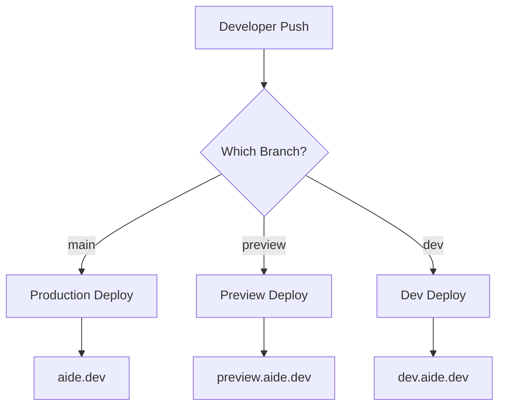

# Multi-Environment Deployment Guide

This guide explains how to set up and manage multiple deployment environments for the AIDE Landing Page using Vercel and GitHub Actions.

## 🏗️ Architecture Overview

The AIDE Landing Page uses a three-environment deployment strategy:

### 🌍 Environments

| Environment     | Branch    | URL                | Purpose              | Stripe Keys     |
| --------------- | --------- | ------------------ | -------------------- | --------------- |
| **Production**  | `main`    | `aide.dev`         | Live production site | Production keys |
| **Preview**     | `preview` | `preview.aide.dev` | Staging/testing      | Test keys       |
| **Development** | `dev`     | `dev.aide.dev`     | Development testing  | Test keys       |

### 🔄 Deployment Flow



## 🚀 Quick Setup

### 1. Initial Vercel Setup

Run the multi-environment setup script:

**Linux/macOS:**

```bash
./scripts/setup-multi-env.sh
```

**Windows:**

```powershell
.\scripts\setup-multi-env.ps1
```

### 2. GitHub Secrets Setup

Configure GitHub secrets for automatic deployment:

**Linux/macOS:**

```bash
./scripts/setup-github-secrets.sh
```

**Windows:**

```powershell
.\scripts\setup-github-secrets.ps1
```

### 3. Create Branches

Create and push the preview and dev branches:

```bash
# Create preview branch
git checkout -b preview
git push origin preview

# Create dev branch
git checkout -b dev
git push origin dev

# Return to main
git checkout main
```

## 🔧 Manual Configuration

### Vercel Environment Variables

Each environment requires the following variables:

#### Required Variables

- `NEXT_PUBLIC_STRIPE_PUBLISHABLE_KEY`
- `STRIPE_SECRET_KEY`
- `NEXT_PUBLIC_STRIPE_PROFESSIONAL_PRICE_ID`
- `NEXT_PUBLIC_STRIPE_PROFESSIONAL_YEARLY_PRICE_ID`
- `NEXT_PUBLIC_STRIPE_ENTERPRISE_PRICE_ID`
- `NEXT_PUBLIC_STRIPE_ENTERPRISE_YEARLY_PRICE_ID`
- `NEXT_PUBLIC_BASE_URL`
- `NEXT_PUBLIC_SITE_URL`
- `NEXT_PUBLIC_CONTROL_PANEL_URL`

#### Manual Setup

If you prefer to set up environments manually:

```bash
# Production environment
vercel env add NEXT_PUBLIC_BASE_URL production
# Enter: https://aide.dev

vercel env add NEXT_PUBLIC_STRIPE_PUBLISHABLE_KEY production
# Enter: pk_live_...

# Preview environment
vercel env add NEXT_PUBLIC_BASE_URL preview
# Enter: https://preview.aide.dev

# Development environment
vercel env add NEXT_PUBLIC_BASE_URL development
# Enter: https://dev.aide.dev
```

### GitHub Secrets

Configure these secrets in your GitHub repository:

1. Go to **Settings** → **Secrets and variables** → **Actions**
2. Add the following secrets:

| Secret Name         | Description      | How to Get                                                     |
| ------------------- | ---------------- | -------------------------------------------------------------- |
| `VERCEL_TOKEN`      | Vercel API token | [vercel.com/account/tokens](https://vercel.com/account/tokens) |
| `VERCEL_ORG_ID`     | Organization ID  | From `.vercel/project.json`                                    |
| `VERCEL_PROJECT_ID` | Project ID       | From `.vercel/project.json`                                    |

## 🔗 Custom Domains

Configure custom domains in the Vercel dashboard:

### Production Domain

1. Go to Vercel dashboard → Your project → **Domains**
2. Add `aide.dev`
3. Configure DNS records as instructed

### Preview Domain

1. Add `preview.aide.dev`
2. Configure DNS CNAME: `preview.aide.dev` → `cname.vercel-dns.com`

### Development Domain

1. Add `dev.aide.dev`
2. Configure DNS CNAME: `dev.aide.dev` → `cname.vercel-dns.com`

## 🔄 Deployment Workflow

### Automatic Deployments

The GitHub Actions workflow (`.github/workflows/deploy-landing.yml`) automatically:

1. **Detects environment** based on branch
2. **Builds the application** with environment-specific variables
3. **Deploys to Vercel** with appropriate settings
4. **Sets custom aliases** for production/preview/dev
5. **Comments on PRs** with deployment preview URLs

### Manual Deployments

Deploy manually using Vercel CLI:

```bash
# Production
vercel --prod

# Preview
vercel

# Specific environment
vercel --target preview
```

## 🧪 Testing Deployments

### Test Environment-Specific Features

1. **Stripe Integration**: Each environment uses different Stripe keys
2. **URLs**: Environment-specific URLs in metadata and links
3. **Analytics**: Environment-specific tracking (if configured)

### Verification Checklist

- [ ] Landing page loads correctly
- [ ] Pricing section displays proper prices
- [ ] Stripe checkout works with correct keys
- [ ] Download detection works
- [ ] All links point to correct environment URLs
- [ ] Custom domain resolves correctly

## 🔒 Security Best Practices

### Environment Separation

- **Production**: Real Stripe keys, real data
- **Preview**: Test Stripe keys, staging data
- **Development**: Test Stripe keys, development data

### Key Management

1. **Never commit secrets** to version control
2. **Use different Stripe accounts** for production vs test
3. **Rotate tokens regularly**
4. **Limit token permissions** to deployment only

## 🐛 Troubleshooting

### Common Issues

#### Deployment Fails

1. Check GitHub secrets are set correctly
2. Verify Vercel project is linked
3. Check environment variables in Vercel dashboard

#### Wrong Environment Variables

1. Verify branch name matches environment configuration
2. Check Vercel environment variable scoping
3. Clear deployment cache and retry

#### Domain Issues

1. Check DNS configuration
2. Verify domain is added in Vercel dashboard
3. Check SSL certificate status

### Debug Commands

```bash
# Check Vercel project info
vercel ls

# Check environment variables
vercel env ls

# Check deployment logs
vercel logs [deployment-url]

# Test local environment
cd apps/aide-landing
npm run dev
```

## 📝 Environment Files

Use these template files for local development:

- `.env.production` - Production configuration
- `.env.preview` - Preview configuration
- `.env.development` - Development configuration
- `.env.local` - Local development (gitignored)

## 🔄 Workflow Customization

### Modify Deployment Conditions

Edit `.github/workflows/deploy-landing.yml` to change:

- **Trigger branches**: Modify the `branches` array
- **File paths**: Update `paths` to trigger on specific changes
- **Environment URLs**: Change alias configuration
- **Custom steps**: Add pre/post deployment hooks

### Add New Environments

1. Create new branch
2. Add environment variables in Vercel
3. Update GitHub workflow
4. Configure custom domain

## 📊 Monitoring

### Deployment Status

- **GitHub Actions**: View deployment status in repository Actions tab
- **Vercel Dashboard**: Monitor deployments and performance
- **Custom Monitoring**: Add application monitoring tools

### Alerts

Set up alerts for:

- Failed deployments
- High error rates
- Performance degradation
- Security issues

## 🔄 Maintenance

### Regular Tasks

1. **Update dependencies** in all environments
2. **Rotate secrets** quarterly
3. **Monitor performance** across environments
4. **Review deployment logs** for issues
5. **Test disaster recovery** procedures

### Environment Synchronization

Keep environments in sync:

- Use same codebase
- Update configurations together
- Test changes in dev → preview → production order

---

## 📞 Support

For issues with multi-environment deployment:

1. Check this documentation
2. Review deployment logs
3. Test in lower environments first
4. Contact team for production issues

**Happy deploying! 🚀**
