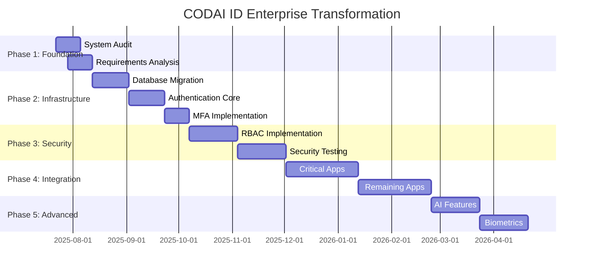

# CODAI ID - Enterprise Transformation Plan 🚀

**Project**: Transforming CODAI ID into World-Class Enterprise Authentication & Identity System  
**Date**: July 22, 2025  
**Version**: 1.0  
**Status**: Plan Created - Ready for Implementation  

---

## 🎯 Executive Summary

This comprehensive plan outlines the transformation of the CODAI ecosystem's ID project from its current basic state (Next.js + SQLite + basic auth) into a world-class, enterprise-grade authentication and identification system capable of serving 40+ applications across banking, healthcare, education, legal, and AI services with millions of users.

### Current State Analysis
- **Technology**: Next.js 15 + React 19 + SQLite + Basic JWT Auth
- **Scope**: Single application with basic user management
- **Limitations**: Not scalable, basic security, no SSO, no MFA, SQLite unsuitable for enterprise
- **Users**: Limited concurrent users, single tenant

### Target State Vision
- **Enterprise-Grade Security**: MFA, SSO, biometrics, Zero Trust architecture
- **Massive Scalability**: Support for millions of concurrent users
- **Regulatory Compliance**: GDPR, HIPAA, SOC2, ISO 27001 ready
- **Ecosystem Integration**: Seamless integration with 40+ CODAI applications
- **Modern Features**: AI-powered fraud detection, adaptive authentication, global CDN

---

## 🏗️ Technical Architecture Transformation

### Current Architecture
```
[Frontend: Next.js] → [Backend: Node.js] → [Database: SQLite]
```

### Target Enterprise Architecture
```
[Global CDN] → [Load Balancer] → [API Gateway]
    ↓
[Microservices Cluster]
├── Authentication Service (OAuth2/OIDC)
├── User Management Service
├── Authorization Service (RBAC/ABAC)
├── MFA Service
├── Audit & Logging Service
├── Notification Service
└── Analytics Service
    ↓
[Database Cluster: PostgreSQL] + [Cache: Redis] + [Search: Elasticsearch]
    ↓
[Message Queue: Kafka] → [Event Processing] → [AI Fraud Detection]
```

---

## 📋 5-Phase Implementation Plan

### **PHASE 1: Foundation & Analysis** (Weeks 1-4)

#### Week 1-2: System Audit & Requirements
- [ ] **Technical Audit**
  - Analyze current codebase architecture
  - Identify security vulnerabilities
  - Performance baseline measurements
  - Database schema analysis
  
- [ ] **Ecosystem Integration Analysis**
  - Map authentication requirements for all 40+ applications
  - Document current integration patterns
  - Identify critical path applications (bancai, ajutai, legalizai)
  
- [ ] **Compliance Requirements**
  - GDPR compliance gap analysis
  - HIPAA requirements for healthcare apps (ajutai)
  - Financial services regulations for banking (bancai)
  - Educational data protection for studiai

#### Week 3-4: Architecture Design
- [ ] **Target Architecture Design**
  - Microservices architecture blueprint
  - API Gateway specifications
  - Database architecture (sharding strategy)
  - Caching strategy design
  
- [ ] **Security Architecture**
  - Zero Trust security model design
  - MFA implementation strategy
  - SSO integration patterns
  - Encryption standards definition

**Deliverables**: Technical audit report, architecture blueprints, requirements specification

---

### **PHASE 2: Core Infrastructure** (Weeks 5-12)

#### Database Migration (Weeks 5-7)
- [ ] **PostgreSQL Setup**
  - Set up primary-replica PostgreSQL cluster
  - Implement connection pooling (PgBouncer)
  - Configure automated backups
  - Set up monitoring (Prometheus + Grafana)
  
- [ ] **Data Migration**
  - Create migration scripts from SQLite to PostgreSQL
  - Implement data validation and integrity checks
  - Test migration process in staging environment
  - Create rollback procedures

#### Authentication Core (Weeks 8-10)
- [ ] **SSO Implementation**
  - Deploy and configure Keycloak/Auth0 enterprise solution
  - Implement OAuth 2.0 and OpenID Connect
  - Create custom authentication flows
  - Integration with existing Next.js frontend
  
- [ ] **JWT Enhancement**
  - Implement short-lived access tokens (15 minutes)
  - Add refresh token rotation
  - Create token revocation mechanisms
  - Implement cryptographic signing

#### MFA Implementation (Weeks 11-12)
- [ ] **Multi-Factor Authentication**
  - TOTP support (Google Authenticator, Authy)
  - SMS/Email OTP integration
  - Hardware token support (YubiKey)
  - Backup codes generation
  - MFA enrollment flows

**Deliverables**: PostgreSQL cluster, SSO server, MFA system, JWT enhancement

---

### **PHASE 3: Advanced Security & Testing** (Weeks 13-20)

#### Security Enhancements (Weeks 13-16)
- [ ] **Role-Based Access Control (RBAC)**
  - Define role hierarchy for ecosystem applications
  - Implement fine-grained permissions system
  - Create admin interfaces for role management
  - Policy-as-Code implementation with Open Policy Agent
  
- [ ] **Zero Trust Implementation**
  - Device registration and management
  - Contextual authentication (location, device, time)
  - Continuous authentication monitoring
  - Risk-based authentication flows
  
- [ ] **Encryption & Security**
  - End-to-end encryption implementation
  - Key management system setup
  - Certificate authority configuration
  - Security headers implementation

#### Testing & Validation (Weeks 17-20)
- [ ] **Security Testing**
  - Penetration testing with OWASP methodology
  - Vulnerability assessments
  - Code security audits
  - Compliance validation testing
  
- [ ] **Performance Testing**
  - Load testing for 1M+ concurrent users
  - Stress testing database cluster
  - CDN performance validation
  - API response time optimization
  
- [ ] **Pilot Application Integration**
  - Select 3 pilot applications for testing
  - Implement SDK for easy integration
  - Create migration guides
  - Monitor integration success metrics

**Deliverables**: RBAC system, security testing reports, pilot integrations

---

### **PHASE 4: Ecosystem Integration** (Weeks 21-32)

#### Critical Applications (Weeks 21-26)
- [ ] **Banking Integration (bancai)**
  - PCI DSS compliance implementation
  - Financial transaction authentication
  - Strong customer authentication (SCA)
  - Fraud detection integration
  
- [ ] **Healthcare Integration (ajutai)**
  - HIPAA compliance implementation
  - Medical data access controls
  - Audit trail requirements
  - Patient consent management
  
- [ ] **Legal Integration (legalizai)**
  - Legal document authentication
  - Digital signature integration
  - Professional identity verification
  - Compliance audit trails

#### Remaining Applications (Weeks 27-32)
- [ ] **Education & AI Services**
  - studiai: Student identity management, FERPA compliance
  - codai: Developer authentication, API key management
  - romai: AI service authentication, usage tracking
  - conversai: Chat authentication, message encryption
  
- [ ] **Business Applications**
  - marketai: Merchant verification, transaction auth
  - talentai: Professional identity, skills verification
  - cumparai: Consumer protection, purchase authentication
  - sociai: Social identity, privacy controls

**Deliverables**: All 40+ applications integrated with centralized authentication

---

### **PHASE 5: Advanced Features & Optimization** (Weeks 33-40)

#### AI-Powered Features (Weeks 33-36)
- [ ] **Fraud Detection System**
  - Machine learning models for anomaly detection
  - Real-time risk scoring
  - Behavioral biometrics analysis
  - Threat intelligence integration
  
- [ ] **Adaptive Authentication**
  - Context-aware authentication decisions
  - Dynamic MFA requirements
  - User behavior profiling
  - Risk-based access controls

#### Biometrics & Modern Features (Weeks 37-40)
- [ ] **Biometric Authentication**
  - Facial recognition integration
  - Fingerprint authentication
  - Voice recognition (optional)
  - Liveness detection
  
- [ ] **Advanced Features**
  - Progressive web app (PWA) support
  - Offline authentication capabilities
  - Cross-device synchronization
  - Emergency access procedures
  
- [ ] **Global Deployment**
  - Multi-region deployment setup
  - CDN optimization for Romania/Europe
  - Edge computing implementation
  - Disaster recovery procedures

**Deliverables**: AI fraud detection, biometric auth, global deployment

---

## 🔒 Security Requirements

### Cryptographic Standards
- **Encryption**: AES-256 (data at rest), TLS 1.3 (data in transit)
- **Hashing**: Argon2id for passwords, SHA-256 for data integrity
- **Key Management**: Hardware Security Modules (HSM) or AWS KMS
- **Certificates**: ECC P-384 or RSA 4096-bit

### Authentication Standards
- **Protocols**: OAuth 2.1, OpenID Connect 1.0, SAML 2.0
- **Token Formats**: JWT with proper expiration and rotation
- **Session Management**: Secure, httpOnly, sameSite cookies
- **Rate Limiting**: Per-user and global rate limiting

### Authorization Framework
- **Model**: Hybrid RBAC/ABAC with policy engine
- **Granularity**: Resource-level permissions
- **Delegation**: Secure delegation patterns
- **Audit**: Complete audit trail for all access decisions

---

## 📊 Scalability & Performance Targets

### Performance Metrics
- **Authentication Latency**: < 100ms (99th percentile)
- **API Response Time**: < 50ms (95th percentile)
- **Concurrent Users**: 10M+ simultaneous sessions
- **Database Performance**: < 10ms query response time
- **Availability**: 99.99% uptime (52.56 minutes downtime/year)

### Scalability Architecture
- **Horizontal Scaling**: Auto-scaling groups with Kubernetes
- **Database Scaling**: Read replicas, connection pooling, sharding
- **Caching Strategy**: Multi-layer caching (L1: Application, L2: Redis, L3: CDN)
- **Global Distribution**: Multi-region deployment with data residency

---

## 📋 Compliance & Regulatory Requirements

### GDPR Compliance
- [ ] Data protection by design and by default
- [ ] User consent management
- [ ] Right to be forgotten implementation
- [ ] Data portability features
- [ ] Privacy impact assessments
- [ ] Data breach notification procedures

### Industry-Specific Compliance
- [ ] **HIPAA** (Healthcare - ajutai): PHI protection, audit logs, access controls
- [ ] **PCI DSS** (Banking - bancai): Card data protection, secure processing
- [ ] **FERPA** (Education - studiai): Student record protection
- [ ] **SOC 2** (General): Security, availability, processing integrity

### Romanian/EU Regulations
- [ ] eIDAS Regulation compliance
- [ ] Romanian data protection law (RGPD)
- [ ] Financial services regulations (ANPC, BNR)
- [ ] Healthcare data regulations

---

## 🛠️ Technology Stack

### Core Technologies
- **Backend**: Node.js 20+ with NestJS framework
- **Frontend**: Next.js 15 + React 19 + TypeScript
- **Database**: PostgreSQL 16+ with read replicas
- **Cache**: Redis 7+ with clustering
- **Message Queue**: Apache Kafka or RabbitMQ
- **Search**: Elasticsearch 8+

### Security & Authentication
- **Identity Provider**: Keycloak or Auth0 Enterprise
- **API Gateway**: Kong or AWS API Gateway
- **Rate Limiting**: Redis-based rate limiting
- **Monitoring**: ELK Stack (Elasticsearch, Logstash, Kibana)
- **Security Scanning**: SonarQube, Snyk, OWASP ZAP

### Infrastructure
- **Containerization**: Docker + Kubernetes
- **CI/CD**: GitHub Actions or GitLab CI
- **Cloud Provider**: AWS, Azure, or GCP (multi-cloud ready)
- **Infrastructure as Code**: Terraform
- **Monitoring**: Prometheus + Grafana + AlertManager

---

## 💰 Budget Estimation

### Development Resources (6 months)
- **Senior Backend Engineers**: 3 × €8,000/month × 6 = €144,000
- **Security Engineers**: 2 × €9,000/month × 6 = €108,000
- **DevOps Engineers**: 2 × €8,500/month × 6 = €102,000
- **QA Engineers**: 2 × €6,000/month × 6 = €72,000
- **Project Management**: 1 × €7,000/month × 6 = €42,000
- **Total Development**: €468,000

### Infrastructure Costs (Annual)
- **Cloud Infrastructure**: €50,000/year
- **Third-party Services**: €30,000/year (Auth0, monitoring tools)
- **Security Tools**: €20,000/year
- **Compliance Audits**: €15,000/year
- **Total Infrastructure**: €115,000/year

### **Total First Year Investment**: €583,000

---

## 📈 Success Metrics & KPIs

### Technical Metrics
- **Uptime**: 99.99% availability
- **Performance**: < 100ms authentication latency
- **Security**: Zero critical vulnerabilities
- **Scalability**: Support 10M+ concurrent users

### Business Metrics
- **Integration Success**: 100% of 40+ applications integrated
- **User Adoption**: > 95% user satisfaction score
- **Compliance**: All regulatory requirements met
- **Cost Efficiency**: < €0.01 per authentication request

### Security Metrics
- **Security Incidents**: Zero data breaches
- **Fraud Detection**: > 99% fraud detection accuracy
- **Access Control**: 100% RBAC compliance
- **Audit Trail**: Complete audit coverage

---

## 🚦 Risk Management

### Technical Risks
- **Migration Complexity**: Mitigate with thorough testing and rollback plans
- **Performance Issues**: Address with load testing and optimization
- **Integration Failures**: Prevent with pilot testing and phased rollout
- **Security Vulnerabilities**: Minimize with security audits and monitoring

### Business Risks
- **Budget Overruns**: Control with milestone-based budgeting
- **Timeline Delays**: Prevent with buffer time and parallel development
- **Compliance Issues**: Address with legal consultation and audits
- **User Adoption**: Ensure with user experience focus and training

### Mitigation Strategies
- **Blue-Green Deployment**: Zero-downtime deployments
- **Feature Flags**: Safe feature rollouts
- **Automated Testing**: Comprehensive test coverage
- **Monitoring**: Real-time system health monitoring

---

## 📅 Detailed Timeline



---

## 🎯 Next Steps

### Immediate Actions (This Week)
1. **Stakeholder Approval**: Get executive sign-off on the plan
2. **Team Assembly**: Recruit development team members
3. **Environment Setup**: Prepare development and staging environments
4. **Vendor Evaluation**: Evaluate identity provider solutions (Keycloak vs Auth0)

### Week 1 Actions
1. **Project Kickoff**: Initialize project tracking and communication
2. **Technical Audit Start**: Begin comprehensive system analysis
3. **Requirements Gathering**: Start ecosystem application interviews
4. **Architecture Design**: Begin detailed technical architecture

### Success Criteria for Go-Live
- [ ] All 40+ applications successfully integrated
- [ ] Security audit passed with no critical issues
- [ ] Performance benchmarks met
- [ ] Compliance requirements satisfied
- [ ] User acceptance testing completed
- [ ] Disaster recovery procedures tested

---

## 📞 Project Contacts

- **Project Sponsor**: CODAI Ecosystem Leadership
- **Technical Lead**: Senior Backend Architect
- **Security Lead**: Security Engineering Team
- **Compliance Lead**: Legal & Regulatory Team
- **Integration Lead**: Application Teams Coordinator

---

**This plan represents the roadmap to transform CODAI ID into a world-class, enterprise-grade authentication and identification system serving the entire CODAI ecosystem. Success depends on careful execution, stakeholder alignment, and maintaining focus on security, scalability, and user experience.**

---

*Document Version: 1.0*  
*Last Updated: July 22, 2025*  
*Next Review: July 29, 2025*
