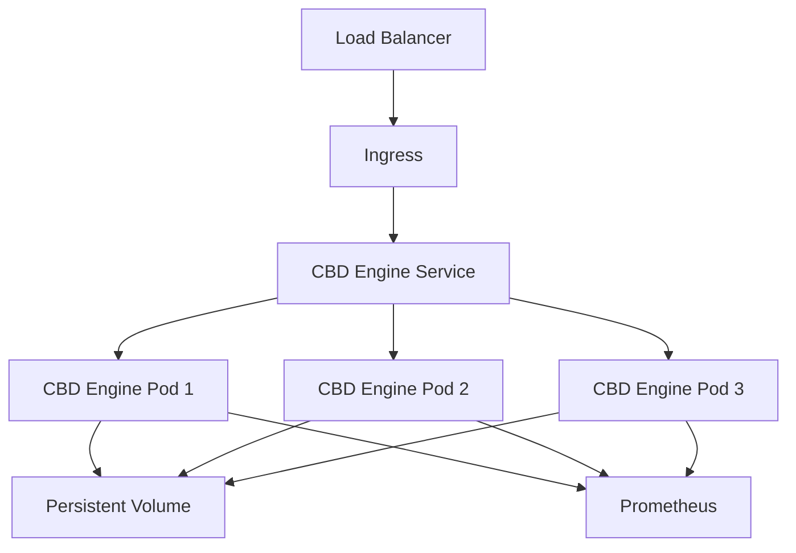

# CBD Enterprise Production Deployment Guide

This guide provides comprehensive instructions for deploying CBD Enterprise Engine to production environments using containerized orchestration with enterprise-grade security and monitoring.

## 📋 Prerequisites

### System Requirements

- **Docker Engine**: Version 20.10 or higher
- **Kubernetes**: Version 1.24 or higher
- **kubectl**: Configured and authenticated
- **PowerShell**: Version 5.1 or higher (Windows) or PowerShell Core 7+ (cross-platform)
- **Helm**: Version 3.0 or higher (optional, for package management)

### Hardware Requirements

- **CPU**: Minimum 8 cores (16 cores recommended for production)
- **Memory**: Minimum 16GB RAM (32GB recommended)
- **Storage**: Minimum 1TB SSD (enterprise NVMe recommended)
- **Network**: High-bandwidth, low-latency connection

### Security Requirements

- **TLS Certificates**: Valid SSL certificates for HTTPS endpoints
- **Container Registry**: Access to secure container registry
- **RBAC**: Kubernetes Role-Based Access Control configured
- **Network Policies**: Kubernetes network policies enabled
- **Secret Management**: Kubernetes secrets or external secret management

## 🚀 Quick Start

### 1. Deploy to Production

```powershell
# Basic deployment
.\scripts\deploy-production.ps1

# Deploy specific version
.\scripts\deploy-production.ps1 -ImageTag "v1.2.0"

# Dry run (test without deploying)
.\scripts\deploy-production.ps1 -DryRun

# Deploy to specific namespace
.\scripts\deploy-production.ps1 -Namespace "production"
```

### 2. Validate Deployment

```powershell
# Validate production deployment
.\scripts\validate-deployment.ps1 -BaseUrl "https://your-domain.com"

# Validate with verbose output
.\scripts\validate-deployment.ps1 -BaseUrl "https://your-domain.com" -Verbose
```

### 3. Monitor Deployment

```powershell
# Watch deployment progress
kubectl get pods -n cbd-enterprise -w

# Check deployment status
kubectl rollout status deployment/cbd-engine -n cbd-enterprise

# View logs
kubectl logs -f deployment/cbd-engine -n cbd-enterprise
```

## 📁 File Structure

```
packages/cbd/rust/
├── Dockerfile                          # Multi-stage production container
├── docker-compose.prod.yml             # Local production testing
├── docker/
│   └── config/
│       └── production.toml             # Production configuration
├── k8s/
│   └── production-deployment.yaml      # Kubernetes manifests
└── scripts/
    ├── deploy-production.ps1           # PowerShell deployment script
    ├── deploy-production.bat          # Windows batch launcher
    ├── deploy-production.sh           # Bash deployment script (Linux/macOS)
    └── validate-deployment.ps1        # Deployment validation
```

## 🐳 Container Configuration

### Dockerfile Features

- **Multi-stage build**: Optimized for production with minimal attack surface
- **Security hardening**: Non-root user, read-only filesystem, security contexts
- **Health checks**: Built-in container health monitoring
- **Resource optimization**: Efficient layer caching and minimal image size

### Production Configuration

Key configuration settings in `docker/config/production.toml`:

```toml
# Enterprise Security
[security]
encryption_key = "${CBD_ENCRYPTION_KEY}"
jwt_secret = "${CBD_JWT_SECRET}"
tls_cert_path = "/app/certs/tls.crt"
tls_key_path = "/app/certs/tls.key"

# Performance Tuning
[performance]
max_connections = 10000
worker_threads = 8
connection_pool_size = 100

# Monitoring
[monitoring]
prometheus_enabled = true
jaeger_enabled = true
metrics_port = 9090
```

## ☸️ Kubernetes Deployment

### Architecture Overview



### Resource Configuration

```yaml
resources:
  requests:
    memory: "2Gi"
    cpu: "1"
  limits:
    memory: "8Gi"
    cpu: "4"
```

### High Availability

- **Replicas**: 3 pods minimum for high availability
- **Pod Disruption Budget**: Ensures at least 2 pods always available
- **Horizontal Pod Autoscaler**: Automatic scaling based on CPU/memory metrics
- **Anti-affinity**: Pods distributed across different nodes

### Persistent Storage

- **Data Volume**: 500Gi for application data
- **Logs Volume**: 100Gi for log storage
- **Storage Class**: High-performance SSD with replication

## 🔒 Security Configuration

### TLS/SSL Configuration

1. **Generate certificates**:
```bash
openssl req -x509 -nodes -days 365 -newkey rsa:2048 \
  -keyout tls.key -out tls.crt \
  -subj "/CN=your-domain.com"
```

2. **Create Kubernetes secret**:
```bash
kubectl create secret tls cbd-tls-secret \
  --cert=tls.crt --key=tls.key -n cbd-enterprise
```

### Network Security

- **Network Policies**: Restrict pod-to-pod communication
- **Ingress Rules**: Control external access
- **Service Mesh**: Optional Istio integration for advanced security

### RBAC Configuration

```yaml
apiVersion: rbac.authorization.k8s.io/v1
kind: ClusterRole
metadata:
  name: cbd-engine-role
rules:
- apiGroups: [""]
  resources: ["configmaps", "secrets"]
  verbs: ["get", "list"]
```

## 📊 Monitoring and Observability

### Metrics Collection

- **Prometheus**: Application and system metrics
- **Grafana**: Visualization and alerting
- **Jaeger**: Distributed tracing
- **Custom Metrics**: Business-specific KPIs

### Health Checks

- **Liveness Probe**: `/health` endpoint every 30s
- **Readiness Probe**: Service readiness validation
- **Startup Probe**: Initial container startup validation

### Logging

- **Structured Logging**: JSON format for log aggregation
- **Log Levels**: Configurable (DEBUG, INFO, WARN, ERROR)
- **Log Rotation**: Automatic log rotation and retention
- **Centralized Logging**: ELK stack or cloud logging integration

## 🔧 Deployment Scripts

### PowerShell Script (`deploy-production.ps1`)

Features:
- ✅ Prerequisites validation
- ✅ Docker image building and pushing
- ✅ Security scanning with Trivy
- ✅ Kubernetes deployment
- ✅ Health checks and smoke tests
- ✅ Rollback capabilities
- ✅ Deployment reporting

### Validation Script (`validate-deployment.ps1`)

Test Coverage:
- ✅ Kubernetes connectivity
- ✅ Deployment status
- ✅ Pod health
- ✅ Service connectivity
- ✅ HTTP endpoints
- ✅ TLS certificates
- ✅ Performance baseline
- ✅ Resource utilization
- ✅ Log analysis

## 🏃‍♂️ Local Testing with Docker Compose

For local production-like testing:

```powershell
# Start all services
docker-compose -f docker-compose.prod.yml up -d

# Check service status
docker-compose -f docker-compose.prod.yml ps

# View logs
docker-compose -f docker-compose.prod.yml logs -f cbd-engine

# Stop services
docker-compose -f docker-compose.prod.yml down
```

Included services:
- CBD Engine (main application)
- PostgreSQL (database)
- Redis (caching)
- Prometheus (metrics)
- Grafana (monitoring)
- Jaeger (tracing)
- Nginx (reverse proxy)

## 📈 Performance Tuning

### Application Tuning

```toml
[performance]
worker_threads = 8              # Match CPU cores
max_connections = 10000         # Based on expected load
connection_timeout = 30         # Seconds
request_timeout = 60           # Seconds
keepalive_timeout = 75         # Seconds
```

### Kubernetes Tuning

```yaml
# Horizontal Pod Autoscaler
spec:
  minReplicas: 3
  maxReplicas: 20
  targetCPUUtilizationPercentage: 70
  targetMemoryUtilizationPercentage: 80
```

### Database Optimization

- Connection pooling with PgBouncer
- Read replicas for query scaling
- Database connection limits tuned for workload

## 🚨 Troubleshooting

### Common Issues

#### 1. Pod Startup Failures

```bash
# Check pod events
kubectl describe pod <pod-name> -n cbd-enterprise

# View pod logs
kubectl logs <pod-name> -n cbd-enterprise --previous
```

#### 2. Service Discovery Issues

```bash
# Test service connectivity
kubectl exec -it <pod-name> -n cbd-enterprise -- nslookup cbd-engine-service

# Check service endpoints
kubectl get endpoints cbd-engine-service -n cbd-enterprise
```

#### 3. Resource Constraints

```bash
# Check node resources
kubectl top nodes

# Check pod resource usage
kubectl top pods -n cbd-enterprise
```

#### 4. Configuration Issues

```bash
# Verify config map
kubectl get configmap cbd-config -n cbd-enterprise -o yaml

# Check secret values
kubectl get secret cbd-secrets -n cbd-enterprise -o yaml
```

### Performance Debugging

```bash
# CPU profiling
kubectl exec -it <pod-name> -n cbd-enterprise -- curl localhost:8080/debug/pprof/profile

# Memory profiling
kubectl exec -it <pod-name> -n cbd-enterprise -- curl localhost:8080/debug/pprof/heap

# Trace analysis
kubectl port-forward svc/jaeger 16686:16686 -n cbd-enterprise
```

## 🔄 Rollback Procedures

### Automated Rollback

```powershell
# Rollback to previous version
.\scripts\deploy-production.ps1 -Rollback
```

### Manual Rollback

```bash
# View deployment history
kubectl rollout history deployment/cbd-engine -n cbd-enterprise

# Rollback to previous revision
kubectl rollout undo deployment/cbd-engine -n cbd-enterprise

# Rollback to specific revision
kubectl rollout undo deployment/cbd-engine --to-revision=2 -n cbd-enterprise
```

## 📝 Maintenance Procedures

### Regular Updates

1. **Update container images**:
   ```bash
   kubectl set image deployment/cbd-engine cbd-engine=cbd-enterprise/cbd-engine:v1.3.0 -n cbd-enterprise
   ```

2. **Update configuration**:
   ```bash
   kubectl apply -f k8s/production-deployment.yaml
   ```

3. **Validate after updates**:
   ```powershell
   .\scripts\validate-deployment.ps1
   ```

### Backup Procedures

1. **Database backup**:
   ```bash
   kubectl exec -it postgres-pod -- pg_dump cbd_enterprise > backup.sql
   ```

2. **Configuration backup**:
   ```bash
   kubectl get configmap cbd-config -o yaml > config-backup.yaml
   kubectl get secret cbd-secrets -o yaml > secrets-backup.yaml
   ```

### Security Updates

1. **Regular security scans**:
   ```bash
   trivy image cbd-enterprise/cbd-engine:latest
   ```

2. **Certificate renewal**:
   ```bash
   kubectl create secret tls cbd-tls-secret --cert=new-tls.crt --key=new-tls.key --dry-run=client -o yaml | kubectl apply -f -
   ```

## 📞 Support and Escalation

### Health Check Endpoints

- **Health**: `GET /health` - Basic health status
- **Ready**: `GET /ready` - Readiness for traffic
- **Metrics**: `GET /metrics` - Prometheus metrics
- **Version**: `GET /version` - Application version info

### Support Contacts

- **DevOps Team**: devops@company.com
- **Security Team**: security@company.com
- **On-call**: +1-xxx-xxx-xxxx (24/7 support)

### Escalation Procedures

1. **Level 1**: Check monitoring dashboards
2. **Level 2**: Review logs and metrics
3. **Level 3**: Contact DevOps team
4. **Level 4**: Emergency escalation to leadership

---

*This documentation is maintained by the DevOps team and updated with each release. Last updated: $(Get-Date -Format "yyyy-MM-dd")*
