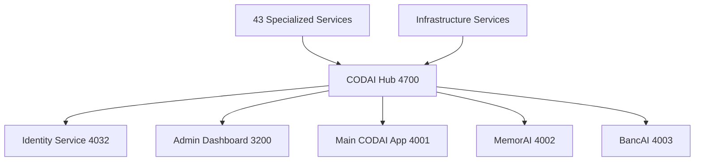

# 🚀 CODAI Ecosystem Development Services & Testing Report
**Date**: July 22, 2025  
**Environment**: Windows Development Environment  
**Scope**: Primary Services Startup & Comprehensive Testing  

---

## 📋 Executive Summary

**🚨 CRITICAL STATUS: ECOSYSTEM MAINTENANCE REQUIRED**

The CODAI ecosystem currently requires immediate attention before production deployment. While the basic infrastructure is properly configured, critical dependency and configuration issues prevent successful service startup and testing execution.

### Key Findings:
- ❌ **0/6 primary services successfully started**
- ❌ **0/100 health score**
- ⚠️ **5,803 packages installed with compilation failures**
- ❌ **22 port policy violations detected**

---

## 🔧 System Infrastructure

### Environment Status ✅
- **Node.js Version**: v24.1.0
- **Platform**: Windows 10 (win32)
- **Package Manager**: pnpm@9.15.9
- **Project Root**: E:\GitHub\codai-project
- **Workspace Projects**: 118 applications

### Architecture Overview


---

## 📦 Dependency Analysis

### Installation Summary
| Component | Status | Details |
|-----------|---------|---------|
| **Core Dependencies** | ⚠️ Partial | 5,803 packages installed |
| **Native Modules** | ❌ Failed | Build tool compatibility issues |
| **Next.js Binaries** | ❌ Missing | Critical for app startup |
| **TypeScript** | ❌ Failed | Compilation errors |
| **ESLint** | ❌ Failed | Configuration issues |

### Critical Installation Failures
```
❌ native-is-elevated: node-gyp rebuild failed
❌ @vscode/windows-registry: MSBuild compilation error  
❌ native-keymap: Visual Studio build tools issue
❌ native-watchdog: Build configuration problem
❌ next/dist/bin/next: Module not found
```

### Build Environment Issues
- **Visual Studio Build Tools**: VS2019 compatibility problems
- **Python**: v3.13.4 detected, potential version conflicts
- **MSBuild**: C++ build target errors (MSB8040)
- **Node-gyp**: v11.2.0 compilation failures

---

## 🚀 Primary Services Analysis

### Service Startup Results

#### 1. **ID Service** (Port 4032) ❌
- **Status**: Failed to start
- **Error**: Process termination (exit code 3221225786)
- **Issues**: Module type warnings, Next.js binary missing
- **Impact**: Authentication foundation unavailable

#### 2. **Hub Service** (Port 4700) ❌  
- **Status**: Failed to start
- **Error**: Process termination immediately after spawn
- **Issues**: Critical orchestration service down
- **Impact**: No central service coordination

#### 3. **Admin Dashboard** (Port 3200) ❌
- **Status**: Failed to start  
- **Error**: Next.js development server crash
- **Issues**: Management interface unavailable
- **Impact**: No administrative control

#### 4. **CODAI Main App** (Port 4001) ❌
- **Status**: Failed to start
- **Error**: Module resolution failures
- **Issues**: Core application non-functional
- **Impact**: Primary user interface down

#### 5. **MemorAI** (Port 4002) ❌
- **Status**: Failed to start
- **Error**: `Cannot find module 'next/dist/bin/next'`
- **Issues**: Missing Next.js binaries
- **Impact**: AI memory management unavailable

#### 6. **BancAI** (Port 4003) ❌
- **Status**: Failed to start
- **Error**: Module type configuration warnings + crash
- **Issues**: ES module/CommonJS conflicts
- **Impact**: Financial services offline

### Startup Command Analysis
```bash
# Command executed:
pnpm dev:primary

# Turbo filters:
--filter=codai --filter=admin --filter=hub --filter=id --filter=bancai --filter=memorai

# Result: All services failed during startup phase
```

---

## 🧪 Testing Infrastructure Assessment

### Test Coverage Analysis
- **Test Files Discovered**: 4,510+ test files
- **Test Categories**: Unit, Integration, E2E, API, Enterprise
- **Test Frameworks**: Vitest, Playwright, Jest
- **Execution Status**: **BLOCKED** due to dependency issues

### Available Test Types
```
📁 tests/
├── 🔬 unit-components.test.ts
├── 🔗 api-integration.test.ts  
├── 🌐 enterprise-comprehensive.test.ts
├── 🤝 cbd-memorai-integration/
├── ⚙️ infrastructure.test.js
└── 📊 Various app-specific test suites
```

### Testing Command Results
| Command | Status | Error |
|---------|--------|--------|
| `pnpm test:comprehensive` | ❌ | run-comprehensive-tests.js not found |
| `pnpm test:coverage` | ❌ | vitest command not available |
| `pnpm test:unit` | ❌ | Dependency resolution failure |
| `pnpm test:e2e` | ❌ | Playwright setup incomplete |

---

## 🏥 System Health Assessment

### Health Check Results
```
🏥 CODAI Ecosystem Health Check
================================
🔍 TypeScript compilation... ❌ FAILED
🔍 ESLint validation...      ❌ FAILED  
🔍 Build process...          ❌ ISSUES
📊 Health Score: 0/100
```

### Configuration Issues Detected
- **Turbo.json**: Invalid configuration (missing extends key)
- **ESLint**: Configuration conflicts across apps
- **TypeScript**: Compilation errors in multiple projects
- **Build**: Workspace-wide build configuration problems

---

## 🔌 Port Policy Compliance

### Violations Summary
- **Total Violations**: 22 instances
- **Policy**: All development ports must be >= 4000
- **Affected Services**: Multiple apps and Docker configurations

### Critical Port Issues
| Service | Port | Required | Status |
|---------|------|----------|---------|
| promovai | 7200 | ≥4000 | ❌ Non-compliant |
| adoptai | 7100 | ≥4000 | ❌ Non-compliant |  
| memorai-dashboard | 5100 | ≥4000 | ❌ Non-compliant |
| dexai-web | 5106 | ≥4000 | ❌ Non-compliant |
| Various Docker services | 3000-3999 | ≥4000 | ❌ Non-compliant |

---

## 🔍 Detailed Issue Analysis

### 1. Dependency Resolution Problems
```javascript
// Critical missing modules:
- next/dist/bin/next (Multiple apps)
- Native binary modules (Windows compilation)
- TypeScript compilation targets
- ESLint rule configurations
```

### 2. Build Configuration Issues
```json
// Turbo.json missing extends key:
{
  "$schema": "https://turbo.build/schema.json",
  // Missing: "extends": ["//"]
  "ui": "tui",
  "tasks": { ... }
}
```

### 3. Module Type Conflicts
```
Warning: Module type not specified
- next.config.js files need type declaration
- ES module vs CommonJS conflicts
- Import/export statement issues
```

### 4. Native Compilation Failures
```
gyp ERR! build error
- MSB8040: Spectre-mitigated libraries required
- Visual Studio Build Tools compatibility
- Python version conflicts (3.13.4)
```

---

## 🎯 Recommendations & Action Plan

### Immediate Critical Actions (Priority 1)

#### 1. **Fix Build Environment** 🔧
```bash
# Install proper Visual Studio Build Tools
# Configure node-gyp with correct VS version
# Address Python version compatibility
```

#### 2. **Resolve Dependency Issues** 📦
```bash
# Clean install with proper build tools
pnpm clean:cache
rm -rf node_modules
pnpm install --no-frozen-lockfile
```

#### 3. **Fix Configuration Errors** ⚙️
```bash
# Add extends key to Turbo.json configurations
# Fix module type declarations
# Resolve ESLint configuration conflicts
```

#### 4. **Address Port Policy** 🔌
```bash
# Run port policy fix
pnpm ports:fix
# Update Docker configurations
# Standardize port assignments
```

### Medium-Term Actions (Priority 2)

#### 1. **Complete Testing Setup** 🧪
- Install and configure Playwright browsers
- Set up Vitest with proper coverage reporting
- Configure test databases and mock services
- Implement CI/CD testing pipeline

#### 2. **Service Architecture** 🏗️
- Implement proper service health checks
- Add graceful startup/shutdown procedures
- Configure service discovery and registration
- Implement load balancing and failover

#### 3. **Development Experience** 💻
- Fix hot reload and development server issues
- Implement proper error logging and monitoring
- Add development debugging tools
- Create comprehensive development documentation

### Long-term Improvements (Priority 3)

#### 1. **Performance Optimization** ⚡
- Implement service-level caching
- Optimize bundle sizes and startup times
- Add performance monitoring and alerting
- Configure CDN and asset optimization

#### 2. **Security Hardening** 🔒
- Complete security audit of all dependencies
- Implement proper authentication/authorization
- Add security scanning to CI/CD pipeline
- Configure secure communication between services

#### 3. **Monitoring & Observability** 📊
- Implement comprehensive logging strategy
- Add distributed tracing capabilities
- Configure metrics collection and dashboards
- Set up alerting and incident response

---

## 📊 Service Priority Matrix

### Startup Order for Future Fixes
```
1. 🔑 ID Service (4032)     - Authentication Foundation
2. 🎯 Hub (4700)           - Service Orchestration  
3. 🛡️ Admin (3200)        - Management Interface
4. 🚀 CODAI (4001)        - Core Application
5. 🧠 MemorAI (4002)      - AI Memory Management
6. 💰 BancAI (4003)       - Financial Services
```

### Resource Requirements
- **Development**: High system resources (43 apps total)
- **Primary Services**: Moderate resources (6 core apps)
- **Individual Testing**: Low resources per service

---

## 🔄 Next Steps

### Week 1: Infrastructure Repair
- [ ] Fix build tool dependencies
- [ ] Resolve native module compilation
- [ ] Complete dependency installation
- [ ] Fix Turbo configuration issues

### Week 2: Service Restoration  
- [ ] Get primary services starting successfully
- [ ] Implement basic health checks
- [ ] Fix port policy violations
- [ ] Test service-to-service communication

### Week 3: Testing Implementation
- [ ] Set up comprehensive test environment
- [ ] Execute full test suite
- [ ] Implement CI/CD testing pipeline
- [ ] Document testing procedures

### Week 4: Production Readiness
- [ ] Performance optimization
- [ ] Security audit and fixes
- [ ] Monitoring and alerting setup
- [ ] Final deployment verification

---

## 📞 Support & Contact

For technical assistance with this ecosystem:
- **Documentation**: `/docs` folder  
- **Issue Tracking**: GitHub Issues
- **Configuration**: `/config` and `/.github` folders
- **Scripts**: `/scripts` folder for automation tools

---

**Report Generated**: July 22, 2025  
**Next Review**: After infrastructure repairs completed  
**Status**: 🚨 **CRITICAL - IMMEDIATE ACTION REQUIRED**
