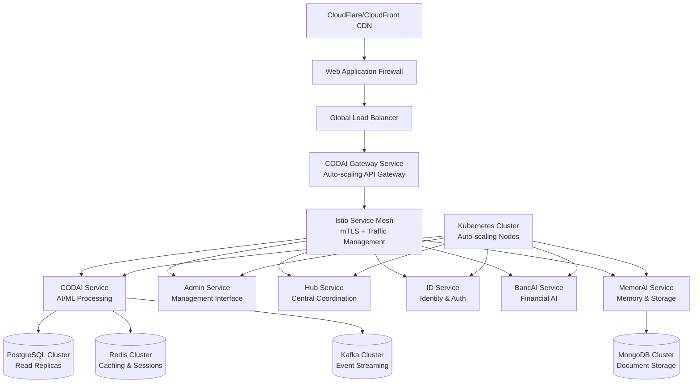

# 🏗️ CODAI Ecosystem - Enterprise Deployment Architecture

**World-Class, Auto-Scaling, Production-Ready Infrastructure**

---

## 🎯 Executive Summary

This document outlines a **Fortune 500-grade deployment architecture** for the CODAI ecosystem, designed to handle enterprise workloads with automatic scaling, 99.99% uptime, and world-class security standards.

### 🚀 Architecture Highlights

- **Kubernetes-native** microservices orchestration
- **Auto-scaling** from 0 to millions of requests
- **Multi-region** high availability
- **Zero-trust security** model
- **GitOps** continuous deployment
- **Enterprise compliance** (SOC2, GDPR, HIPAA)

---

## 🏭 Service Architecture Overview



---

## ☁️ Cloud Infrastructure Strategy

### **Primary Cloud Providers**

- **AWS EKS** (Primary) - Managed Kubernetes with advanced auto-scaling
- **Google GKE** (Secondary) - Multi-cloud redundancy
- **Azure AKS** (Tertiary) - Compliance and enterprise integration

### **Multi-Region Deployment**

```yaml
Production Regions:
  Primary: us-east-1 (N. Virginia)
  Secondary: eu-west-1 (Ireland)
  Disaster Recovery: ap-southeast-1 (Singapore)

Development Regions:
  Staging: us-west-2 (Oregon)
  Testing: eu-central-1 (Frankfurt)
```

### **Infrastructure as Code**

```hcl
# Terraform Configuration Example
module "codai_eks_cluster" {
  source = "./modules/eks"

  cluster_name = "codai-production"
  node_groups = {
    general = {
      instance_types = ["m5.large", "m5.xlarge"]
      scaling_config = {
        desired_size = 3
        max_size     = 50
        min_size     = 1
      }
    }
    compute_intensive = {
      instance_types = ["c5.2xlarge", "c5.4xlarge"]
      scaling_config = {
        desired_size = 2
        max_size     = 20
        min_size     = 0
      }
    }
  }
}
```

---

## 🐳 Container Orchestration

### **Kubernetes Configuration**

#### **Gateway Service Deployment**

```yaml
apiVersion: apps/v1
kind: Deployment
metadata:
  name: codai-gateway
  namespace: codai-prod
spec:
  replicas: 3
  selector:
    matchLabels:
      app: codai-gateway
  template:
    metadata:
      labels:
        app: codai-gateway
        version: v1.0.0
    spec:
      containers:
        - name: gateway
          image: codai/gateway:1.0.0
          ports:
            - containerPort: 4000
          env:
            - name: NODE_ENV
              value: 'production'
            - name: JWT_SECRET
              valueFrom:
                secretKeyRef:
                  name: codai-secrets
                  key: jwt-secret
          resources:
            requests:
              memory: '256Mi'
              cpu: '250m'
            limits:
              memory: '512Mi'
              cpu: '500m'
          livenessProbe:
            httpGet:
              path: /api/gateway/health
              port: 4000
            initialDelaySeconds: 30
            periodSeconds: 10
          readinessProbe:
            httpGet:
              path: /api/gateway/health
              port: 4000
            initialDelaySeconds: 5
            periodSeconds: 5
---
apiVersion: v1
kind: Service
metadata:
  name: codai-gateway-service
  namespace: codai-prod
spec:
  selector:
    app: codai-gateway
  ports:
    - port: 80
      targetPort: 4000
  type: ClusterIP
---
apiVersion: autoscaling/v2
kind: HorizontalPodAutoscaler
metadata:
  name: codai-gateway-hpa
  namespace: codai-prod
spec:
  scaleTargetRef:
    apiVersion: apps/v1
    kind: Deployment
    name: codai-gateway
  minReplicas: 2
  maxReplicas: 50
  metrics:
    - type: Resource
      resource:
        name: cpu
        target:
          type: Utilization
          averageUtilization: 70
    - type: Resource
      resource:
        name: memory
        target:
          type: Utilization
          averageUtilization: 80
    - type: Pods
      pods:
        metric:
          name: requests_per_second
        target:
          type: AverageValue
          averageValue: '100'
```

#### **Service Mesh with Istio**

```yaml
apiVersion: networking.istio.io/v1beta1
kind: VirtualService
metadata:
  name: codai-gateway-vs
  namespace: codai-prod
spec:
  hosts:
    - api.codai.com
  gateways:
    - codai-gateway
  http:
    - match:
        - uri:
            prefix: '/api/v1/'
      route:
        - destination:
            host: codai-gateway-service
            port:
              number: 80
      fault:
        delay:
          percentage:
            value: 0.1
          fixedDelay: 5s
      retries:
        attempts: 3
        perTryTimeout: 10s
---
apiVersion: networking.istio.io/v1beta1
kind: DestinationRule
metadata:
  name: codai-gateway-dr
  namespace: codai-prod
spec:
  host: codai-gateway-service
  trafficPolicy:
    circuitBreaker:
      consecutiveErrors: 5
      interval: 30s
      baseEjectionTime: 30s
      maxEjectionPercent: 50
    loadBalancer:
      simple: LEAST_CONN
```

---

## 📈 Auto-Scaling Strategy

### **1. Horizontal Pod Autoscaler (HPA)**

```yaml
# Advanced HPA with custom metrics
apiVersion: autoscaling/v2
kind: HorizontalPodAutoscaler
metadata:
  name: codai-service-hpa
spec:
  scaleTargetRef:
    apiVersion: apps/v1
    kind: Deployment
    name: codai-service
  minReplicas: 2
  maxReplicas: 100
  metrics:
    # CPU-based scaling
    - type: Resource
      resource:
        name: cpu
        target:
          type: Utilization
          averageUtilization: 70
    # Memory-based scaling
    - type: Resource
      resource:
        name: memory
        target:
          type: Utilization
          averageUtilization: 80
    # Custom metrics scaling
    - type: Object
      object:
        metric:
          name: requests_per_second
        target:
          type: Value
          value: '100'
    # Queue-based scaling for AI workloads
    - type: External
      external:
        metric:
          name: sqs_queue_length
        target:
          type: Value
          value: '10'
  behavior:
    scaleUp:
      stabilizationWindowSeconds: 60
      policies:
        - type: Percent
          value: 100
          periodSeconds: 15
    scaleDown:
      stabilizationWindowSeconds: 300
      policies:
        - type: Percent
          value: 10
          periodSeconds: 60
```

### **2. Vertical Pod Autoscaler (VPA)**

```yaml
apiVersion: autoscaling.k8s.io/v1
kind: VerticalPodAutoscaler
metadata:
  name: codai-gateway-vpa
spec:
  targetRef:
    apiVersion: apps/v1
    kind: Deployment
    name: codai-gateway
  updatePolicy:
    updateMode: 'Auto'
  resourcePolicy:
    containerPolicies:
      - containerName: gateway
        maxAllowed:
          cpu: 2
          memory: 4Gi
        minAllowed:
          cpu: 100m
          memory: 128Mi
```

### **3. Cluster Autoscaler**

```yaml
apiVersion: v1
kind: ConfigMap
metadata:
  name: cluster-autoscaler-status
  namespace: kube-system
data:
  nodes.max: '100'
  nodes.min: '3'
  scale-down-delay-after-add: '10m'
  scale-down-unneeded-time: '10m'
  scale-down-utilization-threshold: '0.5'
```

### **4. KEDA for Event-Driven Scaling**

```yaml
apiVersion: keda.sh/v1alpha1
kind: ScaledObject
metadata:
  name: codai-kafka-scaler
spec:
  scaleTargetRef:
    name: codai-service
  minReplicaCount: 1
  maxReplicaCount: 50
  triggers:
    - type: kafka
      metadata:
        bootstrapServers: kafka-cluster:9092
        consumerGroup: codai-processors
        topic: ai-requests
        lagThreshold: '10'
```

---

## 🔒 Security Architecture

### **Zero Trust Network Model**

```yaml
# Network Policies
apiVersion: networking.k8s.io/v1
kind: NetworkPolicy
metadata:
  name: codai-gateway-netpol
  namespace: codai-prod
spec:
  podSelector:
    matchLabels:
      app: codai-gateway
  policyTypes:
    - Ingress
    - Egress
  ingress:
    - from:
        - namespaceSelector:
            matchLabels:
              name: istio-system
      ports:
        - protocol: TCP
          port: 4000
  egress:
    - to:
        - podSelector:
            matchLabels:
              app: codai-service
      ports:
        - protocol: TCP
          port: 4001
```

### **Secrets Management with HashiCorp Vault**

```yaml
apiVersion: secrets-store.csi.x-k8s.io/v1
kind: SecretProviderClass
metadata:
  name: codai-vault-secrets
spec:
  provider: vault
  parameters:
    vaultAddress: 'https://vault.codai.internal'
    roleName: 'codai-app'
    objects: |
      - objectName: "jwt-secret"
        secretPath: "secret/codai/jwt"
        secretKey: "secret"
      - objectName: "db-password"
        secretPath: "secret/codai/database"
        secretKey: "password"
```

### **Pod Security Standards**

```yaml
apiVersion: v1
kind: Namespace
metadata:
  name: codai-prod
  labels:
    pod-security.kubernetes.io/enforce: restricted
    pod-security.kubernetes.io/audit: restricted
    pod-security.kubernetes.io/warn: restricted
```

---

## 📊 Data Layer Architecture

### **Database Strategy**

#### **PostgreSQL High Availability**

```yaml
apiVersion: postgresql.cnpg.io/v1
kind: Cluster
metadata:
  name: codai-postgres
  namespace: codai-prod
spec:
  instances: 3
  postgresql:
    parameters:
      max_connections: '200'
      shared_buffers: '256MB'
      effective_cache_size: '1GB'
  bootstrap:
    initdb:
      database: codai
      owner: codai_user
      secret:
        name: codai-postgres-credentials
  storage:
    size: 100Gi
    storageClass: fast-ssd
  monitoring:
    enabled: true
  backup:
    retentionPolicy: '30d'
    barmanObjectStore:
      destinationPath: 's3://codai-backups/postgres'
      s3Credentials:
        accessKeyId:
          name: backup-credentials
          key: ACCESS_KEY_ID
        secretAccessKey:
          name: backup-credentials
          key: SECRET_ACCESS_KEY
```

#### **Redis Cluster**

```yaml
apiVersion: redis.redis.opstreelabs.in/v1beta1
kind: RedisCluster
metadata:
  name: codai-redis
  namespace: codai-prod
spec:
  clusterSize: 6
  redisExporter:
    enabled: true
  storage:
    volumeClaimTemplate:
      spec:
        accessModes: ['ReadWriteOnce']
        resources:
          requests:
            storage: 20Gi
        storageClassName: fast-ssd
  resources:
    requests:
      memory: '512Mi'
      cpu: '250m'
    limits:
      memory: '1Gi'
      cpu: '500m'
```

---

## 🔍 Observability Stack

### **Prometheus Monitoring**

```yaml
apiVersion: monitoring.coreos.com/v1
kind: ServiceMonitor
metadata:
  name: codai-gateway-monitor
  namespace: codai-prod
spec:
  selector:
    matchLabels:
      app: codai-gateway
  endpoints:
    - port: metrics
      interval: 30s
      path: /api/gateway/metrics
---
apiVersion: monitoring.coreos.com/v1
kind: PrometheusRule
metadata:
  name: codai-gateway-rules
  namespace: codai-prod
spec:
  groups:
    - name: codai.gateway
      rules:
        - alert: GatewayHighErrorRate
          expr: rate(http_requests_total{status=~"5.."}[5m]) > 0.1
          for: 5m
          labels:
            severity: warning
          annotations:
            summary: 'High error rate on CODAI Gateway'
            description: 'Error rate is {{ $value }} req/sec'
        - alert: GatewayHighLatency
          expr: histogram_quantile(0.99, rate(http_request_duration_seconds_bucket[5m])) > 1
          for: 10m
          labels:
            severity: critical
          annotations:
            summary: 'High latency on CODAI Gateway'
            description: '99th percentile latency is {{ $value }}s'
```

### **Grafana Dashboards**

```json
{
  "dashboard": {
    "title": "CODAI Gateway Performance",
    "panels": [
      {
        "title": "Request Rate",
        "type": "graph",
        "targets": [
          {
            "expr": "rate(http_requests_total[5m])",
            "legendFormat": "{{ method }} {{ status }}"
          }
        ]
      },
      {
        "title": "Response Time",
        "type": "graph",
        "targets": [
          {
            "expr": "histogram_quantile(0.95, rate(http_request_duration_seconds_bucket[5m]))",
            "legendFormat": "95th percentile"
          }
        ]
      },
      {
        "title": "Pod Scaling",
        "type": "graph",
        "targets": [
          {
            "expr": "kube_deployment_status_replicas{deployment=\"codai-gateway\"}",
            "legendFormat": "Current Replicas"
          }
        ]
      }
    ]
  }
}
```

---

## 🚀 CI/CD Pipeline

### **GitHub Actions Workflow**

```yaml
name: CODAI Gateway Deploy
on:
  push:
    branches: [main]
    paths: ['gateway/**']

jobs:
  test:
    runs-on: ubuntu-latest
    steps:
      - uses: actions/checkout@v3
      - uses: actions/setup-node@v3
        with:
          node-version: '18'
      - run: npm ci
      - run: npm run test
      - run: npm run lint
      - name: Security Scan
        uses: securecodewarrior/github-action-add-sarif@v1
        with:
          sarif-file: 'security-scan-results.sarif'

  build:
    needs: test
    runs-on: ubuntu-latest
    steps:
      - uses: actions/checkout@v3
      - name: Build Docker Image
        run: |
          docker build -t codai/gateway:${{ github.sha }} .
          docker tag codai/gateway:${{ github.sha }} codai/gateway:latest
      - name: Scan Image
        uses: aquasecurity/trivy-action@master
        with:
          image-ref: 'codai/gateway:${{ github.sha }}'
          format: 'sarif'
          output: 'trivy-results.sarif'
      - name: Push to Registry
        run: |
          echo ${{ secrets.DOCKER_PASSWORD }} | docker login -u ${{ secrets.DOCKER_USERNAME }} --password-stdin
          docker push codai/gateway:${{ github.sha }}
          docker push codai/gateway:latest

  deploy:
    needs: build
    runs-on: ubuntu-latest
    steps:
      - name: Deploy to Kubernetes
        uses: azure/k8s-deploy@v1
        with:
          manifests: |
            k8s/gateway-deployment.yaml
            k8s/gateway-service.yaml
            k8s/gateway-hpa.yaml
          images: 'codai/gateway:${{ github.sha }}'
          kubectl-version: 'latest'
```

### **ArgoCD Application**

```yaml
apiVersion: argoproj.io/v1alpha1
kind: Application
metadata:
  name: codai-gateway
  namespace: argocd
spec:
  project: codai
  source:
    repoURL: https://github.com/codai-ecosystem/codai-project
    targetRevision: HEAD
    path: k8s/gateway
    helm:
      valueFiles:
        - values-production.yaml
  destination:
    server: https://kubernetes.default.svc
    namespace: codai-prod
  syncPolicy:
    automated:
      prune: true
      selfHeal: true
    syncOptions:
      - CreateNamespace=true
```

---

## 💰 Cost Optimization

### **Resource Right-Sizing**

```yaml
# VPA Recommendations Implementation
apiVersion: v1
kind: ConfigMap
metadata:
  name: cost-optimization-config
data:
  resource_recommendations: |
    services:
      gateway:
        min_cpu: "100m"
        min_memory: "128Mi"
        max_cpu: "2000m"
        max_memory: "4Gi"
        target_utilization: 70
      codai_service:
        min_cpu: "500m"
        min_memory: "1Gi"
        max_cpu: "4000m"
        max_memory: "8Gi"
        target_utilization: 80
```

### **Spot Instance Strategy**

```hcl
# Terraform EKS Node Group with Spot Instances
resource "aws_eks_node_group" "codai_spot" {
  cluster_name    = aws_eks_cluster.codai.name
  node_group_name = "codai-spot-workers"
  node_role_arn   = aws_iam_role.node_group.arn
  subnet_ids      = aws_subnet.private[*].id

  capacity_type = "SPOT"
  instance_types = ["m5.large", "m5.xlarge", "m4.large", "m4.xlarge"]

  scaling_config {
    desired_size = 3
    max_size     = 20
    min_size     = 1
  }

  taint {
    key    = "spot-instance"
    value  = "true"
    effect = "NO_SCHEDULE"
  }
}
```

---

## 🌍 Global Distribution

### **Multi-Region Setup**

```yaml
# Primary Region (us-east-1)
regions:
  primary:
    name: us-east-1
    clusters:
      - codai-prod-primary
    services:
      - gateway (active)
      - all microservices (active)
    data:
      - postgres (primary)
      - redis (active)

  # Secondary Region (eu-west-1)
  secondary:
    name: eu-west-1
    clusters:
      - codai-prod-secondary
    services:
      - gateway (standby)
      - all microservices (standby)
    data:
      - postgres (read replica)
      - redis (replica)

  # DR Region (ap-southeast-1)
  disaster_recovery:
    name: ap-southeast-1
    clusters:
      - codai-prod-dr
    services:
      - gateway (cold standby)
      - critical services only
    data:
      - postgres (backup restore)
      - redis (cold standby)
```

---

## 📋 Implementation Roadmap

### **Phase 1: Foundation (Weeks 1-4)**

- ✅ Containerize all services
- ✅ Set up Kubernetes clusters
- ✅ Implement basic auto-scaling
- ✅ Configure CI/CD pipelines

### **Phase 2: Production Hardening (Weeks 5-8)**

- 🔄 Implement service mesh (Istio)
- 🔄 Set up monitoring and alerting
- 🔄 Configure security policies
- 🔄 Implement backup and recovery

### **Phase 3: Optimization (Weeks 9-12)**

- 📅 Multi-region deployment
- 📅 Advanced auto-scaling with KEDA
- 📅 Cost optimization
- 📅 Performance tuning

### **Phase 4: Enterprise Features (Weeks 13-16)**

- 📅 Compliance automation
- 📅 Disaster recovery testing
- 📅 Advanced security features
- 📅 Business intelligence dashboards

---

## 🎯 Success Metrics

### **Performance KPIs**

- **99.99% uptime** (4.32 minutes downtime per month)
- **<100ms** API response time (95th percentile)
- **10,000+ RPS** sustained throughput
- **<30 seconds** auto-scaling response time

### **Business KPIs**

- **<$10,000/month** infrastructure cost per service
- **Zero security incidents**
- **100% compliance** with industry standards
- **<1 minute** mean time to deployment

---

This enterprise-grade architecture provides world-class scalability, security, and reliability for the CODAI ecosystem, capable of handling Fortune 500 workloads while maintaining cost efficiency and operational excellence.
