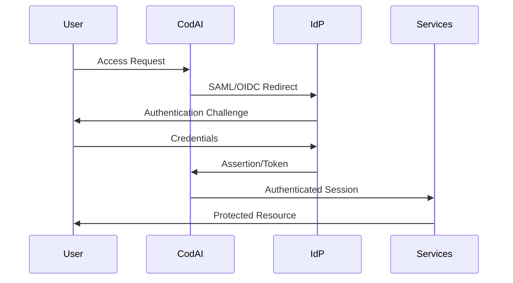

# Enterprise Features Implementation Architecture
# US-PROD-003: Multi-Tenancy, Advanced RBAC, Enterprise SSO & Compliance
# Version: 1.0

## Overview

This document defines the comprehensive enterprise features implementation for Enhanced Essential CodAI Services, adding multi-tenancy, advanced Role-Based Access Control (RBAC), enterprise Single Sign-On (SSO), white-label capabilities, audit logging, and regulatory compliance features.

## Enterprise Feature Matrix

### 1. Multi-Tenancy Architecture

**Tenant Isolation Strategies:**
- **Database-per-Tenant**: Dedicated PostgreSQL databases for data isolation
- **Schema-per-Tenant**: Separate schemas within shared database instances
- **Row-Level Security (RLS)**: PostgreSQL RLS for data access control
- **Tenant Context Injection**: Middleware-based tenant identification
- **Resource Quotas**: Per-tenant resource limits and usage monitoring

**Tenant Management:**
- **Tenant Provisioning**: Automated tenant setup and configuration
- **Tenant Lifecycle**: Creation, suspension, deletion workflows
- **Tenant Metadata**: Organization details, settings, customizations
- **Cross-Tenant Security**: Zero data leakage between tenants
- **Tenant Analytics**: Usage metrics and billing integration

### 2. Advanced RBAC System

**Role Hierarchy:**
- **System Admin**: Platform-wide administrative access
- **Tenant Admin**: Full tenant management capabilities
- **Department Manager**: Department-specific permissions
- **Team Lead**: Team and project management permissions
- **End User**: Standard application access
- **Read-Only User**: View-only access to resources
- **API User**: Programmatic access with limited scope

**Permission Framework:**
- **Resource-Based Permissions**: Granular access to specific resources
- **Action-Based Controls**: Create, Read, Update, Delete, Execute permissions
- **Context-Aware Access**: Location, time, device-based restrictions
- **Dynamic Permissions**: Runtime permission calculation
- **Permission Inheritance**: Hierarchical permission propagation
- **Permission Auditing**: Complete access control audit trails

### 3. Enterprise SSO Integration

**Supported Protocols:**
- **SAML 2.0**: Identity Provider (IdP) integration
- **OpenID Connect (OIDC)**: Modern OAuth2-based authentication
- **OAuth 2.0**: Third-party application authorization
- **LDAP/Active Directory**: Corporate directory integration
- **JWT Token Management**: Secure token lifecycle management

**SSO Features:**
- **Single Sign-On**: Seamless access across all services
- **Single Sign-Out**: Coordinated logout from all applications
- **Multi-Factor Authentication**: TOTP, SMS, hardware tokens
- **Social Login**: Google, Microsoft, GitHub integration
- **Federation Management**: Cross-organization authentication
- **Session Management**: Secure session handling and timeout

### 4. White-Label Capabilities

**Branding Customization:**
- **Custom Logos**: Tenant-specific logo and brand assets
- **Color Schemes**: Customizable UI color palettes
- **Typography**: Font selection and text styling
- **Custom CSS**: Advanced styling overrides
- **Domain Mapping**: Custom domain support for tenants
- **Email Templates**: Branded notification templates

**UI Customization:**
- **Component Theming**: Customizable UI component styling
- **Layout Options**: Flexible dashboard and page layouts
- **Navigation Customization**: Custom menu structures
- **Feature Toggles**: Tenant-specific feature availability
- **Localization**: Multi-language support per tenant
- **Custom Fields**: Tenant-defined data fields

### 5. Comprehensive Audit Logging

**Audit Event Categories:**
- **Authentication Events**: Login, logout, failed attempts
- **Authorization Events**: Permission grants, denials, changes
- **Data Access Events**: Create, read, update, delete operations
- **Administrative Events**: Configuration changes, user management
- **System Events**: Service starts, stops, errors, warnings
- **API Events**: All REST and GraphQL API interactions

**Audit Data Structure:**
```typescript
interface AuditEvent {
  id: string
  timestamp: Date
  tenantId: string
  userId: string
  sessionId: string
  eventType: string
  eventCategory: string
  resource: string
  action: string
  result: 'success' | 'failure' | 'partial'
  ipAddress: string
  userAgent: string
  geolocation?: GeoLocation
  metadata: Record<string, any>
  risk_score?: number
}
```

### 6. Regulatory Compliance Framework

**GDPR Compliance:**
- **Data Subject Rights**: Access, rectification, erasure, portability
- **Consent Management**: Granular consent tracking and withdrawal
- **Data Processing Records**: Complete processing activity logs
- **Privacy by Design**: Built-in privacy protection mechanisms
- **Data Breach Notification**: Automated breach detection and reporting
- **Cross-Border Data Transfer**: Legal basis validation

**HIPAA Compliance:**
- **PHI Protection**: Protected Health Information safeguards
- **Access Controls**: Minimum necessary access principle
- **Audit Logs**: Healthcare-specific audit requirements
- **Encryption**: Data at rest and in transit protection
- **Business Associate Agreements**: Third-party compliance management
- **Risk Assessments**: Regular security and privacy assessments

**SOC 2 Type II Compliance:**
- **Security Controls**: Comprehensive security framework
- **Availability Controls**: System uptime and reliability
- **Processing Integrity**: Data processing accuracy and completeness
- **Confidentiality Controls**: Sensitive data protection
- **Privacy Controls**: Personal information handling
- **Continuous Monitoring**: Real-time compliance monitoring

## Implementation Architecture

### 1. Multi-Tenant Data Layer

**Database Strategy:**
- **Tenant Context Middleware**: Automatic tenant injection in all queries
- **Connection Pooling**: Per-tenant connection management
- **Data Encryption**: Tenant-specific encryption keys
- **Backup Strategy**: Tenant-isolated backup and restore
- **Performance Monitoring**: Per-tenant database metrics

**Tenant Routing:**
```typescript
interface TenantContext {
  tenantId: string
  subdomain: string
  customDomain?: string
  databaseConfig: DatabaseConfig
  features: string[]
  limits: ResourceLimits
  branding: BrandingConfig
}
```

### 2. RBAC Implementation

**Permission Engine:**
- **Policy-Based Access Control (PBAC)**: Flexible rule-based permissions
- **Attribute-Based Access Control (ABAC)**: Context-aware authorization
- **Just-In-Time (JIT) Access**: Temporary privilege escalation
- **Zero Trust Model**: Continuous verification and authorization
- **Permission Caching**: High-performance access control decisions

**Role Management API:**
```typescript
interface RoleDefinition {
  id: string
  name: string
  description: string
  permissions: Permission[]
  inherits: string[]
  tenantId: string
  isSystem: boolean
  metadata: Record<string, any>
}

interface Permission {
  resource: string
  actions: string[]
  conditions?: AccessCondition[]
  effect: 'allow' | 'deny'
}
```

### 3. SSO Integration Layer

**Identity Provider Integration:**
- **SAML Service Provider**: Complete SAML 2.0 implementation
- **OIDC Relying Party**: OpenID Connect client integration
- **Token Management**: Secure token storage and refresh
- **Session Federation**: Cross-service session synchronization
- **Identity Mapping**: External identity to internal user mapping

**Authentication Flow:**


### 4. White-Label System

**Theming Engine:**
- **CSS-in-JS**: Dynamic styling based on tenant configuration
- **Asset Management**: CDN-based tenant asset serving
- **Template System**: Customizable UI templates
- **Feature Flags**: Tenant-specific feature availability
- **API Customization**: Tenant-branded API responses

**Branding Configuration:**
```typescript
interface BrandingConfig {
  logo: {
    primary: string
    secondary?: string
    favicon: string
  }
  colors: {
    primary: string
    secondary: string
    accent: string
    background: string
    text: string
  }
  typography: {
    fontFamily: string
    fontSize: Record<string, string>
    fontWeight: Record<string, number>
  }
  customCss?: string
  emailTemplates: Record<string, string>
}
```

### 5. Audit System Architecture

**Event Collection:**
- **Async Event Processing**: Non-blocking audit event capture
- **Event Aggregation**: Batch processing for high-volume events
- **Event Enrichment**: Adding context and metadata to events
- **Event Filtering**: Configurable event inclusion/exclusion rules
- **Event Retention**: Configurable retention policies

**Storage Strategy:**
- **Time-Series Database**: Optimized for audit log queries
- **Data Partitioning**: Efficient storage and retrieval
- **Compression**: Storage optimization for large audit datasets
- **Archival**: Long-term storage for compliance requirements
- **Search Indexing**: Fast audit log search capabilities

### 6. Compliance Automation

**Automated Compliance Checks:**
- **Data Classification**: Automatic sensitive data identification
- **Policy Enforcement**: Real-time compliance rule enforcement
- **Compliance Reporting**: Automated regulatory reports
- **Risk Scoring**: Continuous compliance risk assessment
- **Remediation Workflows**: Automated compliance issue resolution

**Compliance Dashboard:**
```typescript
interface ComplianceMetrics {
  gdprCompliance: {
    dataSubjectRequests: number
    processingActivities: number
    consentStatus: ConsentMetrics
    breachIncidents: number
  }
  hipaaCompliance: {
    phiAccess: number
    auditLogCompleteness: number
    encryptionStatus: EncryptionMetrics
    riskAssessments: number
  }
  soc2Compliance: {
    securityControls: ControlStatus[]
    availabilityMetrics: AvailabilityMetrics
    privacyControls: PrivacyMetrics
  }
}
```

## Security Architecture

### 1. Zero Trust Security Model

**Identity Verification:**
- **Continuous Authentication**: Regular identity verification
- **Device Trust**: Device registration and compliance checking
- **Location Awareness**: Geographic access controls
- **Behavioral Analysis**: Anomaly detection and response
- **Risk-Based Authentication**: Adaptive authentication requirements

### 2. Data Protection

**Encryption Strategy:**
- **Encryption at Rest**: AES-256 database and file encryption
- **Encryption in Transit**: TLS 1.3 for all communications
- **Key Management**: Hardware Security Module (HSM) integration
- **Field-Level Encryption**: Selective data field encryption
- **Tenant Key Isolation**: Per-tenant encryption key management

### 3. API Security

**API Protection:**
- **Rate Limiting**: Per-tenant and per-user API limits
- **API Gateway Security**: Centralized security policy enforcement
- **OAuth 2.0 Scopes**: Granular API access permissions
- **API Versioning**: Secure API evolution and deprecation
- **Request Validation**: Comprehensive input validation and sanitization

## Performance Optimization

### 1. Multi-Tenant Performance

**Tenant Isolation:**
- **Resource Quotas**: CPU, memory, and storage limits per tenant
- **Query Optimization**: Tenant-aware database query optimization
- **Caching Strategy**: Per-tenant cache isolation
- **Load Balancing**: Tenant-aware traffic distribution
- **Performance Monitoring**: Per-tenant performance metrics

### 2. RBAC Performance

**Permission Caching:**
- **Redis-Based Caching**: High-performance permission caching
- **Cache Invalidation**: Smart cache invalidation strategies
- **Permission Pre-computation**: Pre-calculated permission sets
- **Lazy Loading**: On-demand permission evaluation
- **Batch Permission Checks**: Efficient bulk authorization

## Deployment Strategy

### 1. Phased Rollout

**Phase 1: Foundation**
- Multi-tenancy infrastructure
- Basic RBAC system
- Audit logging framework

**Phase 2: Authentication**
- Enterprise SSO integration
- Advanced RBAC features
- Security enhancements

**Phase 3: Customization**
- White-label capabilities
- Advanced audit features
- Compliance automation

### 2. Migration Strategy

**Tenant Migration:**
- **Data Migration**: Secure tenant data migration utilities
- **Configuration Migration**: Tenant settings and customizations
- **User Migration**: Identity mapping and role assignment
- **Testing Framework**: Comprehensive migration testing
- **Rollback Procedures**: Safe migration rollback capabilities

## Success Metrics

### 1. Enterprise Readiness

**Multi-Tenancy Metrics:**
- Tenant provisioning time < 5 minutes
- Zero cross-tenant data leakage incidents
- 99.9% tenant isolation effectiveness
- Support for 1000+ concurrent tenants

**RBAC Effectiveness:**
- Permission check response time < 10ms
- 100% access control audit coverage
- Zero unauthorized access incidents
- Role management efficiency improvements

**SSO Performance:**
- Single sign-on completion time < 3 seconds
- 99.9% authentication success rate
- Support for 10+ identity providers
- Zero SSO-related security incidents

### 2. Compliance Metrics

**Regulatory Compliance:**
- 100% GDPR compliance score
- HIPAA audit readiness
- SOC 2 Type II certification
- Automated compliance reporting

**Audit Effectiveness:**
- 100% audit event capture rate
- Real-time audit processing
- Comprehensive audit trail completeness
- Audit query response time < 500ms

This architecture ensures Enhanced Essential CodAI Services become a fully enterprise-ready platform with comprehensive multi-tenancy, security, and compliance capabilities.